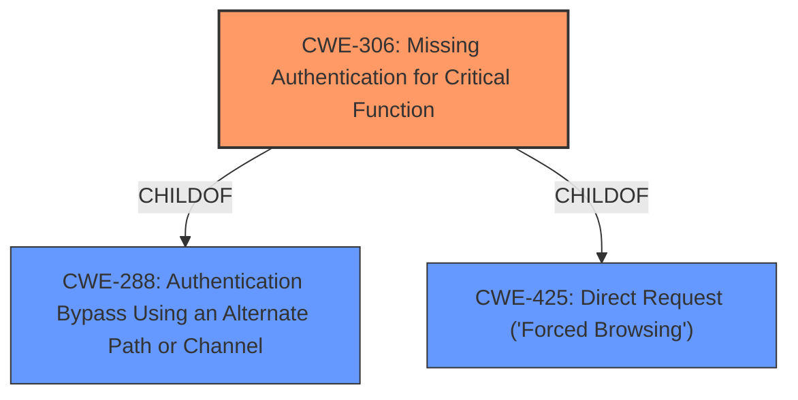

# Analysis Report for CVE-2025-2572

# Vulnerability Analysis Report: CVE-2025-2572

## Description

In WhatsUp Gold versions released before 2024.0.3, a database manipulation vulnerability allows an unauthenticated attacker to modify the contents of WhatsUp.dbo.WrlsMacAddressGroup.

## Vulnerability Description Key Phrases

- **Impact:** modify the contents of WhatsUp.dbo.WrlsMacAddressGroup
- **Attacker:** unauthenticated attacker
- **Product:** WhatsUp Gold
- **Version:** versions released before 2024.0.3

## Analysis (with Relationship Data)

# Summary
| CWE ID | CWE Name | Confidence | CWE Abstraction Level | CWE Vulnerability Mapping Label | CWE-Vulnerability Mapping Notes |
|---|---|---|---|---|---|
| CWE-306 | Missing Authentication for Critical Function | 0.9 | Base | Primary CWE | Allowed |

## Evidence and Confidence

*   **Confidence Score:** 0.9
*   **Evidence Strength:** LOW

## Relationship Analysis
The primary relationship to consider is that CWE-306 [Base] is a child of several higher-level CWEs, such as CWE-288 [Base] (Authentication Bypass Using an Alternate Path or Channel) and CWE-425 [Base] (Direct Request ('Forced Browsing')). However, the description clearly states that the vulnerability is due to a **missing authentication** for a critical function. Therefore, CWE-306 is the most specific and appropriate choice.



## Vulnerability Chain
The vulnerability chain is relatively simple:

1.  **Root Cause:** **Missing authentication** (CWE-306) for a critical function (database manipulation).
2.  **Impact:** An unauthenticated attacker can **modify the contents** of the WhatsUp.dbo.WrlsMacAddressGroup database table.

## Summary of Analysis
The primary weakness is the **missing authentication** (CWE-306) that allows an unauthenticated attacker to **modify the database**. The vulnerability description states that an "unauthenticated attacker" can "modify the contents of WhatsUp.dbo.WrlsMacAddressGroup," indicating a **lack of authentication** for this database manipulation function.

The selection is based on the fact that the vulnerability allows an unauthenticated attacker to **modify the database**, which indicates that there is **missing authentication** for this function.

The retriever results also list CWE-306, "Missing Authentication for Critical Function", as a potential candidate. Although the evidence is limited, the description strongly suggests this weakness.

The selected CWE is at the optimal level of specificity because it directly addresses the root cause - the **absence of authentication** for a critical function.

Other CWEs Considered:

*   CWE-89 (Improper Neutralization of Special Elements used in an SQL Command ('SQL Injection')): While database manipulation is mentioned, there's no indication of SQL injection. Therefore, this CWE is not applicable.
*   CWE-918 (Server-Side Request Forgery (SSRF)): There's no mention of server-side requests or URL manipulation, so this CWE is not relevant.
*   CWE-120 (Buffer Copy without Checking Size of Input ('Classic Buffer Overflow')): There is no mention of a buffer, buffer copy, or buffer overflow.
*   CWE-79 (Improper Neutralization of Input During Web Page Generation ('Cross-site Scripting')): There is no mention of web page generation or cross-site scripting.
*   CWE-620 (Unverified Password Change): There is no mention of password change.


## CWE Relationship Analysis

Current CWEs represent these abstraction levels: .


### Vulnerability Chain Analysis

**Chain starting from CWE-288:**
- 288 (Authentication Bypass Using an Alternate Path or Channel) - ROOT


**Chain starting from CWE-89:**
- 89 (Improper Neutralization of Special Elements used in an SQL Command ('SQL Injection')) - ROOT


### CWE Relationship Diagram

```mermaid
graph TD
    classDef primary fill:#f96,stroke:#333,stroke-width:2px
    classDef secondary fill:#69f,stroke:#333
    classDef tertiary fill:#9e9,stroke:#333
```


*Report generated on 2025-07-14 13:40:09*
