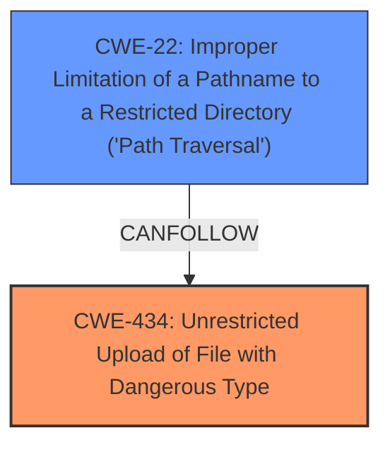

# Analysis Report for CVE-2025-25791

# Vulnerability Analysis Report: CVE-2025-25791

## Description

An arbitrary **file upload vulnerability** in the plugin installation feature of YZNCMS v2.0.1 allows attackers to execute arbitrary code via uploading a crafted Zip file.

## Vulnerability Description Key Phrases

- **Weakness:** ['file upload vulnerability', 'arbitrary file upload']
- **Impact:** ['execute arbitrary code', 'arbitrary file upload']
- **Vector:** crafted Zip file
- **Attacker:** attackers
- **Product:** YZNCMS
- **Version:** v2.0.1
- **Component:** plugin installation feature

## Analysis (with Relationship Data)

# Summary
| CWE ID | CWE Name | Confidence | CWE Abstraction Level | CWE Vulnerability Mapping Label | CWE-Vulnerability Mapping Notes |
|---|---|---|---|---|---|
| CWE-434 | Unrestricted Upload of File with Dangerous Type | 1.0 | Base | Primary | Allowed |
| CWE-22 | Improper Limitation of a Pathname to a Restricted Directory ('Path Traversal') | 0.7 | Base | Secondary | Allowed |

## Evidence and Confidence

*   **Confidence Score:** 0.85
*   **Evidence Strength:** HIGH

## Relationship Analysis
The primary relationship influencing the decision is that CWE-434 [CWE-434: Unrestricted Upload of File with Dangerous Type] is the root cause, where a dangerous file type is uploaded without proper restrictions. CWE-22 [CWE-22: Improper Limitation of a Pathname to a Restricted Directory ('Path Traversal')] could be a secondary weakness if the uploaded file is written to an arbitrary location due to path traversal issues. Both are Base level abstractions.



## Vulnerability Chain
The vulnerability chain starts with the **unrestricted upload** of a file, specifically a crafted ZIP file, and this leads to the ability to **execute arbitrary code**.
  - The **root cause** is the lack of restrictions on the type of file being uploaded, captured by CWE-434 [CWE-434: Unrestricted Upload of File with Dangerous Type].
  - A secondary weakness, which is optional based on exploit details, is path traversal from the uploaded file which could lead to arbitrary file writes represented by CWE-22 [CWE-22: Improper Limitation of a Pathname to a Restricted Directory ('Path Traversal')].
  - The final impact is arbitrary code execution.

## Summary of Analysis
The analysis strongly supports CWE-434 [CWE-434: Unrestricted Upload of File with Dangerous Type] as the primary CWE because the **file upload vulnerability** is directly mentioned, and the description states a "crafted ZIP file" can be uploaded to **execute arbitrary code**. The description also contains "arbitrary **file upload**" The evidence aligns with the CWE's definition, as the product allows the upload of a dangerous file type (crafted ZIP) that can be automatically processed to achieve code execution.

The possibility of CWE-22 [CWE-22: Improper Limitation of a Pathname to a Restricted Directory ('Path Traversal')] exists if the crafted ZIP file exploits path traversal vulnerabilities when its contents are extracted. This is possible, but not explicitly stated in the vulnerability description, so it is a secondary consideration.

Other CWEs such as CWE-96 [CWE-96: Improper Neutralization of Directives in Statically Saved Code ('Static Code Injection')] and CWE-78 [CWE-78: Improper Neutralization of Special Elements used in an OS Command ('OS Command Injection')] were considered, but they are less relevant since the vulnerability is triggered by uploading a dangerous file type, not by injecting code directly into existing code or OS commands.

The selected CWEs are at the optimal level of specificity because CWE-434 [CWE-434: Unrestricted Upload of File with Dangerous Type] is a Base level CWE that directly addresses the **root cause** of the vulnerability, while CWE-22 [CWE-22: Improper Limitation of a Pathname to a Restricted Directory ('Path Traversal')] represents a potential secondary weakness.


## CWE Relationship Analysis

Current CWEs represent these abstraction levels: .


### Vulnerability Chain Analysis

**Chain starting from CWE-96:**
- 96 (Improper Neutralization of Directives in Statically Saved Code ('Static Code Injection')) - ROOT


**Chain starting from CWE-22:**
- 22 (Improper Limitation of a Pathname to a Restricted Directory ('Path Traversal')) - ROOT


### CWE Relationship Diagram

```mermaid
graph TD
    classDef primary fill:#f96,stroke:#333,stroke-width:2px
    classDef secondary fill:#69f,stroke:#333
    classDef tertiary fill:#9e9,stroke:#333
```


*Report generated on 2025-07-14 13:44:28*
