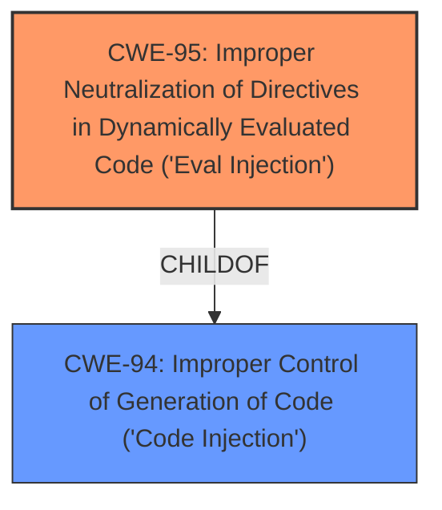

# Analysis Report for CVE-2025-25792

# Vulnerability Analysis Report: CVE-2025-25792

## Description

SeaCMS v13.3 was discovered to contain a remote code execution (RCE) vulnerability via the isopen parameter at admin_weixin.php.

## Vulnerability Description Key Phrases

- **Impact:** remote code execution
- **Vector:** isopen parameter
- **Product:** SeaCMS
- **Version:** v13.3
- **Component:** admin_weixin.php

## Analysis (with Relationship Data)

# Summary
| CWE ID | CWE Name | Confidence | CWE Abstraction Level | CWE Vulnerability Mapping Label | CWE-Vulnerability Mapping Notes |
|---|---|---|---|---|---|
| CWE-95 | Improper Neutralization of Directives in Dynamically Evaluated Code ('Eval Injection') | 0.8 | Variant | Allowed | Primary CWE. The vulnerability allows for remote code execution via a parameter, indicating the execution of dynamically evaluated code. |

## Evidence and Confidence

*   **Confidence Score:** 0.8
*   **Evidence Strength:** MEDIUM

## Relationship Analysis
The primary CWE is CWE-95, which is a variant of CWE-94 (Improper Control of Generation of Code). This indicates a hierarchical relationship where CWE-95 is a more specific type of code injection. No chain relationships are apparent from the provided data. The abstraction level of Variant for CWE-95 is appropriate as it describes a specific type of code injection via dynamic evaluation.



## Vulnerability Chain
The vulnerability chain starts with the **improper neutralization** of directives in dynamically evaluated code (CWE-95), leading directly to remote code execution.

## Summary of Analysis
The initial assessment identifies CWE-95 as the most relevant CWE based on the vulnerability description, which states that a remote code execution (RCE) vulnerability exists via a specific parameter. This strongly suggests that the code is dynamically evaluating input without proper neutralization. The relationship analysis shows that CWE-95 is a specific type of code injection, making it a suitable choice.

The evidence from the vulnerability description key phrases mentions "remote code execution" and "isopen parameter", indicating a potential issue where the value of the 'isopen' parameter is being used in a dynamic evaluation call. This aligns directly with the description of CWE-95.

Other CWEs considered but not used:

*   CWE-78 (Improper Neutralization of Special Elements used in an OS Command ('OS Command Injection')): While RCE is possible, the mechanism is more specific to dynamic code evaluation than a generic OS command injection.
*   CWE-89 (Improper Neutralization of Special Elements used in an SQL Command ('SQL Injection')): There is no evidence of SQL being involved in the vulnerability.
*   CWE-1336 (Improper Neutralization of Special Elements Used in a Template Engine): No evidence of template engine usage.
*   CWE-96 (Improper Neutralization of Directives in Statically Saved Code ('Static Code Injection')): The vulnerability description highlights RCE, which typically involves dynamic code execution rather than static code injection.
*   CWE-77 (Improper Neutralization of Special Elements used in a Command ('Command Injection')): Similar to CWE-78, this is a more generic form of command injection and less specific than dynamic code evaluation.

The selected CWE is at the optimal level of specificity because it directly addresses the root cause of the vulnerability: the **improper neutralization** of directives in dynamically evaluated code, leading to remote code execution.


## CWE Relationship Analysis

Current CWEs represent these abstraction levels: .


### Vulnerability Chain Analysis

**Chain starting from CWE-89:**
- 89 (Improper Neutralization of Special Elements used in an SQL Command ('SQL Injection')) - ROOT


**Chain starting from CWE-94:**
- 94 (Improper Control of Generation of Code ('Code Injection')) - ROOT


### CWE Relationship Diagram

```mermaid
graph TD
    classDef primary fill:#f96,stroke:#333,stroke-width:2px
    classDef secondary fill:#69f,stroke:#333
    classDef tertiary fill:#9e9,stroke:#333
```


*Report generated on 2025-07-14 13:44:41*
