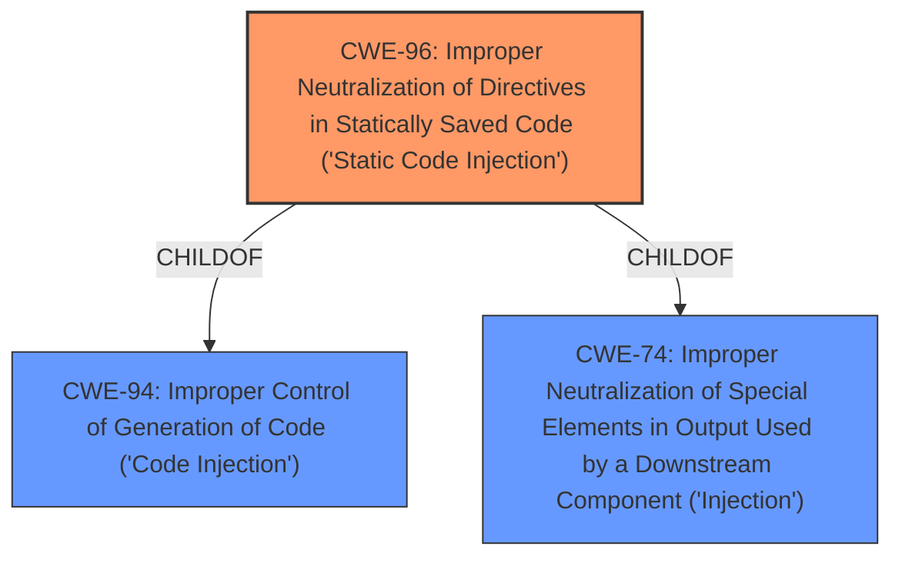

# Analysis for CVE-2025-25813

# Summary
| CWE ID | CWE Name | Confidence | CWE Abstraction Level | CWE Vulnerability Mapping Label | CWE-Vulnerability Mapping Notes |
|---|---|---|---|---|---|
| CWE-96 | Improper Neutralization of Directives in Statically Saved Code ('Static Code Injection') | 0.7 | Base | Primary CWE | Allowed |

## Evidence and Confidence

*   **Confidence Score:** 0.7
*   **Evidence Strength:** LOW

## Relationship Analysis
The primary CWE is CWE-96, which is a base-level CWE. The retriever results also suggest other CWEs such as CWE-95, CWE-78, and CWE-89 which are related to injection vulnerabilities. However, without more information about the exact injection mechanism, CWE-96 is the most appropriate base-level CWE.

## Vulnerability Chain
The vulnerability chain starts with the **improper neutralization** of directives in statically saved code (CWE-96), leading to remote code execution.

## Summary of Analysis
The vulnerability description indicates a remote code execution (RCE) vulnerability in SeaCMS v13.3 via the admin_files.php component. The retriever results suggest CWE-96 as a potential match.

The vulnerability description indicates a remote code execution vulnerability via the component `admin_files.php`. The term **"remote code execution"** by itself does not indicate a root cause weakness and many weaknesses can enable code execution.

CWE-96, "Improper Neutralization of Directives in Statically Saved Code ('Static Code Injection')", is a base-level CWE that describes a scenario where the product does not neutralize or incorrectly neutralizes code syntax before inserting the input into an executable resource. This could potentially lead to code injection and subsequent RCE, which aligns with the provided vulnerability description.

The evidence is weak, given the limited information in the vulnerability description. However, based on the available evidence, CWE-96 appears to be the most appropriate mapping.

Other CWEs considered but not used:
* CWE-95: Improper Neutralization of Directives in Dynamically Evaluated Code ('Eval Injection') - Similar to CWE-96 but involves dynamic evaluation. The description does not explicitly mention dynamic evaluation, so it is less likely.
* CWE-78: Improper Neutralization of Special Elements used in an OS Command ('OS Command Injection') - Requires interaction with the operating system, which isn't specified in the description.
* CWE-89: Improper Neutralization of Special Elements used in an SQL Command ('SQL Injection') - Requires interaction with a database using SQL, which isn't specified in the description.
* CWE-434: Unrestricted Upload of File with Dangerous Type - This could be a contributing factor, but the core issue seems to be the **improper neutralization**, not necessarily the unrestricted upload.