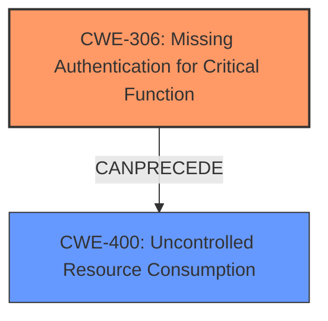

# Raw Analyzer Response for CVE-2025-2586

# Summary
| CWE ID | CWE Name | Confidence | CWE Abstraction Level | CWE Vulnerability Mapping Label | CWE-Vulnerability Mapping Notes |
|---|---|---|---|---|---|
| CWE-306 | Missing Authentication for Critical Function | 1.0 | Base | Primary CWE | Allowed |
| CWE-400 | Uncontrolled Resource Consumption | 0.8 | Class | Secondary Candidate | Discouraged |

## Evidence and Confidence

*   **Confidence Score:** 0.9
*   **Evidence Strength:** HIGH

## Relationship Analysis
The primary relationship influencing the decision is that CWE-306 is a Base level CWE directly addressing the root cause of missing authentication. While CWE-400 is a related impact, it is a Class level CWE and less specific. CWE-306 can precede CWE-400 in a vulnerability chain.

## Vulnerability Chain
The vulnerability chain starts with **CWE-306 Missing Authentication for Critical Function**. Because authentication is missing, an attacker can send unlimited requests, leading to **CWE-400 Uncontrolled Resource Consumption** due to excessive CPU, RAM, and disk usage, ultimately impacting service availability.

## Summary of Analysis
The initial analysis focused on identifying the root cause of the vulnerability. The key phrase "**does not require authentication**" from the "Vulnerability Description Key Phrases" strongly indicates a **missing authentication** issue. The CVE Reference Links Content Summary confirms that the "OpenShift Lightspeed Service does not enforce authentication when logging metrics." This aligns perfectly with **CWE-306 Missing Authentication for Critical Function**. The impact of this **missing authentication** is resource exhaustion, which could be represented by **CWE-400 Uncontrolled Resource Consumption**, but this is a consequence of the **missing authentication**, not the root cause. Therefore, **CWE-306** is the primary CWE.

The relationship analysis emphasizes that **CWE-306** can lead to **CWE-400**. The selection of **CWE-306** is at the optimal level of specificity because it directly addresses the **lack of authentication** for a critical function, which is the root cause.
The LLM Rules of Thumb guidance also states that "No identity check (no login)" likely indicates **CWE-306**.

Relevant CWE Information:

# Enhanced Context (25 CWEs)
The following CWEs were identified as potentially relevant to this vulnerability:

## CWE-400: Improper Resource Shutdown or Release
**Abstraction Level**: Class
**Similarity Score**: 0.75
**Source**: dense

**Description**:
The product does not release or incorrectly releases a resource before it is made available for re-use.

**Mapping Guidance**:
- Usage: Allowed-with-Review
- Rationale: This CWE entry is a Class and might have Base-level children that would be more appropriate

## CWE-306: Missing Authentication for Critical Function
**Abstraction Level**: Base
**Similarity Score**: 1508.34
**Source**: sparse

**Description**:
The product does not perform any authentication for functionality that requires a provable user identity or consumes a significant amount of resources.

**Mapping Guidance**:
- Usage: Allowed
- Rationale: This CWE entry is at the Base level of abstraction, which is a preferred level of abstraction for mapping to the root causes of vulnerabilities.

## CWE-400: Uncontrolled Resource Consumption
**Abstraction Level**: Class
**Similarity Score**: 0.386
**Source**: sparse

**Description**:
The product does not properly control the consumption of resources, which can lead to denial of service, degraded performance, or other negative consequences.

**Mapping Guidance**:
- Usage: Discouraged
- Rationale: This CWE entry is a Class and might have Base-level children that would be more appropriate.

---
**CWE-306: Missing Authentication for Critical Function**
*   **Technical Explanation:** The OpenShift Lightspeed Service lacks authentication for API requests, including those to non-existent endpoints. This means anyone can send requests without proving their identity.
*   **Security Implications:** An attacker can flood the service with requests, consuming resources like CPU, RAM, and disk space.
*   **Relationship Analysis:** This is the root cause. The impact is resource exhaustion, potentially leading to a denial-of-service (DoS) condition.
*   **Mapping Guidance:** The vulnerability description and CVE summary explicitly state the **lack of authentication**. This perfectly matches the definition of **CWE-306**.
*   **Confidence:** 1.0

**CWE-400: Uncontrolled Resource Consumption**
*   **Technical Explanation:** Due to the **missing authentication**, the system is vulnerable to resource exhaustion. An external attacker can send repeated queries to non-existent endpoints, inflating metrics storage and processing.
*   **Security Implications:** This leads to monitoring system degradation, increased disk usage, and potential service unavailability, affecting both application and cluster stability.
*   **Relationship Analysis:** While **CWE-400** describes the impact, it's a consequence of the **CWE-306**. **CWE-400** is a Class-level CWE, and **CWE-306** is the more specific root cause (Base-level).
*   **Mapping Guidance:** **CWE-400** is discouraged as it's a Class level CWE.
*   **Confidence:** 0.8