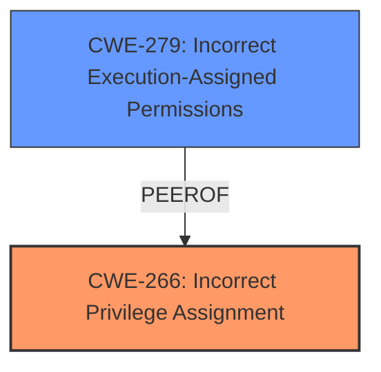

# Raw Analyzer Response for CVE-2025-25872

# Summary

| CWE ID | CWE Name | Confidence | CWE Abstraction Level | CWE Vulnerability Mapping Label | CWE-Vulnerability Mapping Notes |
|---|---|---|---|---|---|
| CWE-266 | Incorrect Privilege Assignment | 0.9 | Base | Primary CWE | Allowed |
| CWE-279 | Incorrect Execution-Assigned Permissions | 0.7 | Variant | Secondary Candidate | Allowed |

## Evidence and Confidence

*   **Confidence Score:** 0.9
*   **Evidence Strength:** MEDIUM

## Relationship Analysis

The primary CWE is CWE-266, which represents the root cause of the vulnerability. CWE-279 is considered a possible secondary candidate. The relationships show a hierarchical structure where specific instances of privilege management errors fall under broader categories of access control issues. The abstraction levels guide the selection of the most specific CWE applicable.

## Vulnerability Chain

The vulnerability chain starts with an **incorrect privilege assignment** (CWE-266), which leads to the attacker being able to **escalate privileges**. The vulnerability description highlights the "Fix Permissions function" as the vulnerable component, which suggests the possibility of **incorrect execution-assigned permissions** (CWE-279).

## Summary of Analysis

The initial analysis identified CWE-266 as the primary candidate based on the vulnerability description stating that the attacker can "escalate privileges". The retriever results also list CWE-266 with a high score. The CWE Classification Guidance section regarding Privileges vs Permissions mapping further reinforces this choice. The evidence directly supports that the **incorrect assignment of privileges** is the root cause.

CWE-279 was considered because the vulnerability occurs in the "Fix Permissions function" which could be related to incorrect permissions being assigned during execution.

Both CWEs are at the optimal level of specificity, with CWE-266 at the Base level and CWE-279 at the Variant level.

Relevant CWE Information:

# Enhanced Context (25 CWEs)
The following CWEs were identified as potentially relevant to this vulnerability:

## CWE-266: Incorrect Privilege Assignment
**Abstraction Level**: Base
**Similarity Score**: 0.80
**Source**: dense

**Description**:
A product **incorrectly assigns a privilege** to a particular actor, creating an unintended sphere of control for that actor.

**Mapping Guidance**:
- Usage: Allowed
- Rationale: This CWE entry is at the Base level of abstraction, which is a preferred level of abstraction for mapping to the root causes of vulnerabilities.

**EVIDENCE:** The vulnerability description states that the vulnerability allows a remote attacker to "escalate privileges" via the "Fix Permissions function". This aligns with **incorrectly assigning a privilege**.

## CWE-279: Incorrect Execution-Assigned Permissions
**Abstraction Level**: Variant
**Similarity Score**: 0.52
**Source**: dense

**Description**:
The product assigns permissions to a process or thread that are **incorrect** for the intended operation, which can cause the process to perform actions that it should not be allowed to perform.

**Mapping Guidance**:
- Usage: Allowed
- Rationale: This CWE entry is at the Variant level of abstraction, which is a preferred level of abstraction for mapping to the root causes of vulnerabilities.

**EVIDENCE:** The vulnerability occurs in the "Fix Permissions function", suggesting that the permissions assigned during the execution of this function are **incorrect**.

Other CWEs Considered But Not Used:

*   CWE-250: Execution with Unnecessary Privileges: While privilege escalation is mentioned, the root cause seems to be in the assignment of privileges rather than the execution with unnecessary privileges.
*   CWE-732: Incorrect Permission Assignment for Critical Resource: This is more about file/resource permissions rather than user privilege assignment.
*   CWE-285: Improper Authorization: The authorization logic is present but flawed