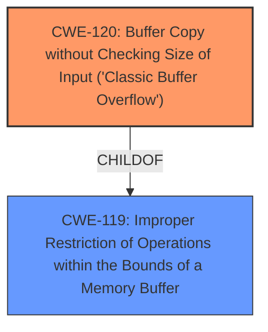

# Analysis Report for CVE-2025-25899

# Vulnerability Analysis Report: CVE-2025-25899

## Description

A **buffer overflow** vulnerability was discovered in TP-Link TL-WR841ND V11 via the gw parameter at /userRpm/WanDynamicIpV6CfgRpm.htm. This vulnerability allows attackers to cause a Denial of Service (DoS) via a crafted packet.

## Vulnerability Description Key Phrases

- **Weakness:** buffer overflow
- **Impact:** Denial of Service (DoS)
- **Vector:** crafted packet
- **Attacker:** attackers
- **Product:** TP-Link TL-WR841ND
- **Version:** V11
- **Component:** /userRpm/WanDynamicIpV6CfgRpm.htm

## Analysis (with Relationship Data)

# Summary

| CWE ID  | CWE Name | Confidence | CWE Abstraction Level | CWE Vulnerability Mapping Label | CWE-Vulnerability Mapping Notes |
| :------- | :------------------------------------------------------------------------------------- | :---------- | :-------------------- | :---------------------------------- | :---------------------------------- |
| CWE-120 | Buffer Copy without Checking Size of Input ('Classic Buffer Overflow') | 0.9 | Base | Allowed-with-Review | Primary CWE |
| CWE-119 | Improper Restriction of Operations within the Bounds of a Memory Buffer | 0.7 | Class | Discouraged | Secondary Candidate |

## Evidence and Confidence

*   **Confidence Score:** 0.9
*   **Evidence Strength:** MEDIUM

## Relationship Analysis

The primary relationship considered here is the parent-child relationship between CWE-119 and CWE-120. CWE-120 is a more specific case of CWE-119, where a buffer is copied without checking the size of the input, leading to a buffer overflow. The vulnerability description explicitly mentions a **buffer overflow**, which is a strong indicator of CWE-120. However, the description lacks specific details about the copy operation itself. Because of the mention of the **buffer overflow** vulnerability, CWE-120 is the more specific and appropriate choice, and the parent CWE-119 is a reasonable, though less specific secondary candidate.



## Vulnerability Chain

The vulnerability chain starts with the **buffer overflow** due to an unchecked copy operation. This leads to a denial-of-service (DoS) as the final impact.

Root Cause: **Buffer Overflow** (CWE-120)
Impact: Denial of Service (DoS)

## Summary of Analysis

The vulnerability description clearly states a **buffer overflow** condition in TP-Link TL-WR841ND V11. The `gw` parameter at `/userRpm/WanDynamicIpV6CfgRpm.htm` is the vulnerable component. This condition allows attackers to cause a Denial of Service (DoS).

The primary CWE selected is CWE-120 (Buffer Copy without Checking Size of Input ('Classic Buffer Overflow')). This is because the vulnerability description explicitly mentions a **buffer overflow**, and CWE-120 directly addresses the scenario where a buffer is copied without proper size validation. This aligns with the description of CWE-120, which states: "The product copies an input buffer to an output buffer without verifying that the size of the input buffer is less than the size of the output buffer, leading to a buffer overflow."

The secondary CWE considered is CWE-119 (Improper Restriction of Operations within the Bounds of a Memory Buffer). While CWE-119 is a more general class of buffer vulnerabilities, the explicit mention of a **buffer overflow** makes CWE-120 a more precise fit.

The selection of CWE-120 is at the optimal level of specificity, as it captures the core weakness described in the vulnerability. It's a Base level CWE, which is preferred. Other CWEs were considered but not selected because they did not accurately reflect the specific type of vulnerability described. For instance, CWE-190 (Integer Overflow or Wraparound) and CWE-193 (Off-by-one Error) are related to integer manipulation issues, which are not explicitly mentioned in the vulnerability description.

Relevant CWE Information:

# Enhanced Context (25 CWEs)

## CWE-121: Stack-based Buffer Overflow
**Abstraction Level**: Variant
**Similarity Score**: 0.73
**Source**: dense

**Description**:
A stack-based buffer overflow condition is a condition where the buffer being overwritten is allocated on the stack (i.e., is a local variable or, rarely, a parameter to a function).

**Mapping Guidance**:
- Usage: Allowed
- Rationale: This CWE entry is at the Variant level of abstraction, which is a preferred level of abstraction for mapping to the root causes of vulnerabilities.

## CWE-191: Integer Underflow (Wrap or Wraparound)
**Abstraction Level**: Base
**Similarity Score**: 0.73
**Source**: dense

**Description**:
The product subtracts one value from another, such that the result is less than the minimum allowable integer value, which produces a value that is not equal to the correct result.

**Mapping Guidance**:
- Usage: Allowed
- Rationale: This CWE entry is at the Base level of abstraction, which is a preferred level of abstraction for mapping to the root causes of vulnerabilities.

## CWE-193: Off-by-one Error
**Abstraction Level**: Base
**Similarity Score**: 0.73
**Source**: dense

**Description**:
A product calculates or uses an incorrect maximum or minimum value that is 1 more, or 1 less, than the correct value.

**Mapping Guidance**:
- Usage: Allowed
- Rationale: This CWE entry is at the Base level of abstraction, which is a preferred level of abstraction for mapping to the root causes of vulnerabilities.

## CWE-134: Use of Externally-Controlled Format String
**Abstraction Level**: Base
**Similarity Score**: 0.73
**Source**: dense

**Description**:
The product uses a function that accepts a format string as an argument, but the format string originates from an external source.

**Mapping Guidance**:
- Usage: Allowed
- Rationale: This CWE entry is at the Base level of abstraction, which is a preferred level of abstraction for mapping to the root causes of vulnerabilities.

## CWE-131: Incorrect Calculation of Buffer Size
**Abstraction Level**: Base
**Similarity Score**: 0.72
**Source**: dense

**Description**:
The product does not correctly calculate the size to be used when allocating a buffer, which could lead to a buffer overflow.

**Mapping Guidance**:
- Usage: Allowed
- Rationale: This CWE entry is at the Base level of abstraction, which is a preferred level of abstraction for mapping to the root causes of vulnerabilities.

## CWE-805: Buffer Access with Incorrect Length Value
**Abstraction Level**: Base
**Similarity Score**: 0.72
**Source**: dense

**Description**:
The product uses a sequential operation to read or write a buffer, but it uses an incorrect length value that causes it to access memory that is outside of the bounds of the buffer.

**Mapping Guidance**:
- Usage: Allowed
- Rationale: This CWE entry is at the Base level of abstraction, which is a preferred level of abstraction for mapping to the root causes of vulnerabilities.

## CWE-790: Improper Filtering of Special Elements
**Abstraction Level**: Class
**Similarity Score**: 0.71
**Source**: dense

**Description**:
The product receives data from an upstream component, but does not filter or incorrectly filters special elements before sending it to a downstream component.

**Mapping Guidance**:
- Usage: Allowed-with-Review
- Rationale: This CWE entry is a Class and might have Base-level children that would be more appropriate

## CWE-119: Improper Restriction of Operations within the Bounds of a Memory Buffer
**Abstraction Level**: Class
**Similarity Score**: 0.71
**Source**: dense

**Description**:
The product performs operations on a memory buffer, but it reads from or writes to a memory location outside the buffer's intended boundary. This may result in read or write operations on unexpected memory locations that could be linked to other variables, data structures, or internal program data.

**Mapping Guidance**:
- Usage: Discouraged
- Rationale: CWE-119 is commonly misused in low-information vulnerability reports when lower-level CWEs could be used instead, or when more details about the vulnerability are available.

## CWE-755: Improper Handling of Exceptional Conditions
**Abstraction Level**: Class
**Similarity Score**: 0.71
**Source**: dense

**Description**:
The product does not handle or incorrectly handles an exceptional condition.

**Mapping Guidance**:
- Usage: Discouraged
- Rationale: This CWE entry is a level-1 Class (i.e., a child of a Pillar). It might have lower-level children that would be more appropriate

## CWE-617: Reachable Assertion
**Abstraction Level**: Base
**Similarity Score**: 0.70
**Source**: dense

**Description**:
The product contains an assert() or similar statement that can be triggered by an attacker, which leads to an application exit or other behavior that is more severe than necessary.

**Mapping Guidance**:
- Usage: Allowed
- Rationale: This CWE entry is at the Base level of abstraction, which is a preferred level of abstraction for mapping to the root causes of vulnerabilities.

## CWE-190: Integer Overflow or Wraparound
**Abstraction Level**: Base
**Similarity Score**: 512.66
**Source


## CWE Relationship Analysis

Current CWEs represent these abstraction levels: .


### Vulnerability Chain Analysis

**Chain starting from CWE-121:**
- 121 (Stack-based Buffer Overflow) - ROOT


**Chain starting from CWE-805:**
- 805 (Buffer Access with Incorrect Length Value) - ROOT


### CWE Relationship Diagram

```mermaid
graph TD
    classDef primary fill:#f96,stroke:#333,stroke-width:2px
    classDef secondary fill:#69f,stroke:#333
    classDef tertiary fill:#9e9,stroke:#333
```


*Report generated on 2025-07-14 13:48:57*
