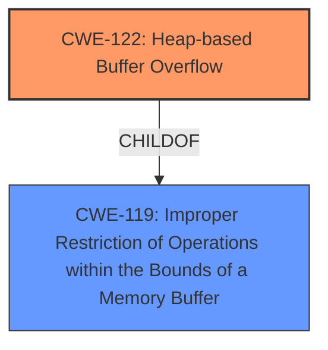

# Analysis for CVE-2025-25944

# Summary

| CWE ID  | CWE Name                                                                                   | Confidence | CWE Abstraction Level | CWE Vulnerability Mapping Label | CWE-Vulnerability Mapping Notes |
| :-------- | :----------------------------------------------------------------------------------------- | :---------- | :---------------------- | :------------------------------ | :------------------------------ |
| CWE-122 | Heap-based Buffer Overflow                                                               | 0.9         | Variant                 | Allowed                       | Primary CWE                   |
| CWE-119 | Improper Restriction of Operations within the Bounds of a Memory Buffer | 0.7        | Class                  | Discouraged                       | Secondary Candidate                    |

## Evidence and Confidence

*   **Confidence Score:** 0.9
*   **Evidence Strength:** HIGH

## Relationship Analysis

The primary relationship that influenced the CWE selection is the parent-child relationship between CWE-119 and CWE-122. CWE-122 is a variant of CWE-119, specifying that the buffer overflow occurs on the heap. The vulnerability description and reference links content summary clearly indicate a **heap-based buffer overflow**.

## Vulnerability Chain

The vulnerability chain starts with the crafted MP4 input file leading to a **heap-based buffer overflow** during the processing within the `AP4_RtpAtom::AP4_RtpAtom` function, eventually leading to potential arbitrary code execution.

## Summary of Analysis

The initial assessment pointed towards a general buffer overflow (CWE-119). However, the evidence from the "CVE Reference Links Content Summary" section specifically mentions "Heap-Buffer-Overflow (BUG7)" in `Ap4RtpAtom.cpp` within `AP4_RtpAtom::AP4_RtpAtom`. This clearly indicates that the overflow occurs in the heap memory. Therefore, CWE-122, which is a variant of CWE-119, provides a more specific and accurate classification.

The decision is primarily based on the explicit mention of "Heap-Buffer-Overflow" in the provided evidence. The graph relationships reinforce this decision by showing that CWE-122 is a child of CWE-119, making it a more specific representation of the **buffer overflow**. The retriever scores also support the choice of CWE-122.

Relevant CWE Information:

# Enhanced Context (25 CWEs)

## CWE-122: Heap-based Buffer Overflow
**Abstraction Level**: Variant
**Similarity Score**: 0.69
**Source**: dense

**Description**:
A heap overflow condition is a buffer overflow, where the buffer that can be overwritten is allocated in the heap portion of memory, generally meaning that the buffer was allocated using a routine such as malloc().

**Mapping Guidance**:
- Usage: Allowed
- Rationale: This CWE entry is at the Variant level of abstraction, which is a preferred level of abstraction for mapping to the root causes of vulnerabilities.

## CWE-119: Improper Restriction of Operations within the Bounds of a Memory Buffer
**Abstraction Level**: Class
**Similarity Score**: 1.00
**Source**: Retriever Results

**Description**: The software performs an operation that reads or writes to a memory buffer, but it does not properly check the size of the input or the size of the buffer. This could lead to a buffer overflow or underflow.

**CWE-122**: **Heap-based Buffer Overflow**

*   **Technical Explanation:** The vulnerability occurs because the software **does not properly restrict operations within the bounds of a memory buffer** allocated on the heap. Specifically, a crafted MP4 input file is provided to `mp4fragment`, leading to an overflow in the `AP4_RtpAtom::AP4_RtpAtom` function.
*   **Security Implications:** This allows a local attacker to execute arbitrary code. The overflow can overwrite critical data structures on the heap, leading to control-flow hijacking.
*   **Relationship Analysis:** CWE-122 is a variant of CWE-119 (Improper Restriction of Operations within the Bounds of a Memory Buffer), indicating a more specific type of buffer overflow.
*   **Mapping Guidance:** The usage for CWE-122 is ALLOWED, and it's at the Variant level, which is a preferred level of abstraction.
*   **Evidence:** "Heap-Buffer-Overflow (BUG7): In `Ap4RtpAtom.cpp` within `AP4_RtpAtom::AP4_RtpAtom` when processing a crafted MP4 file."
*   **Confidence:** 0.9

**CWE-119**: Improper Restriction of Operations within the Bounds of a Memory Buffer

*   **Technical Explanation:** The software **does not properly restrict operations within the bounds of a memory buffer**. While the specific location (heap) wasn't initially clear, this CWE captures the general issue of improper bounds checking.
*   **Security Implications:** Memory corruption and potential arbitrary code execution.
*   **Relationship Analysis:** This is a parent class of CWE-122, representing a broader category of buffer access issues.
*   **Mapping Guidance:** The usage for CWE-119 is Discouraged, because more granular CWEs are available.
*   **Evidence:** "Buffer Overflow vulnerability in Bento4 v.1.6.0-641 allows a local attacker to execute arbitrary code via the Ap4RtpAtom.cpp, specifically in AP4_RtpAtomAP4_RtpAtom, during the execution of mp4fragment with a crafted MP4 input file."
*   **Confidence:** 0.7

**CWEs Considered but Not Used:**

*   CWE-120: Buffer Copy without Checking Size of Input ('Classic Buffer Overflow'): While a buffer overflow is present, there's no explicit mention of a buffer copy operation in the description.
*   CWE-125: Out-of-bounds Read: The vulnerability is primarily described as a buffer overflow (write), not just a read.
*   CWE-190: Integer Overflow or Wraparound: There's no indication of integer overflow being the root cause.
*   CWE-193: Off-by-one Error: No specific evidence suggests an off-by-one error.
*   CWE-131: Incorrect Calculation of Buffer Size: The root cause seems to be a missing or inadequate bounds check rather than an incorrect size calculation.
*   CWE-787: Access of Memory Location After End of Buffer: This is similar to CWE-122 but less specific. CWE-122 directly addresses heap-based overflows.