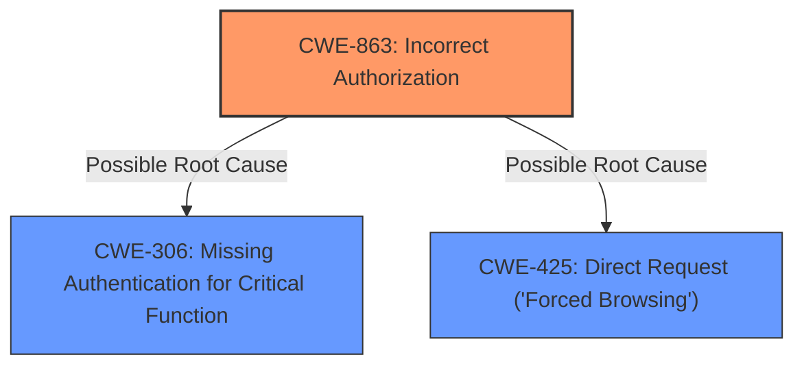

# Analysis for CVE-2025-25948

# Summary
| CWE ID | CWE Name | Confidence | CWE Abstraction Level | CWE Vulnerability Mapping Label | CWE-Vulnerability Mapping Notes |
|---|---|---|---|---|---|
| CWE-863 | Incorrect Authorization | 0.9 | Class |  | Allowed-with-Review |
| CWE-306 | Missing Authentication for Critical Function | 0.7 | Base |  | Allowed |
| CWE-425 | Direct Request ('Forced Browsing') | 0.6 | Base |  | Allowed |

## Evidence and Confidence

*   **Confidence Score:** 0.8
*   **Evidence Strength:** MEDIUM

## Relationship Analysis
The primary CWE is CWE-863, representing an authorization check performed incorrectly. CWE-306 and CWE-425 are considered as possible alternative root causes due to potential missing authentication or direct request issues, respectively. The relationship between these CWEs helps clarify the nature of the **incorrect access control**, where authorization checks may be flawed or completely absent.

## Vulnerability Chain
The vulnerability chain starts with **incorrect access control**, which leads to the ability to create and modify user accounts, including an administrator account.
- Root Cause: **Incorrect Authorization (CWE-863)**, or potentially **Missing Authentication (CWE-306)**, or **Direct Request (CWE-425)**.
- Impact: Create and modify user accounts, including an Administrator account.

## Summary of Analysis
Initially, the description points to **incorrect access control** leading to the ability to create and modify user accounts, including an Administrator account. The key phrase "Incorrect access control" suggests a problem with authorization.

Based on the provided evidence and the CWE guidance, CWE-863 (Incorrect Authorization) is the most appropriate primary CWE. The vulnerability description explicitly states "Incorrect access control", which aligns with the definition of CWE-863. However, the possibility of Missing Authentication (CWE-306) or Direct Request (CWE-425) exists, making them secondary considerations.

The selection of CWE-863 is at the Class level, which is acceptable but might be refined with more detailed information.

Relevant CWE Information:

# Enhanced Context (25 CWEs)
The following CWEs were identified as potentially relevant to this vulnerability:

## CWE-285: Improper Authorization
**Abstraction Level**: Class
**Similarity Score**: 1126.66
**Source**: sparse

**Description**:
The product does not perform or incorrectly performs an authorization check when an actor attempts to access a resource or perform an action.

**Mapping Guidance**:
- Usage: Discouraged
- Rationale: CWE-285 is high-level and lower-level CWEs can frequently be used instead. It is a level-1 Class (i.e., a child of a Pillar).

## CWE-306: Missing Authentication for Critical Function
**Abstraction Level**: Base
**Similarity Score**: 1083.38
**Source**: sparse

**Description**:
The product does not perform any authentication for functionality that requires a provable user identity or consumes a significant amount of resources.

**Mapping Guidance**:
- Usage: Allowed
- Rationale: This CWE entry is at the Base level of abstraction, which is a preferred level of abstraction for mapping to the root causes of vulnerabilities.

## CWE-425: Direct Request ('Forced Browsing')
**Abstraction Level**: Base
**Similarity Score**: 1102.96
**Source**: sparse

**Description**:
The web application does not adequately enforce appropriate authorization on all restricted URLs, scripts, or files.

**Mapping Guidance**:
- Usage: Allowed
- Rationale: This CWE entry is at the Base level of abstraction, which is a preferred level of abstraction for mapping to the root causes of vulnerabilities.

## CWE-798: Use of Hard-coded Credentials
**Abstraction Level**: Base
**Similarity Score**: 1083.38
**Source**: sparse

**Description**:
The product contains hard-coded credentials, such as a password or cryptographic key.

**Mapping Guidance**:
- Usage: Allowed
- Rationale: This CWE entry is at the Base level of abstraction, which is a preferred level of abstraction for mapping to the root causes of vulnerabilities.

## CWE-863: Incorrect Authorization
**Abstraction Level**: Class
**Similarity Score**: 1083.38
**Source**: sparse

**Description**:
The product performs an authorization check when an actor attempts to access a resource or perform an action, but it does not correctly perform the check.

**Mapping Guidance**:
- Usage: Allowed-with-Review
- Rationale: This CWE entry is a Class and might have Base-level children that would be more appropriate

## CWE-472: External Control of Assumed-Immutable Web Parameter
**Abstraction Level**: Base
**Similarity Score**: 1083.38
**Source**: sparse

**Description**:
The web application does not sufficiently verify inputs that are assumed to be immutable but are actually externally controllable, such as hidden form fields.

**Mapping Guidance**:
- Usage: Allowed
- Rationale: This CWE entry is at the Base level of abstraction, which is a preferred level of abstraction for mapping to the root causes of vulnerabilities.

## CWE-284: Improper Access Control
**Abstraction Level**: Pillar
**Similarity Score**: 1083.38
**Source**: sparse

**Description**:
The product does not adequately control access to resources, which can allow an attacker to perform unauthorized actions or gain access to sensitive information.

**Mapping Guidance**:
- Usage: Discouraged
- Rationale: CWE-284 is high-level and lower-level CWEs can frequently be used instead. It is a level-0 Class (i.e., a child of a Pillar).

## CWE Explanations
- **CWE-863: Incorrect Authorization**: This CWE applies because the system performs an authorization check, but it is flawed, allowing unauthorized account creation and modification. The impact is significant, as it allows for the creation of administrator accounts.
- **CWE-306: Missing Authentication for Critical Function**: This CWE is considered because the vulnerability might stem from a complete lack of authentication for the user creation functionality. If no authentication is required, this would be the root cause.
- **CWE-425: Direct Request ('Forced Browsing')**: This CWE is considered as a possible cause where the application does not adequately enforce authorization on the affected URL, allowing direct requests to bypass access control mechanisms.

## Rejected CWEs
- **CWE-285 (Improper Authorization)**: While related, CWE-285 is a more general case. Since the description specifies "Incorrect access control," implying a flawed check rather than a complete absence, CWE-863 is more appropriate.
- **CWE-798 (Use of Hard-coded Credentials)**: This CWE does not fit the description, as there is no mention of hard-coded credentials being involved.
- **CWE-472 (External Control of Assumed-Immutable Web Parameter)**: There is no indication in the description that external control of assumed-immutable web parameters is a contributing factor.
- **CWE-284 (Improper Access Control)**: This is a high-level CWE that should be avoided if a more specific CWE is applicable, as is the case with CWE-863.