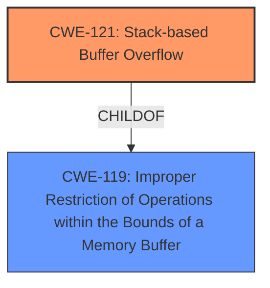

# Analysis Report for CVE-2025-26004

# Vulnerability Analysis Report: CVE-2025-26004

## Description

Telesquare TLR-2005KSH 1.1.4 is vulnerable to unauthorized **stack buffer overflow vulnerability** when requesting admin.cgi parameter with setDdns.

## Vulnerability Description Key Phrases

- **Weakness:** stack buffer overflow vulnerability
- **Impact:** unauthorized access
- **Product:** Telesquare TLR-2005KSH
- **Version:** 1.1.4
- **Component:** admin.cgi

## Analysis (with Relationship Data)

# Summary
| CWE ID | CWE Name | Confidence | CWE Abstraction Level | CWE Vulnerability Mapping Label | CWE-Vulnerability Mapping Notes |
|---|---|---|---|---|---|
| CWE-121 | Stack-based Buffer Overflow | 1.0 | Variant | Allowed | Primary CWE |
| CWE-119 | Improper Restriction of Operations within the Bounds of a Memory Buffer | 0.7 | Class | Discouraged | Secondary Candidate |

## Evidence and Confidence

*   **Confidence Score:** 0.9
*   **Evidence Strength:** HIGH

## Relationship Analysis
The primary weakness is a stack-based buffer overflow (CWE-121), a variant of the more general class, Improper Restriction of Operations within the Bounds of a Memory Buffer (CWE-119). The analysis focuses on identifying the most specific CWE that accurately reflects the vulnerability.



## Vulnerability Chain
The vulnerability chain starts with a **stack buffer overflow vulnerability** (CWE-121), leading to unauthorized access. The root cause is the insufficient validation of input size before copying data to a stack-allocated buffer, resulting in overwriting adjacent memory regions on the stack.

## Summary of Analysis
The vulnerability description clearly states a "**stack buffer overflow vulnerability**" when requesting a specific parameter. The Retriever Results also list CWE-121 as a potential candidate. The final decision is based on the explicit mention of "stack buffer overflow" in the vulnerability description, which makes CWE-121 the most appropriate and specific choice. CWE-119 is considered as a secondary candidate as it is the parent class of CWE-121.

Relevant CWE Information:

# Enhanced Context (25 CWEs)
The following CWEs were identified as potentially relevant to this vulnerability:

## CWE-121: Stack-based Buffer Overflow
**Abstraction Level**: Variant
**Similarity Score**: 0.71
**Source**: dense

**Description**:
A stack-based buffer overflow condition is a condition where the buffer being overwritten is allocated on the stack (i.e., is a local variable or, rarely, a parameter to a function).

**Mapping Guidance**:
- Usage: Allowed
- Rationale: This CWE entry is at the Variant level of abstraction, which is a preferred level of abstraction for mapping to the root causes of vulnerabilities.

## CWE-119: Improper Restriction of Operations within the Bounds of a Memory Buffer
**Abstraction Level**: Class
**Similarity Score**: 0.80
**Source**: alternate_terms

**Description**: The product performs an operation on a memory buffer, but it does not correctly perform bounds checking, which can lead to read or write operations outside of the intended buffer.

## Vulnerability Description
Telesquare TLR-2005KSH 1.1.4 is vulnerable to unauthorized **stack buffer overflow vulnerability** when requesting admin.cgi parameter with setDdns.

### Vulnerability Description Key Phrases
- **weakness:** **stack buffer overflow vulnerability**
- **impact:** unauthorized access
- **product:** Telesquare TLR-2005KSH
- **version:** 1.1.4
- **component:** admin.cgi

## Retriever Results

### Top Combined Results

| Rank | CWE ID | Name | Abstraction | Usage  | Retrievers | Individual Scores |
|------|--------|------|-------------|-------|------------|-------------------|
| 1 | 119 | Improper Restriction of Operations within the Bounds of a Memory Buffer | Class | Discouraged | alternate_terms | 0.800 |
| 2 | 190 | Integer Overflow or Wraparound | Base | Allowed | alternate_terms | 0.800 |
| 3 | 121 | Stack-based Buffer Overflow | Variant | Allowed | sparse | 0.155 |
| 4 | 120 | Buffer Copy without Checking Size of Input ('Classic Buffer Overflow') | Base | Allowed-with-Review | sparse | 0.133 |

**CWE-121: Stack-based Buffer Overflow**
*   **Explanation:** The vulnerability description explicitly mentions a "**stack buffer overflow vulnerability**". This directly aligns with the definition of CWE-121, which involves overflowing a buffer allocated on the stack.
*   **Security Implications:** Stack-based buffer overflows can allow attackers to overwrite return addresses, function pointers, or other critical data on the stack, leading to arbitrary code execution.
*   **Relationship:** CWE-121 is a variant (more specific type) of CWE-119 (Improper Restriction of Operations within the Bounds of a Memory Buffer).
*   **Mapping Guidance:** The usage is "Allowed" and the Abstraction Level is Variant which is the preferred level.
*   **Confidence:** 1.0

**CWE-119: Improper Restriction of Operations within the Bounds of a Memory Buffer**
*   **Explanation:** This is a more general class of weakness that includes buffer overflows. While relevant, it is less specific than CWE-121, given the explicit mention of "stack" in the vulnerability description.
*   **Security Implications:** Can lead to memory corruption, information disclosure, or arbitrary code execution.
*   **Relationship:** It is the parent class of CWE-121.
*   **Mapping Guidance:** The usage is "Discouraged" and the Abstraction Level is Class. This CWE entry is a Class and might have Base-level children that would be more appropriate
*   **Confidence:** 0.7

**CWEs Considered but Not Used:**

*   CWE-120: Buffer Copy without Checking Size of Input ('Classic Buffer Overflow'): While this CWE also deals with buffer overflows, it doesn't specify that the buffer is stack-based. The vulnerability description explicitly states "stack buffer overflow," making CWE-121 a more precise fit.
*   CWE-190: Integer Overflow or Wraparound: This CWE is related to integer calculations, and there's no information in the vulnerability description to suggest an integer overflow is the root cause.
*   CWE-125: Out-of-bounds Read: This CWE involves reading data outside the intended buffer, while the vulnerability description indicates a buffer overflow (write), making it less relevant.
*   CWE-193: Off-by-one Error: This CWE involves incorrect maximum or minimum values, which is not directly indicated in the vulnerability description.
*   CWE-1284: Improper Validation of Specified Quantity in Input: While input validation might be a factor, the core issue is the stack buffer overflow, making CWE-121 the more direct and accurate classification.
*   CWE-674: Uncontrolled Recursion: This CWE is about uncontrolled recursion, not memory corruption.
*   CWE-78: Improper Neutralization of Special Elements used in an OS Command ('OS Command Injection'): There's no indication of OS command injection in the vulnerability description.
*   CWE-128: Wrap-around Error: This CWE is about wrap-around errors, and there's no information in the vulnerability description to suggest this type of error.
*   CWE-131: Incorrect Calculation of Buffer Size: While the buffer size may be incorrect, the explicit mention of a *stack* buffer overflow makes CWE-121 a better fit.


## CWE Relationship Analysis

Current CWEs represent these abstraction levels: .


### Vulnerability Chain Analysis

**Chain starting from CWE-121:**
- 121 (Stack-based Buffer Overflow) - ROOT


**Chain starting from CWE-1284:**
- 1284 (Improper Validation of Specified Quantity in Input) - ROOT


### CWE Relationship Diagram

```mermaid
graph TD
    classDef primary fill:#f96,stroke:#333,stroke-width:2px
    classDef secondary fill:#69f,stroke:#333
    classDef tertiary fill:#9e9,stroke:#333
```


*Report generated on 2025-07-14 13:55:46*
