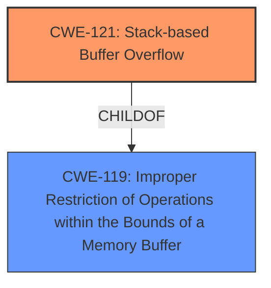

# Raw Analyzer Response for CVE-2025-26007

# Summary
| CWE ID | CWE Name | Confidence | CWE Abstraction Level | CWE Vulnerability Mapping Label | CWE-Vulnerability Mapping Notes |
|---|---|---|---|---|---|
| CWE-121 | Stack-based Buffer Overflow | 1.0 | Variant | Allowed | Primary CWE. The vulnerability description mentions a "stack overflow". |
| CWE-119 | Improper Restriction of Operations within the Bounds of a Memory Buffer | 0.7 | Class | Allowed | Secondary CWE. CWE-121 is a variant of CWE-119. |

## Evidence and Confidence

*   **Confidence Score:** 1.0
*   **Evidence Strength:** HIGH

## Relationship Analysis
The primary CWE is CWE-121, which is a Variant of CWE-119. This parent-child relationship guided the selection, providing a more specific classification (CWE-121) while acknowledging the broader class of memory buffer restriction issues (CWE-119).

## Vulnerability Chain
The vulnerability chain starts with the **unauthorized stack overflow** (CWE-121). The root cause is the **lack of proper bounds checking** leading to the overflow. The impact is potential unauthorized access or code execution due to the ability to overwrite data on the stack.

## Summary of Analysis
The analysis is based on the provided vulnerability description, which explicitly states an **unauthorized stack overflow**. The selection of CWE-121 is a direct match to this description, with high confidence. The retriever results also listed CWE-121 as the top candidate. The relationship analysis confirms that CWE-121 is a variant of CWE-119, providing a more specific classification. The selected CWE is at the optimal level of specificity because it precisely describes the nature of the **stack overflow** vulnerability.

Relevant CWE Information:

# Enhanced Context (25 CWEs)
The following CWEs were identified as potentially relevant to this vulnerability:

## CWE-121: Stack-based Buffer Overflow
**Abstraction Level**: Variant
**Similarity Score**: 0.69
**Source**: dense

**Description**:
A stack-based buffer overflow condition is a condition where the buffer being overwritten is allocated on the stack (i.e., is a local variable or, rarely, a parameter to a function).

**Mapping Guidance**:
- Usage: Allowed
- Rationale: This CWE entry is at the Variant level of abstraction, which is a preferred level of abstraction for mapping to the root causes of vulnerabilities.

### CWEs Considered But Not Used:

*   **CWE-190 Integer Overflow or Wraparound:** While listed in the Retriever Results, there is no indication of integer overflows in the vulnerability description.
*   **CWE-120 Buffer Copy without Checking Size of Input:** The description states an "unauthorized stack overflow," which is a more specific case than a general buffer copy without size checking. Also, the "Usage" for CWE-120 suggests it might be misused.
*   **CWE-770 Allocation of Resources Without Limits or Throttling:** Not relevant, as the vulnerability is focused on a buffer overflow, not resource allocation.
*   **CWE-1284 Improper Validation of Specified Quantity in Input:** Not relevant because the vulnerability description focuses on a stack overflow not a quantity in input.
*   **CWE-789 Memory Allocation with Excessive Size Value:** Not relevant, as the vulnerability involves a stack overflow, not excessive memory allocation.
*   **CWE-131 Incorrect Calculation of Buffer Size:** Not relevant because the vulnerability description focuses on a stack overflow not an incorrect calculation of buffer size.
*   **CWE-128 Wrap-around Error:** Not relevant because the vulnerability description focuses on a stack overflow not a wrap-around error.
*   **CWE-1339 Insufficient Precision or Accuracy of a Real Number:** Not relevant because the vulnerability description focuses on a stack overflow not precision or accuracy of a real number.
*   **CWE-123 Write-what-where Condition:** Not relevant because the vulnerability description focuses on a stack overflow not a write-what-where condition.
*   **CWE-294: Authentication Bypass by Capture-replay:** Not relevant, as the vulnerability is a stack overflow, not an authentication bypass.
*   **CWE-303: Incorrect Implementation of Authentication Algorithm:** Not relevant, as the vulnerability is a stack overflow, not an issue with authentication algorithms.
*   **CWE-824: Access of Uninitialized Pointer:** Not relevant, as the vulnerability is a stack overflow, not an access of an uninitialized pointer.
*   **CWE-790: Improper Filtering of Special Elements:** Not relevant, as the vulnerability is a stack overflow, not an issue with filtering special elements.
*   **CWE-755: Improper Handling of Exceptional Conditions:** Not relevant, as the vulnerability is a stack overflow, not a general lack of exception handling.
*   **CWE-346: Origin Validation Error:** Not relevant, as the vulnerability is a stack overflow, not an origin validation error.
*   **CWE-1325: Improperly Controlled Sequential Memory Allocation:** Not relevant, as the vulnerability is a stack overflow, not an issue with sequential memory allocation.
*   **CWE-193: Off-by-one Error:** Not relevant because the vulnerability description focuses on a stack overflow not an off-by-one error.
*   **CWE-209: Generation of Error Message Containing Sensitive Information:** Not relevant because the vulnerability description focuses on a stack overflow not generation of an error message containing sensitive information.
*   **CWE-674 Uncontrolled Recursion:** Not relevant because the vulnerability description focuses on a stack overflow and not uncontrolled recursion.