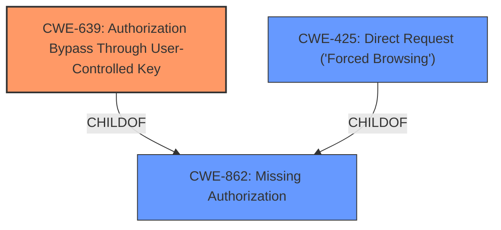

# Enhanced Analysis for CVE-2025-26138

# Summary
| CWE ID  | CWE Name                                                      | Confidence | CWE Abstraction Level | CWE Vulnerability Mapping Label | CWE-Vulnerability Mapping Notes |
| ------- | ------------------------------------------------------------- | ---------- | --------------------- | ----------------------------- | ------------------------------- |
| CWE-639 | Authorization Bypass Through User-Controlled Key              | 0.9        | Base                  | Primary                       | Allowed                         |
| CWE-425 | Direct Request ('Forced Browsing')                            | 0.7        | Base                  | Secondary                     | Allowed                         |
| CWE-862 | Missing Authorization                                         | 0.6        | Class                 | Secondary                     | Allowed-with-Review             |

## Evidence and Confidence

*   **Confidence Score:** 0.8
*   **Evidence Strength:** HIGH

## Relationship Analysis
The primary CWE is CWE-639, which describes the specific flaw of using a user-controlled key for authorization. This is a base-level CWE, providing a good level of detail. CWE-425 is a closely related weakness, as it involves directly requesting resources without proper authorization checks. CWE-862 is a class-level CWE representing missing authorization, which is more general. The relationships between these CWEs are as follows: CWE-639 and CWE-425 could be considered specific instances or consequences of CWE-862.



## Vulnerability Chain
The vulnerability chain starts with the **improper access control**, specifically the use of a predictable numerical ID parameter. This leads to unauthorized users being able to access and download files they do not have permission to view. This can be mapped as follows:
1.  **CWE-639**: Authorization Bypass Through User-Controlled Key (Root Cause)
2.  **CWE-425**: Direct Request ('Forced Browsing') (Consequence)

## Summary of Analysis
The vulnerability is due to **improper access control**. The application allows unauthorized users to access files by manipulating a predictable numerical ID parameter in the URL.

The primary CWE is CWE-639 (Authorization Bypass Through User-Controlled Key). This CWE accurately captures the root cause of the vulnerability because the system's authorization mechanism is flawed by relying on a user-controlled key (the numerical ID) to access resources. "Uploaded files are accessible via a predictable numerical ID parameter, allowing unauthorized users to increment or decrement the ID to access and download files they do not have permission to view."

CWE-425 (Direct Request ('Forced Browsing')) is also relevant, as the vulnerability enables unauthorized users to directly request files by manipulating the ID parameter.

CWE-862 (Missing Authorization) is a broader class of weakness that applies because the application does not properly validate whether the user is authorized to access the requested file. This is less specific than CWE-639 and CWE-425, which is why I've marked it as a secondary consideration.

The final selection of CWE-639 as the primary CWE is based on the specific details of the vulnerability description, which highlights the use of a user-controlled key for authorization. The other considered CWEs were either too general (CWE-862) or represented a consequence of the root cause (CWE-425).

Relevant CWE Information:

# Enhanced Context (25 CWEs)
The following CWEs were identified as potentially relevant to this vulnerability:

## CWE-266: Incorrect Privilege Assignment
**Abstraction Level**: Base
**Similarity Score**: 0.73
**Source**: dense

**Description**:
A product incorrectly assigns a privilege to a particular actor, creating an unintended sphere of control for that actor.

**Mapping Guidance**:
- Usage: Allowed
- Rationale: This CWE entry is at the Base level of abstraction, which is a preferred level of abstraction for mapping to the root causes of vulnerabilities.

*Not Used*: This is not a privilege assignment issue.

## CWE-267: Privilege Defined With Unsafe Actions
**Abstraction Level**: Base
**Similarity Score**: 0.73
**Source**: dense

**Description**:
A particular privilege, role, capability, or right can be used to perform unsafe actions that were not intended, even when it is assigned to the correct entity.

**Mapping Guidance**:
- Usage: Allowed
- Rationale: This CWE entry is at the Base level of abstraction, which is a preferred level of abstraction for mapping to the root causes of vulnerabilities.

*Not Used*: This is not a privilege issue.

## CWE-280: Improper Handling of Insufficient Permissions or Privileges 
**Abstraction Level**: Base
**Similarity Score**: 0.72
**Source**: dense

**Description**:
The product does not handle or incorrectly handles when it has insufficient privileges to access resources or functionality as specified by their permissions. This may cause it to follow unexpected code paths that may leave the product in an invalid state.

**Mapping Guidance**:
- Usage: Allowed
- Rationale: This CWE entry is at the Base level of abstraction, which is a preferred level of abstraction for mapping to the root causes of vulnerabilities.

*Not Used*: This is an access control issue but the root cause is the user controlled key.

## CWE-668: Exposure of Resource to Wrong Sphere
**Abstraction Level**: Class
**Similarity Score**: 0.72
**Source**: dense

**Description**:
The product exposes a resource to the wrong control sphere, providing unintended actors with inappropriate access to the resource.

**Mapping Guidance**:
- Usage: Discouraged
- Rationale: CWE-668 is high-level and is often misused as a catch-all when lower-level CWE IDs might be applicable. It is sometimes used for low-information vulnerability reports [REF-1287]. It is a level-1 Class (i.e., a child of a Pillar). It is not useful for trend analysis.

*Not Used*: Too generic, a more specific CWE is available.

## CWE-41: Improper Resolution of Path Equivalence
**Abstraction Level**: Base
**Similarity Score**: 0.72
**Source**: dense

**Description**:
The product is vulnerable to file system contents disclosure through path equivalence. Path equivalence involves the use of special characters in file and directory names. The associated manipulations are intended to generate multiple names for the same object.

**Mapping Guidance**:
- Usage: Allowed
- Rationale: This CWE entry is at the Base level of abstraction, which is a preferred level of abstraction for mapping to the root causes of vulnerabilities.

*Not Used*: Not related to path equivalence.

## CWE-274: Improper Handling of Insufficient Privileges
**Abstraction Level**: Base
**Similarity Score**: 0.72
**Source**: dense

**Description**:
The product does not handle or incorrectly handles when it has insufficient privileges to perform an operation, leading to resultant weaknesses.

**Mapping Guidance**:
- Usage: Discouraged
- Rationale: This CWE entry could be deprecated in a future version of CWE.

*Not Used*: This is an access control issue but the root cause is the user controlled key.

## CWE-472: External Control of Assumed-Immutable Web Parameter
**Abstraction Level**: Base
**Similarity Score**: 0.72
**Source**: dense

**Description**:
The web application does not sufficiently verify inputs that are assumed to be immutable but are actually externally controllable, such as hidden form fields.

**Mapping Guidance**:
- Usage: Allowed
- Rationale: This CWE entry is at the Base level of abstraction, which is a preferred level of abstraction for mapping to the root causes of vulnerabilities.

*Not Used*: While related to external control, it's not the primary issue.

## CWE-807: Reliance on Untrusted Inputs in a Security Decision
**Abstraction Level**: Base
**Similarity Score**: 0.71
**Source**: dense

**Description**:
The product uses a protection mechanism that relies on the existence or values of an input, but the input can be modified by an untrusted actor in a way that bypasses the protection mechanism.

**Mapping Guidance**:
- Usage: Allowed
- Rationale: This CWE entry is at the Base level of abstraction, which is a preferred level of abstraction for mapping to the root causes of vulnerabilities.

*Not Used*: A security decision is being made on the user controlled key, but CWE-639 is a better fit.

## CWE-59: Improper Link Resolution Before File Access ('Link Following')
**Abstraction Level**: Base
**Similarity Score**: 0.71
**Source**: dense

**Description**:


## CWE Relationship Analysis

Current CWEs represent these abstraction levels: .


### Vulnerability Chain Analysis

**Chain starting from CWE-274:**
- 274 (Improper Handling of Insufficient Privileges) - ROOT


**Chain starting from CWE-280:**
- 280 (Improper Handling of Insufficient Permissions or Privileges ) - ROOT


### CWE Relationship Diagram

```mermaid
graph TD
    classDef primary fill:#f96,stroke:#333,stroke-width:2px
    classDef secondary fill:#69f,stroke:#333
    classDef tertiary fill:#9e9,stroke:#333
```