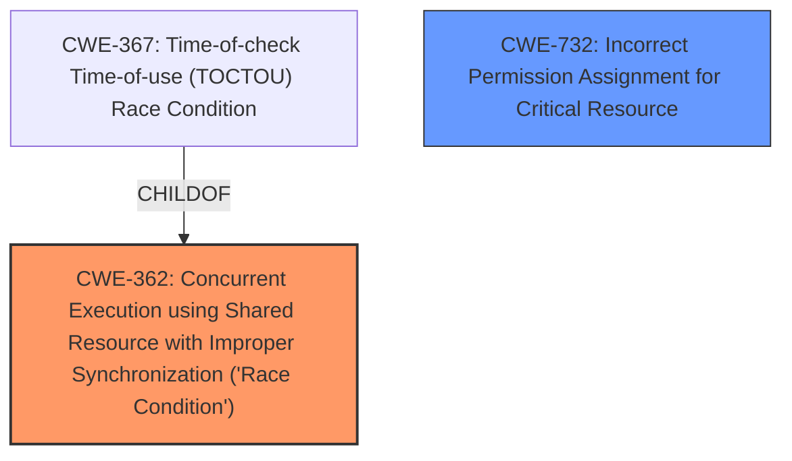

# Analysis Report for CVE-2025-26169

# Vulnerability Analysis Report: CVE-2025-26169

## Description

IXON VPN Client before 1.4.4 on Windows allows Local Privilege Escalation to SYSTEM because there is code execution from a configuration file that can be controlled by a low-privileged user. There is a **race condition** in which a temporary configuration file, in a world-writable directory, can be overwritten.

## Vulnerability Description Key Phrases

- **Rootcause:** race condition
- **Vector:** overwrite of temporary configuration file
- **Weakness:** code execution from configuration file
- **Product:** IXON VPN Client
- **Impact:** Local Privilege Escalation, Privilege Escalation to SYSTEM
- **Attacker:** low-privileged user
- **Version:** before 1.4.4

## Analysis (with Relationship Data)

# Summary

| CWE ID  | CWE Name                                                                                       | Confidence | CWE Abstraction Level | CWE Vulnerability Mapping Label | CWE-Vulnerability Mapping Notes |
| ------- | ---------------------------------------------------------------------------------------------- | ---------- | --------------------- | ------------------------------- | ------------------------------- |
| CWE-362 | Concurrent Execution using Shared Resource with Improper Synchronization ('Race Condition') | 0.9        | Class                 | Primary                         | Allowed-with-Review             |
| CWE-732 | Incorrect Permission Assignment for Critical Resource                                          | 0.7        | Class                 | Secondary                       | Allowed-with-Review             |

## Evidence and Confidence

*   **Confidence Score:** 0.8
*   **Evidence Strength:** MEDIUM

## Relationship Analysis

The primary relationship considered was the hierarchical structure of CWEs related to race conditions and privilege management. CWE-362, a Class-level CWE, represents the general concept of race conditions. CWE-367, a Base-level CWE, is a specific type of race condition (TOCTOU). While the description mentions a race condition, it doesn't explicitly specify a Time-of-Check Time-of-Use scenario. Therefore, CWE-362 is selected as the primary CWE. CWE-732 is related to incorrect permission assignments, which are relevant given the context of local privilege escalation, which is related to file permissions, which is related to privilege management.



## Vulnerability Chain

The vulnerability chain starts with a **race condition** (CWE-362) where a temporary configuration file in a world-writable directory can be overwritten. This leads to **code execution from the configuration file**, which ultimately results in a Local Privilege Escalation to SYSTEM. Since the temporary configuration file can be controlled by a low-privileged user, this indicates an **incorrect permission assignment for a critical resource** (CWE-732).

## Summary of Analysis

The initial analysis focused on identifying the root cause of the vulnerability based on the description. The description clearly states that there is a **race condition** in which a temporary configuration file can be overwritten, leading to code execution and privilege escalation.

The retriever results suggested CWE-362 (Concurrent Execution using Shared Resource with Improper Synchronization ('Race Condition')) and CWE-367 (Time-of-check Time-of-use (TOCTOU) Race Condition) as potential candidates. While CWE-367 is a more specific type of race condition, the description doesn't provide enough detail to confirm a TOCTOU scenario. Therefore, CWE-362 is a more appropriate choice. The fact that the configuration file is in a world-writable directory and can be controlled by a low-privileged user points to a permission issue, thus CWE-732 is included.

The selection of CWE-362 is based on the explicit mention of a **race condition** in the vulnerability description. The CWE definition aligns with the scenario where concurrent execution and improper synchronization lead to a vulnerability.

The selection of CWE-732 is based on the **code execution from configuration file** that can be controlled by a low-privileged user.

The selected CWEs are at the optimal level of specificity because they directly address the root cause (**race condition**) and the immediate consequence (**incorrect permission assignment**) that leads to the privilege escalation. Other CWEs considered, such as CWE-367, were either too specific or didn't fully capture the essence of the vulnerability.

Relevant CWE Information:

# Enhanced Context (25 CWEs)
The following CWEs were identified as potentially relevant to this vulnerability:

## CWE-266: Incorrect Privilege Assignment
**Abstraction Level**: Base
**Similarity Score**: 0.78
**Source**: dense

**Description**:
A product incorrectly assigns a privilege to a particular actor, creating an unintended sphere of control for that actor.

**Mapping Guidance**:
- Usage: Allowed
- Rationale: This CWE entry is at the Base level of abstraction, which is a preferred level of abstraction for mapping to the root causes of vulnerabilities.

*Rationale for not selecting*: While privilege escalation is the impact, the root cause is not a direct incorrect privilege assignment but a race condition that enables a low-privileged user to control a configuration file.

## CWE-267: Privilege Defined With Unsafe Actions
**Abstraction Level**: Base
**Similarity Score**: 0.77
**Source**: dense

**Description**:
A particular privilege, role, capability, or right can be used to perform unsafe actions that were not intended, even when it is assigned to the correct entity.

**Mapping Guidance**:
- Usage: Allowed
- Rationale: This CWE entry is at the Base level of abstraction, which is a preferred level of abstraction for mapping to the root causes of vulnerabilities.

*Rationale for not selecting*: This CWE does not match the vulnerability description.

## CWE-59: Improper Link Resolution Before File Access ('Link Following')
**Abstraction Level**: Base
**Similarity Score**: 0.76
**Source**: dense

**Description**:
The product attempts to access a file based on the filename, but it does not properly prevent that filename from identifying a link or shortcut that resolves to an unintended resource.

**Mapping Guidance**:
- Usage: Allowed
- Rationale: This CWE entry is at the Base level of abstraction, which is a preferred level of abstraction for mapping to the root causes of vulnerabilities.

*Rationale for not selecting*: This CWE does not match the vulnerability description.

## CWE-280: Improper Handling of Insufficient Permissions or Privileges 
**Abstraction Level**: Base
**Similarity Score**: 0.76
**Source**: dense

**Description**:
The product does not handle or incorrectly handles when it has insufficient privileges to access resources or functionality as specified by their permissions. This may cause it to follow unexpected code paths that may leave the product in an invalid state.

**Mapping Guidance**:
- Usage: Allowed
- Rationale: This CWE entry is at the Base level of abstraction, which is a preferred level of abstraction for mapping to the root causes of vulnerabilities.

*Rationale for not selecting*: The vulnerability isn't about handling insufficient privileges, but rather about exploiting a race condition to gain control over a configuration file.

## CWE-41: Improper Resolution of Path Equivalence
**Abstraction Level**: Base
**Similarity Score**: 0.75
**Source**: dense

**Description**:
The product is vulnerable to file system contents disclosure through path equivalence. Path equivalence involves the use of special characters in file and directory names. The associated manipulations are intended to generate multiple names for the same object.

**Mapping Guidance**:
- Usage: Allowed
- Rationale: This CWE entry is at the Base level of abstraction, which is a preferred level of abstraction for mapping to the root causes of vulnerabilities.

*Rationale for not selecting*: This CWE does not match the vulnerability description.

## CWE-274: Improper Handling of Insufficient Privileges
**Abstraction Level**: Base
**Similarity Score**: 0.75
**Source**: dense

**Description**:
The product does not handle or incorrectly handles when it has insufficient privileges to perform an operation, leading to resultant weaknesses.

**Mapping Guidance**:
- Usage: Discouraged
- Rationale: This CWE entry could be deprecated in a future version of CWE.

*Rationale for not selecting*: This CWE does not match the vulnerability description.

## CWE-754: Improper Check for Unusual or Exceptional Conditions
**Abstraction Level**: Class
**Similarity Score**: 0.75
**Source**: dense

**Description**:
The product does not check or incorrectly checks for unusual or exceptional conditions that are not expected to occur frequently during day to day operation of the product.

**Mapping Guidance**:
- Usage: Allowed-with-Review
- Rationale: This CWE entry is a Class and might have Base-level children that would be more appropriate

*Rationale for not selecting*: This is too generic. The root cause is a race condition, which is more specific.

## CWE-667: Improper Locking
**Abstraction Level**: Class
**Similarity Score**: 0.75
**Source**: dense

**Description**:
The product does not properly acquire or release a lock on a resource, leading to unexpected resource state changes and behaviors.

**Mapping Guidance**:
- Usage: Allowed-with-Review
- Rationale: This CWE entry is a Class and might have Base-level children that would be more appropriate

*Rationale for not selecting*: Improper Locking could result in a Race Condition, but the description identifies Race Condition as the root cause, so it is more appropriate to select that.

## CWE-367: Time-of-check Time-of-use (TOCTOU


## CWE Relationship Analysis

Current CWEs represent these abstraction levels: .


### Vulnerability Chain Analysis

**Chain starting from CWE-274:**
- 274 (Improper Handling of Insufficient Privileges) - ROOT


**Chain starting from CWE-280:**
- 280 (Improper Handling of Insufficient Permissions or Privileges ) - ROOT


### CWE Relationship Diagram

```mermaid
graph TD
    classDef primary fill:#f96,stroke:#333,stroke-width:2px
    classDef secondary fill:#69f,stroke:#333
    classDef tertiary fill:#9e9,stroke:#333
```


*Report generated on 2025-07-14 14:02:45*
