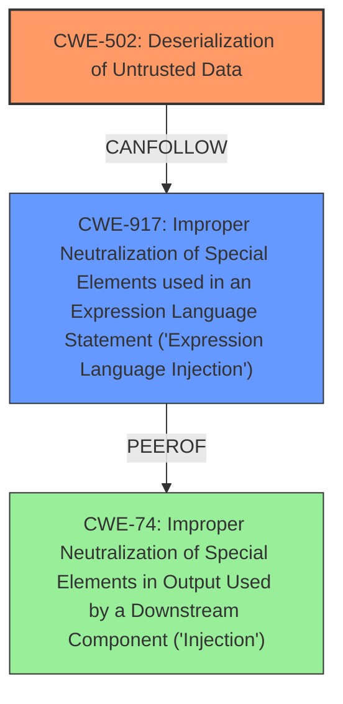

# Enhanced Analysis for CVE-2025-2622

# Summary

| CWE ID | CWE Name | Confidence | CWE Abstraction Level | CWE Vulnerability Mapping Label | CWE-Vulnerability Mapping Notes |
|---|---|---|---|---|---|
| CWE-502 | Deserialization of Untrusted Data | 1.0 | Base | Allowed | Primary CWE |
| CWE-917 | Improper Neutralization of Special Elements used in an Expression Language Statement ('Expression Language Injection') | 1.0 | Base | Allowed | Secondary Candidate |

## Evidence and Confidence

*   **Confidence Score:** 1.0
*   **Evidence Strength:** HIGH

## Relationship Analysis

The primary relationship that influenced the selection was the direct identification of **deserialization** in both the vulnerability description and the CVE summary. The secondary relationship was the SpEL injection, which can lead to code execution through deserialization.


## Vulnerability Chain

The vulnerability chain starts with **deserialization** of untrusted data (CWE-502), which then allows for SpEL injection (CWE-917), ultimately leading to remote code execution.

## Summary of Analysis

The primary focus is on **deserialization** as the root cause, supported by the vulnerability description's key phrases and the CVE summary. The evidence is strong, leading to high confidence.

The analysis relies heavily on the provided evidence, specifically:

*   "The manipulation of the argument nodeExpression leads to **deserialization**."
*   "The application is vulnerable to SpEL (Spring Expression Language) injection, leading to RCE (Remote Code Execution) due to the use of an unfiltered `StandardEvaluationContext`."

The graph relationships highlight how SpEL injection (CWE-917) can be a consequence of **deserialization** (CWE-502) when untrusted data is being deserialized.

CWE-502 is at the optimal level of specificity as it directly addresses the **deserialization** issue. CWE-917 is considered as a secondary CWE since the SpEL injection is a consequence of the **deserialization**.

Relevant CWE Information:

# Enhanced Context (25 CWEs)
The following CWEs were identified as potentially relevant to this vulnerability:

## CWE-917: Improper Neutralization of Special Elements used in an Expression Language Statement ('Expression Language Injection')
**Abstraction Level**: Base
**Similarity Score**: 0.77
**Source**: dense

**Description**:
The product constructs all or part of an expression language (EL) statement in a framework such as a Java Server Page (JSP) using externally-influenced input from an upstream component, but it does not neutralize or incorrectly neutralizes special elements that could modify the intended EL statement before it is executed.

**Mapping Guidance**:
- Usage: Allowed
- Rationale: This CWE entry is at the Base level of abstraction, which is a preferred level of abstraction for mapping to the root causes of vulnerabilities.

## CWE-116: Improper Encoding or Escaping of Output
**Abstraction Level**: Class

## CWE-502: Deserialization of Untrusted Data
**Abstraction Level**: Base
**Similarity Score**: 0.74
**Source**: dense

**Description**:
The product deserializes untrusted data without sufficiently ensuring that the resulting data will be valid.

**Mapping Guidance**:
- Usage: Allowed
- Rationale: This CWE entry is at the Base level of abstraction, which is a preferred level of abstraction for mapping to the root causes of vulnerabilities.

## CWE-74: Improper Neutralization of Special Elements in Output Used by a Downstream Component ('Injection')
**Abstraction Level**: Class

## CWE-294: Authentication Bypass by Capture-replay
**Abstraction Level**: Base

## CWE-79: Improper Neutralization of Input During Web Page Generation ('Cross-site Scripting')
**Abstraction Level**: Base

## CWE-93: Improper Neutralization of CRLF Sequences ('CRLF Injection')
**Abstraction Level**: Base

## CWE-80: Improper Neutralization of Script-Related HTML Tags in a Web Page (Basic XSS)
**Abstraction Level**: Variant

## CWE-138: Improper Neutralization of Special Elements
**Abstraction Level**: Class

## CWE-790: Improper Filtering of Special Elements
**Abstraction Level**: Class

## CWE-917: Improper Neutralization of Special Elements used in an Expression Language Statement ('Expression Language Injection')
**Abstraction Level**: Base
**Similarity Score**: 899.53
**Source**: sparse

**Description**:
The product constructs all or part of an expression language (EL) statement in a framework such as a Java Server Page (JSP) using externally-influenced input from an upstream component, but it does not neutralize or incorrectly neutralizes special elements that could modify the intended EL statement before it is executed.

**Mapping Guidance**:
- Usage: Allowed
- Rationale: This CWE entry is at the Base level of abstraction, which is a preferred level of abstraction for mapping to the root causes of vulnerabilities.

## CWE-89: Improper Neutralization of Special Elements used in an SQL Command ('SQL Injection')
**Abstraction Level**: Base

## CWE-1336: Improper Neutralization of Special Elements Used in a Template Engine
**Abstraction Level**: Base

## CWE-79: Improper Neutralization of Input During Web Page Generation ('Cross-site Scripting')
**Abstraction Level**: Base

## CWE-116: Improper Encoding or Escaping of Output
**Abstraction Level**: Class

## CWE-1336: Improper Neutralization of Special Elements Used in a Template Engine
**Abstraction Level**: base

## CWE-79: Improper Neutralization of Input During Web Page Generation ('Cross-site Scripting')
**Abstraction Level**: Base

## CWE-184: Incomplete List of Disallowed Inputs
**Abstraction Level**: Base

## CWE-434: Unrestricted Upload of File with Dangerous Type
**Abstraction Level**: Base

## CWE-78: Improper Neutralization of Special Elements used in an OS Command ('OS Command Injection')
**Abstraction Level**: base

## CWE-183: Permissive List of Allowed Inputs
**Abstraction Level**: base

## CWE-113: Improper Neutralization of CRLF Sequences in HTTP Headers ('HTTP Request/Response Splitting')
**Abstraction Level**: variant

## CWE-917: Improper Neutralization of Special Elements used in an Expression Language Statement ('Expression Language Injection')
**Abstraction Level**: Base

## CWE-94: Improper Control of Generation of Code ('Code Injection')
**Abstraction Level**: base

## CWE-306: Missing Authentication for Critical Function
**Abstraction Level**: base

### CWE Details:

*   **CWE-502 [Confidence: 1.0, Abstraction: Base, Usage: Allowed]:** The application deserializes untrusted data without proper validation, as evidenced by the vulnerability description. This allows for the injection of malicious SpEL expressions, leading to remote code execution.
*   **CWE-917 [Confidence: 1.0, Abstraction: Base, Usage: Allowed]:** The application uses an unfiltered `StandardEvaluationContext` to evaluate SpEL expressions, allowing attackers to inject malicious code.

### Considered but not used:

*   CWE-74, CWE-78, CWE-79, CWE-89, CWE-94, CWE-1336: These CWEs relate to other forms of injection, but the primary issue is the **deserialization** of untrusted data which then allows for SpEL injection. Therefore, these were considered less relevant as a primary classification.


## CWE Relationship Analysis

Current CWEs represent these abstraction levels: .


### Vulnerability Chain Analysis

**Chain starting from CWE-94:**
- 94 (Improper Control of Generation of Code ('Code Injection')) - ROOT


**Chain starting from CWE-93:**
- 93 (Improper Neutralization of CRLF Sequences ('CRLF Injection')) - ROOT


### CWE Relationship Diagram

```mermaid
graph TD
    classDef primary fill:#f96,stroke:#333,stroke-width:2px
    classDef secondary fill:#69f,stroke:#333
    classDef tertiary fill:#9e9,stroke:#333
```