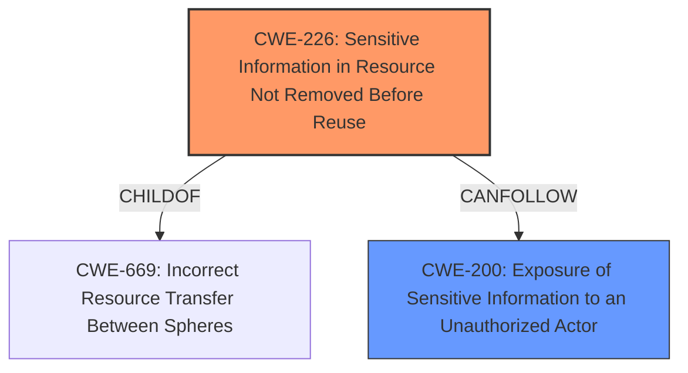

# Enhanced Analysis for CVE-2025-26263

# Summary
| CWE ID | CWE Name | Confidence | CWE Abstraction Level | CWE Vulnerability Mapping Label | CWE-Vulnerability Mapping Notes |
|---|---|---|---|---|---|
| CWE-226 | Sensitive Information in Resource Not Removed Before Reuse | 0.8 | Base | Allowed | Primary CWE - Root cause is **improper memory handling** resulting in credentials disclosure |
| CWE-200 | Exposure of Sensitive Information to an Unauthorized Actor | 0.6 | Class | Discouraged | Secondary CWE - Impact is sensitive information exposure, but this is a high-level class. |

## Evidence and Confidence

*   **Confidence Score:** 0.7
*   **Evidence Strength:** MEDIUM

## Relationship Analysis
The primary relationship that influenced the decision was the parent-child relationship. CWE-226 is at the Base level of abstraction, making it a more suitable choice than its parent classes. CWE-200 was also considered, but is discouraged as it represents the impact rather than the root cause.



## Vulnerability Chain
The vulnerability chain starts with **improper memory handling** (CWE-226), which leads to the disclosure of credentials, resulting in exposure of sensitive information (CWE-200).

## Summary of Analysis
The initial assessment focused on the **improper memory handling** as the root cause leading to credentials disclosure. The primary CWE selected, CWE-226, directly addresses the **failure to remove sensitive information before reuse**, which aligns with the vulnerability description stating **improper memory handling** led to credentials being exposed. CWE-200 was considered due to the impact of credentials disclosure. However, CWE-200 is a high-level class representing the impact of the vulnerability rather than the root cause. The final decision favors CWE-226 for its specific description of the memory handling issue and its base abstraction level.

The vulnerability description states: "GeoVision ASManager Windows desktop application with the version 6.1.2.0 or less (fixed in 6.2.0), is vulnerable to credentials disclosure due to **improper memory handling** in the ASManagerService.exe process." This statement and the **Vulnerability Description Key Phrases** entry stating "**rootcause:** **improper memory handling**" directly supports the root cause assessment.

Relevant CWE Information:

# Enhanced Context (25 CWEs)

## CWE-497: Exposure of Sensitive System Information to an Unauthorized Control Sphere
**Abstraction Level**: Base
**Similarity Score**: 0.73

## CWE-1391: Use of Weak Credentials
**Abstraction Level**: Class
**Similarity Score**: 0.72

## CWE-212: Improper Removal of Sensitive Information Before Storage or Transfer
**Abstraction Level**: Base
**Similarity Score**: 0.72

## CWE-522: Insufficiently Protected Credentials
**Abstraction Level**: Class
**Similarity Score**: 0.71

## CWE-668: Exposure of Resource to Wrong Sphere
**Abstraction Level**: Class
**Similarity Score**: 0.71

## CWE-200: Exposure of Sensitive Information to an Unauthorized Actor
**Abstraction Level**: Class
**Similarity Score**: 0.71

## CWE-798: Use of Hard-coded Credentials
**Abstraction Level**: Base
**Similarity Score**: 0.70

## CWE-472: External Control of Assumed-Immutable Web Parameter
**Abstraction Level**: Base
**Similarity Score**: 0.70

## CWE-266: Incorrect Privilege Assignment
**Abstraction Level**: Base
**Similarity Score**: 0.70

## CWE-303: Incorrect Implementation of Authentication Algorithm
**Abstraction Level**: Base
**Similarity Score**: 0.70

## CWE-732: Incorrect Permission Assignment for Critical Resource
**Abstraction Level**: Class
**Similarity Score**: 773.11

## CWE-200: Exposure of Sensitive Information to an Unauthorized Actor
**Abstraction Level**: Class
**Similarity Score**: 769.40

## CWE-119: Improper Restriction of Operations within the Bounds of a Memory Buffer
**Abstraction Level**: Class
**Similarity Score**: 756.82

## CWE-269: Improper Privilege Management
**Abstraction Level**: Class
**Similarity Score**: 752.62

## CWE-125: Out-of-bounds Read
**Abstraction Level**: Base
**Similarity Score**: 738.23

## CWE-226: Sensitive Information in Resource Not Removed Before Reuse
**Abstraction Level**: base
**Similarity Score**: 4.33

**Description**:
CWE-226: Sensitive Information in Resource Not Removed Before Reuse

**Mapping Guidance**:
- Usage: Allowed
- Rationale: This CWE entry is at the Base level of abstraction, which is a preferred level of abstraction for mapping to the root causes of vulnerabilities.

**Relationships**:
- PARENTOF -> CWE-244
- PARENTOF -> CWE-1342
- PARENTOF -> CWE-1301
- PARENTOF -> CWE-1272
- PARENTOF -> CWE-1239

## CWE-201: Insertion of Sensitive Information Into Sent Data
**Abstraction Level**: base
**Similarity Score**: 4.33

## CWE-125: Out-of-bounds Read
**Abstraction Level**: base
**Similarity Score**: 3.89

## CWE-787: Out-of-bounds Write
**Abstraction Level**: base
**Similarity Score**: 3.30

## CWE-212: Improper Removal of Sensitive Information Before Storage or Transfer
**Abstraction Level**: Base
**Similarity Score**: 2.88

## CWE-822: Untrusted Pointer Dereference
**Abstraction Level**: base
**Similarity Score**: 2.87

## CWE-823: Use of Out-of-range Pointer Offset
**Abstraction Level**: base
**Similarity Score**: 2.87

## CWE-824: Access of Uninitialized Pointer
**Abstraction Level**: base
**Similarity Score**: 2.87

## CWE-825: Expired Pointer Dereference
**Abstraction Level**: base
**Similarity Score**: 2.87

## CWE-190: Integer Overflow or Wraparound
**Abstraction Level**: base
**Similarity Score**: 2.87

### Analysis of other CWEs Considered but not Used:

*   **CWE-119: Improper Restriction of Operations within the Bounds of a Memory Buffer**: While **improper memory handling** might suggest a buffer overflow, the description focuses on the presence of sensitive data in memory rather than an overflow condition. Therefore, CWE-119 is less appropriate.
*   **CWE-200: Exposure of Sensitive Information to an Unauthorized Actor**: This CWE describes the impact of the vulnerability (credentials disclosure) rather than the root cause (**improper memory handling**).
*   **CWE-787: Out-of-bounds Write**: Similar to CWE-119, this relates to memory corruption, which isn't the core issue described.
*   **CWE-125: Out-of-bounds Read**: Similar to CWE-119 and CWE-787, this relates to memory corruption, which isn't the core issue described.
*   **CWE-732: Incorrect Permission Assignment for Critical Resource**: This CWE focuses on incorrect permission assignments. While the vulnerability allows unauthorized access to resources after exploitation, the initial cause is related to **improper memory handling** rather than a permission issue.


## CWE Relationship Analysis

Current CWEs represent these abstraction levels: .


### Vulnerability Chain Analysis

**Chain starting from CWE-226:**
- 226 (Sensitive Information in Resource Not Removed Before Reuse) - ROOT


**Chain starting from CWE-125:**
- 125 (Out-of-bounds Read) - ROOT


### CWE Relationship Diagram

```mermaid
graph TD
    classDef primary fill:#f96,stroke:#333,stroke-width:2px
    classDef secondary fill:#69f,stroke:#333
    classDef tertiary fill:#9e9,stroke:#333
```