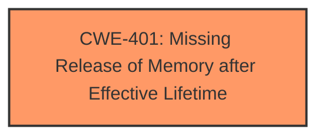

# Enhanced Analysis for CVE-2025-26310

# Summary
| CWE ID | CWE Name | Confidence | CWE Abstraction Level | CWE Vulnerability Mapping Label | CWE-Vulnerability Mapping Notes |
|---|---|---|---|---|---|
| CWE-401 | Missing Release of Memory after Effective Lifetime | 1.0 | Variant | Allowed | Primary CWE. The vulnerability is a **memory leak** due to the failure to release allocated memory. |

## Evidence and Confidence

*   **Confidence Score:** 1.0
*   **Evidence Strength:** HIGH

## Relationship Analysis
The primary CWE is CWE-401, which is a variant. No other relationships appear to be relevant based on the available information.



## Vulnerability Chain
The vulnerability chain consists of a **missing memory release**, which leads to a **memory leak**, and finally results in a **denial of service**.

## Summary of Analysis
The analysis indicates a clear **memory leak** vulnerability due to the failure to release allocated memory. The vulnerability description explicitly states that **multiple memory leaks** have been identified. The CVE reference links content summary confirms that memory is allocated but not freed, leading to resource exhaustion and denial of service.

The Retriever Results also lists CWE-401 as the top candidate.

CWE-125 (Out-of-bounds Read) was considered, but it does not match the vulnerability description as there is no indication of out-of-bounds reads.
CWE-789 (Memory Allocation with Excessive Size Value) was also considered, but the description indicates a memory leak, not excessive allocation size.
CWE-770 (Allocation of Resources Without Limits or Throttling) might appear relevant because of the resource exhaustion, but the root cause is the memory leak, not the lack of limits on resource allocation.

The selected CWE, CWE-401, is at the optimal level of specificity (Variant) as it directly describes the **missing release of memory** that leads to the vulnerability.


## CWE Relationship Analysis

Current CWEs represent these abstraction levels: .


### Vulnerability Chain Analysis

**Chain starting from CWE-789:**
- 789 (Memory Allocation with Excessive Size Value) - ROOT


**Chain starting from CWE-401:**
- 401 (Missing Release of Memory after Effective Lifetime) - ROOT


### CWE Relationship Diagram

```mermaid
graph TD
    classDef primary fill:#f96,stroke:#333,stroke-width:2px
    classDef secondary fill:#69f,stroke:#333
    classDef tertiary fill:#9e9,stroke:#333
```