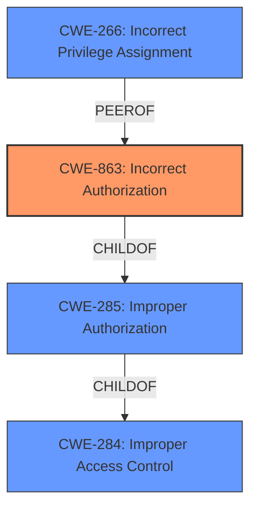

# Enhanced Analysis for CVE-2025-26393

# Summary

| CWE ID  | CWE Name                                        | Confidence | CWE Abstraction Level | CWE Vulnerability Mapping Label | CWE-Vulnerability Mapping Notes |
| :------- | :---------------------------------------------- | :--------- | :-------------------- | :------------------------------ | :------------------------------ |
| CWE-863 | Incorrect Authorization                         | 0.95       | Class                 | Primary CWE                     | Allowed-with-Review           |
| CWE-266 | Incorrect Privilege Assignment                  | 0.70       | Base                  | Secondary Candidate             | Allowed                       |
| CWE-285 | Improper Authorization                         | 0.60       | Class                 | Secondary Candidate             | Discouraged                    |

## Evidence and Confidence

*   **Confidence Score:** 0.90
*   **Evidence Strength:** HIGH

## Relationship Analysis

The primary weakness is **CWE-863 (Incorrect Authorization)**. The vulnerability description explicitly states "broken access control" and the CVE Reference Links Content Summary indicates that "Unauthorized authenticated requesters can override ticket states". This aligns with **CWE-863**, where authorization checks are performed, but are done incorrectly. While **CWE-285 (Improper Authorization)** is a broader class encompassing incorrect authorization, **CWE-863** is more specific, indicating a flawed authorization logic, making it a more appropriate choice. Another considered CWE was **CWE-266 (Incorrect Privilege Assignment)** which is a base level CWE, because the description mentions privilege escalation by authenticated users.



## Vulnerability Chain

The vulnerability chain starts with **broken access control**, specifically **incorrect authorization** (**CWE-863**). This leads to authenticated users being able to escalate privileges, ultimately resulting in unauthorized data manipulation.

Incorrect Authorization (CWE-863) -> Privilege Escalation -> Unauthorized Data Manipulation

## Summary of Analysis

The initial analysis focused on identifying the root cause of the **broken access control** vulnerability. The evidence clearly points to **CWE-863 (Incorrect Authorization)** as the primary weakness.

The vulnerability description states: "SolarWinds Service Desk is affected by a **broken access control** vulnerability. The issue allows authenticated users to escalate privileges, leading to unauthorized data manipulation."

The CVE Reference Links Content Summary states: "**Root cause of vulnerability:** Unauthorized authenticated requesters can override ticket states. **Weaknesses/vulnerabilities present:** Broken Access Control. **Impact of exploitation:** Potentially redirecting ticket flows and changing process behavior. **Required attacker capabilities/position:** Unauthorized authenticated requesters."

The CWE guidance explicitly states that "CWE-863: Incorrect Authorization – the application checks authorization, but does it incorrectly (e.g., flawed logic)." This aligns perfectly with the vulnerability description, where authenticated users are able to perform actions they should not be authorized to do, due to flawed authorization checks.

**CWE-284 (Improper Access Control)** was considered but deemed too general, as the issue is specifically related to incorrect authorization logic. While **CWE-285 (Improper Authorization)** is a parent of **CWE-863**, **CWE-863** provides a more specific classification.

The selected CWEs are at the optimal level of specificity, with **CWE-863** being a Class-level CWE that accurately represents the vulnerability.

Relevant CWE Information:

# Enhanced Context (25 CWEs)
The following CWEs were identified as potentially relevant to this vulnerability:

## CWE-266: Incorrect Privilege Assignment
**Abstraction Level**: Base
**Similarity Score**: 0.75
**Source**: dense

**Description**:
A product incorrectly assigns a privilege to a particular actor, creating an unintended sphere of control for that actor.

**Mapping Guidance**:
- Usage: Allowed
- Rationale: This CWE entry is at the Base level of abstraction, which is a preferred level of abstraction for mapping to the root causes of vulnerabilities.

Technical explanation: While privilege escalation is mentioned in the description, the root cause lies in the incorrect authorization that allows users to escalate privileges in the first place. If the system incorrectly assigns privileges (e.g., assigning admin privileges to a regular user), then **CWE-266** would be a better fit.

## CWE-267: Privilege Defined With Unsafe Actions
**Abstraction Level**: Base
**Similarity Score**: 0.74
**Source**: dense

**Description**:
A particular privilege, role, capability, or right can be used to perform unsafe actions that were not intended, even when it is assigned to the correct entity.

**Mapping Guidance**:
- Usage: Allowed
- Rationale: This CWE entry is at the Base level of abstraction, which is a preferred level of abstraction for mapping to the root causes of vulnerabilities.

Technical explanation: This CWE is not suitable because it focuses on situations where a correctly assigned privilege allows unintended unsafe actions, whereas the provided vulnerability centers on incorrect authorization leading to privilege escalation.

## CWE-280: Improper Handling of Insufficient Permissions or Privileges
**Abstraction Level**: Base
**Similarity Score**: 0.74
**Source**: dense

**Description**:
The product does not handle or incorrectly handles when it has insufficient privileges to access resources or functionality as specified by their permissions. This may cause it to follow unexpected code paths that may leave the product in an invalid state.

**Mapping Guidance**:
- Usage: Allowed
- Rationale: This CWE entry is at the Base level of abstraction, which is a preferred level of abstraction for mapping to the root causes of vulnerabilities.

Technical explanation: This CWE is less suitable than **CWE-863** because it focuses on insufficient privileges, whereas the vulnerability involves users gaining excessive privileges due to incorrect authorization.

## CWE-274: Improper Handling of Insufficient Privileges
**Abstraction Level**: Base
**Similarity Score**: 0.73
**Source**: dense

**Description**:
The product does not handle or incorrectly handles when it has insufficient privileges to perform an operation, leading to resultant weaknesses.

**Mapping Guidance**:
- Usage: Discouraged
- Rationale: This CWE entry could be deprecated in a future version of CWE.

Technical explanation: Similar to **CWE-280**, this CWE focuses on insufficient privileges, making it less relevant than **CWE-863** for the reported vulnerability.

## CWE-668: Exposure of Resource to Wrong Sphere
**Abstraction Level**: Class
**Similarity Score**: 0.73
**Source**: dense

**Description**:
The product exposes a resource to the wrong control sphere, providing unintended actors with inappropriate access to the resource.

**Mapping Guidance**:
- Usage: Discouraged
- Rationale: CWE-668 is high-level and is often misused as a catch-all when lower-level CWE IDs might be applicable. It is sometimes used for low-information vulnerability reports [REF-1287]. It is a level-1 Class (i.e., a child of a Pillar). It is not useful for trend analysis.

Technical explanation: This CWE is too general and doesn't capture the specific nature of the **incorrect authorization** vulnerability.

## CWE-41: Improper Resolution of Path Equivalence
**Abstraction Level**: Base
**Similarity Score**: 0.72
**Source**: dense

**Description**:
The product is vulnerable to file system contents disclosure through path equivalence. Path equivalence involves the use of special characters in file and directory names. The associated manipulations are intended to generate multiple names for the same object.

**Mapping Guidance**:
- Usage: Allowed
- Rationale: This CWE entry is at the Base level of abstraction, which is a preferred level of abstraction for mapping to the root causes of vulnerabilities.

Technical explanation: This CWE is not relevant as it deals with file system path manipulation, which is unrelated to the described vulnerability.

## CWE-59: Improper Link Resolution Before File Access ('Link Following')
**Abstraction Level**: Base
**Similarity Score**: 0.71
**Source**: dense

**Description**:
The product attempts to access a file based on the filename, but it does not properly prevent that filename from identifying a link or shortcut that resolves to an unintended resource.

**Mapping Guidance**:
- Usage: Allowed
- Rationale: This CWE entry is at the Base level of abstraction, which is a preferred level of abstraction for mapping to the root causes of vulnerabilities.

Technical explanation: This CWE is not relevant as it deals with improper handling of symbolic links, which is unrelated to the described vulnerability.


## CWE Relationship Analysis

Current CWEs represent these abstraction levels: .


### Vulnerability Chain Analysis

**Chain starting from CWE-274:**
- 274 (Improper Handling of Insufficient Privileges) - ROOT


**Chain starting from CWE-863:**
- 863 (Incorrect Authorization) - ROOT


### CWE Relationship Diagram

```mermaid
graph TD
    classDef primary fill:#f96,stroke:#333,stroke-width:2px
    classDef secondary fill:#69f,stroke:#333
    classDef tertiary fill:#9e9,stroke:#333
```