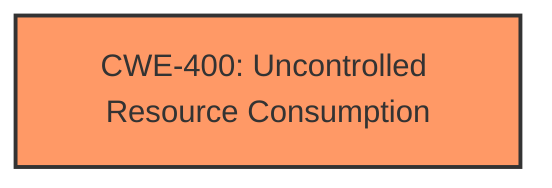

# Analysis Report for CVE-2025-26481

# Vulnerability Analysis Report: CVE-2025-26481

## Description

Dell PowerScale OneFS, versions 9.4.0.0 through 9.9.0.0, contains an **uncontrolled resource consumption** vulnerability. A remote unprivileged attacker could potentially exploit this vulnerability, leading to denial of service.

## Vulnerability Description Key Phrases

- **Rootcause:** uncontrolled resource consumption
- **Impact:** denial of service
- **Attacker:** remote unprivileged attacker
- **Product:** Dell PowerScale OneFS
- **Version:** 9.4.0.0 through 9.9.0.0

## Analysis (with Relationship Data)

# Summary
| CWE ID | CWE Name | Confidence | CWE Abstraction Level | CWE Vulnerability Mapping Label | CWE-Vulnerability Mapping Notes |
|---|---|---|---|---|---|
| CWE-400 | Uncontrolled Resource Consumption | 1.0 | Class | Allowed-with-Review | Primary CWE. The vulnerability is due to uncontrolled resource consumption, leading to denial of service. |

## Evidence and Confidence

*   **Confidence Score:** 1.0
*   **Evidence Strength:** HIGH

## Relationship Analysis
The primary CWE is CWE-400 (Uncontrolled Resource Consumption), a Class-level CWE. While there are no direct child CWEs that are immediately applicable based on the provided information, it's important to note that CWE-400 is a high-level category. The relationships show that CWE-400 can be caused by several other CWEs, but without further information, it is the most accurate classification.



## Vulnerability Chain
The vulnerability chain is straightforward:
1.  **Root Cause:** **Uncontrolled Resource Consumption** (CWE-400)
2.  **Impact:** Denial of Service

## Summary of Analysis
The vulnerability description clearly states that the root cause is **uncontrolled resource consumption**, which directly leads to a denial-of-service condition. The "CVE Reference Links Content Summary" confirms this. The retriever results also list CWE-400 as the top candidate. The evidence is strong and directly supports the classification of CWE-400 as the primary weakness.

Relevant CWE Information:

# Enhanced Context (25 CWEs)
The following CWEs were identified as potentially relevant to this vulnerability:

## CWE-400: Uncontrolled Resource Consumption
**Abstraction Level**: Class
**Similarity Score**: 0.74
**Source**: dense

**Description**:
The product does not properly control the allocation and maintenance of a limited resource, thereby enabling an actor to influence the amount of resources consumed, eventually leading to the exhaustion of available resources.

**Mapping Guidance**:
- Usage: Discouraged
- Rationale: CWE-400 is intended for incorrect behaviors in which the product is expected to track and restrict how many resources it consumes, but CWE-400 is often misused because it is conflated with the "technical impact" of vulnerabilities in which resource consumption occurs. It is sometimes used for low-information vulnerability reports. It is a level-1 Class (i.e., a child of a Pillar).

**CWEs Considered but Not Used:**

*   **CWE-834: Excessive Iteration:** While excessive iteration can lead to resource consumption, the description doesn't specify iteration as the cause.
*   **CWE-772: Missing Release of Resource after Effective Lifetime:** The description doesn't mention a missing resource release.
*   **CWE-1176: Inefficient CPU Computation:** The description doesn't mention inefficient computation.
*   **CWE-770: Allocation of Resources Without Limits or Throttling:** This is closely related, but CWE-400 is a better fit since it's more general.
*   **CWE-1333: Inefficient Regular Expression Complexity:** This is not relevant to the vulnerability description.
*   **CWE-789: Memory Allocation with Excessive Size Value:** This is not directly indicated in the description.
*   **CWE-410: Insufficient Resource Pool:** This could be related, but the primary issue is the uncontrolled consumption, not the size of the pool.

The decision to use CWE-400 is based on the evidence that the **uncontrolled resource consumption** is the **root cause** of the denial of service.


## CWE Relationship Analysis

Current CWEs represent these abstraction levels: .


### Vulnerability Chain Analysis

**Chain starting from CWE-1176:**
- 1176 (Inefficient CPU Computation) - ROOT


**Chain starting from CWE-400:**
- 400 (Uncontrolled Resource Consumption) - ROOT


### CWE Relationship Diagram

```mermaid
graph TD
    classDef primary fill:#f96,stroke:#333,stroke-width:2px
    classDef secondary fill:#69f,stroke:#333
    classDef tertiary fill:#9e9,stroke:#333
```


*Report generated on 2025-07-14 14:16:36*
