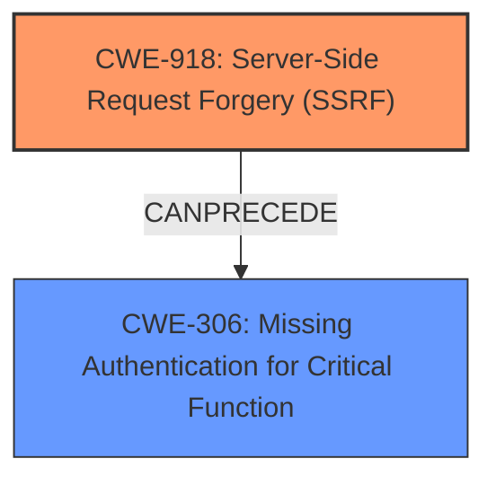

# Raw Analyzer Response for CVE-2025-26494

# Summary
| CWE ID | CWE Name | Confidence | CWE Abstraction Level | CWE Vulnerability Mapping Label | CWE-Vulnerability Mapping Notes |
|---|---|---|---|---|---|
| CWE-918 | Server-Side Request Forgery (SSRF) | 0.9 | Base | Primary CWE | Allowed |
| CWE-306 | Missing Authentication for Critical Function | 0.6 | Base | Secondary Candidate | Allowed |

## Evidence and Confidence

*   **Confidence Score:** 0.75
*   **Evidence Strength:** MEDIUM

## Relationship Analysis
The primary relationship is that of root cause to impact. The **Server-Side Request Forgery** (SSRF) vulnerability (CWE-918) allows for Authentication Bypass (CWE-306). In this case, the **Server-Side Request Forgery** can lead to bypassing authentication, so it can be considered the root cause. CWE-918 is a base level CWE and is preferred. CWE-306 is a base level CWE and is preferred.

## Vulnerability Chain
The vulnerability chain starts with the **Server-Side Request Forgery** (CWE-918), which then leads to the **Authentication Bypass** (CWE-306). The **Server-Side Request Forgery** is the root cause of the chain, and the **Authentication Bypass** is the impact.

## Summary of Analysis
The initial analysis identified CWE-918 as the primary CWE due to the **Server-Side Request Forgery** being the root cause. The secondary CWE is CWE-306, which is the impact of the vulnerability. The graph relationships show that CWE-918 can precede CWE-306. The selection of CWE-918 is at the optimal level of specificity because it is a base level CWE and is the root cause of the vulnerability.

The vulnerability description clearly states a **Server-Side Request Forgery** (SSRF) vulnerability leading to Authentication Bypass.

# Enhanced Context (25 CWEs)
The following CWEs were identified as potentially relevant to this vulnerability:

## CWE-303: Incorrect Implementation of Authentication Algorithm
**Abstraction Level**: Base
**Similarity Score**: 0.76

## CWE-918: Server-Side Request Forgery (SSRF)
**Abstraction Level**: Base
**Similarity Score**: 0.75
**Source**: dense

**Description**:
The web server receives a URL or similar request from an upstream component and retrieves the contents of this URL, but it does not sufficiently ensure that the request is being sent to the expected destination.

**Mapping Guidance**:
- Usage: Allowed
- Rationale: This CWE entry is at the Base level of abstraction, which is a preferred level of abstraction for mapping to the root causes of vulnerabilities.

## CWE-602: Client-Side Enforcement of Server-Side Security
**Abstraction Level**: Class
**Similarity Score**: 0.74

## CWE-807: Reliance on Untrusted Inputs in a Security Decision
**Abstraction Level**: Base
**Similarity Score**: 0.74

## CWE-294: Authentication Bypass by Capture-replay
**Abstraction Level**: Base
**Similarity Score**: 0.74

## CWE-472: External Control of Assumed-Immutable Web Parameter
**Abstraction Level**: Base
**Similarity Score**: 0.74

## CWE-212: Improper Removal of Sensitive Information Before Storage or Transfer
**Abstraction Level**: Base
**Similarity Score**: 0.74

## CWE-668: Exposure of Resource to Wrong Sphere
**Abstraction Level**: Class
**Similarity Score**: 0.74

## CWE-288: Authentication Bypass Using an Alternate Path or Channel
**Abstraction Level**: Base
**Similarity Score**: 0.74

## CWE-74: Improper Neutralization of Special Elements in Output Used by a Downstream Component ('Injection')
**Abstraction Level**: Class
**Similarity Score**: 0.74

## CWE-639: Authorization Bypass Through User-Controlled Key
**Abstraction Level**: Base
**Similarity Score**: 1160.13

## CWE-863: Incorrect Authorization
**Abstraction Level**: Class
**Similarity Score**: 1149.63

## CWE-285: Improper Authorization
**Abstraction Level**: Class
**Similarity Score**: 1127.43

## CWE-113: Improper Neutralization of CRLF Sequences in HTTP Headers ('HTTP Request/Response Splitting')
**Abstraction Level**: Variant
**Similarity Score**: 1114.21

## CWE-306: Missing Authentication for Critical Function
**Abstraction Level**: Base
**Similarity Score**: 1109.69

**Description**:
The product does not perform any authentication for functionality that requires a provable user identity or consumes a significant amount of resources.

**Mapping Guidance**:
- Usage: Allowed
- Rationale: This CWE entry is at the Base level of abstraction, which is a preferred level of abstraction for mapping to the root causes of vulnerabilities.

## CWE-93: Improper Neutralization of CRLF Sequences ('CRLF Injection')
**Abstraction Level**: base
**Similarity Score**: 4.33

## CWE-117: Improper Output Neutralization for Logs
**Abstraction Level**: base
**Similarity Score**: 4.33

## CWE-79: Improper Neutralization of Input During Web Page Generation ('Cross-site Scripting')
**Abstraction Level**: base
**Similarity Score**: 2.91

## CWE-611: Improper Restriction of XML External Entity Reference
**Abstraction Level**: base
**Similarity Score**: 2.77

## CWE-1275: Sensitive Cookie with Improper SameSite Attribute
**Abstraction Level**: variant
**Similarity Score**: 2.55

## CWE-601: URL Redirection to Untrusted Site ('Open Redirect')
**Abstraction Level**: base
**Similarity Score**: 2.40

## CWE-306: Missing Authentication for Critical Function
**Abstraction Level**: base
**Similarity Score**: 2.33

## CWE-941: Incorrectly Specified Destination in a Communication Channel
**Abstraction Level**: base
**Similarity Score**: 2.33

## CWE-471: Modification of Assumed-Immutable Data (MAID)
**Abstraction Level**: base
**Similarity Score**: 2.21

## CWE-113: Improper Neutralization of CRLF Sequences in HTTP Headers ('HTTP Request/Response Splitting')
**Abstraction Level**: variant
**Similarity Score**: 2.16

Relevant CWE Information:

### CWE-918: Server-Side Request Forgery (SSRF)
* Technical Explanation: The vulnerability description explicitly mentions "Server-Side Request Forgery (SSRF)". This aligns directly with the definition of CWE-918, where the server retrieves the contents of a URL without sufficient validation, potentially leading to unintended consequences.
* Security Implications: An attacker could exploit this vulnerability to make the server send requests to internal or external systems, potentially exposing sensitive data or performing unauthorized actions.
* Relationship Analysis: CWE-918 is a root cause that can lead to other vulnerabilities like information disclosure or remote code execution.
* Mapping Guidance: The Usage is "Allowed" and the Rationale states it is at the Base level of abstraction, which is preferred.

### CWE-306: Missing Authentication for Critical Function
* Technical Explanation: The vulnerability description mentions "Authentication Bypass". This aligns with CWE-306, where critical functionality lacks proper authentication mechanisms.
* Security Implications: Without authentication, attackers can directly access and manipulate critical functions, leading to unauthorized actions and data breaches.
* Relationship Analysis: CWE-306 is often a consequence of other vulnerabilities or misconfigurations, such as SSRF.
* Mapping Guidance: The Usage is "Allowed" and the Rationale states it is at the Base level of abstraction, which is preferred.

### Other CWEs Considered But Not Used:

* CWE-611: While SSRF can sometimes involve XML External Entity (XXE) injection, the description doesn't specifically mention XML or entities, making CWE-611 less applicable.
* CWE-89, CWE-93, CWE-113, CWE-601: These CWEs represent different types of injection vulnerabilities, but the description doesn't provide enough details to support their inclusion. The root cause appears to be an SSRF vulnerability, not a specific type of injection.
* CWE-352: This CWE describes Cross-Site Request Forgery (CSRF). There is no mention of CSRF in the description, and therefore it is not applicable.

I am overriding the retriever results and focusing on the root cause, which is the SSRF (