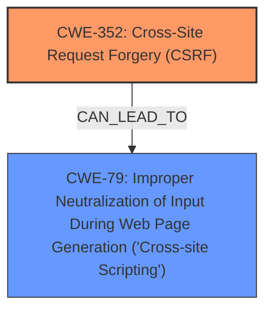

# Analysis for CVE-2025-26569

# Summary
| CWE ID | CWE Name | Confidence | CWE Abstraction Level | CWE Vulnerability Mapping Label | CWE-Vulnerability Mapping Notes |
|---|---|---|---|---|---|
| CWE-352 | Cross-Site Request Forgery (CSRF) | 0.9 | Compound | Allowed | Primary CWE |
| CWE-79 | Improper Neutralization of Input During Web Page Generation ('Cross-site Scripting') | 0.9 | Base | Allowed | Secondary Candidate |

## Evidence and Confidence

*   **Confidence Score:** 0.9
*   **Evidence Strength:** HIGH

## Relationship Analysis
The primary identified weakness is CWE-352, Cross-Site Request Forgery (CSRF), which is a compound weakness. A successful CSRF attack can lead to further vulnerabilities such as CWE-79, Improper Neutralization of Input During Web Page Generation ('Cross-site Scripting'). The relationship between CSRF and XSS is that CSRF can be a means to inject malicious scripts if the application doesn't properly validate requests and neutralizes inputs.

## Vulnerability Chain
The vulnerability chain starts with **CWE-352: Cross-Site Request Forgery (CSRF)**, where the application fails to properly verify the origin of requests. This allows an attacker to potentially perform actions on behalf of an authenticated user. A consequence of this could be the injection of malicious scripts via stored XSS, leading to **CWE-79: Improper Neutralization of Input During Web Page Generation ('Cross-site Scripting')**.

## Summary of Analysis
The vulnerability description indicates a **Cross-Site Request Forgery** (CSRF) vulnerability leading to Stored **XSS**. The key phrases highlight CSRF as the root cause and XSS as the weakness, impacting the Post Thumbs plugin. The retriever results also suggest CWE-79 and CWE-352 as the top candidates.

Given the information, the primary weakness is **CWE-352: Cross-Site Request Forgery (CSRF)** because the vulnerability description specifically mentions CSRF as the root cause. The **XSS** is a consequence of the CSRF, where an attacker can potentially inject malicious scripts because the application doesn't sufficiently verify the origin of the requests.

**CWE-79: Improper Neutralization of Input During Web Page Generation ('Cross-site Scripting')** is considered a secondary weakness, as it is a consequence of the CSRF. If the application properly neutralized input, the CSRF may not have resulted in stored XSS.

The selected CWEs are at the optimal level of specificity as they directly address the identified root cause (CSRF) and the subsequent weakness (XSS).

Relevant CWE Information:
*   **CWE-352: Cross-Site Request Forgery (CSRF)** - The web application does not sufficiently verify whether a well-formed, valid, consistent request was intentionally provided by the user who submitted the request.
*   **CWE-79: Improper Neutralization of Input During Web Page Generation ('Cross-site Scripting')** - The product does not neutralize or incorrectly neutralizes user-controllable input before it is placed in output that is used as a web page that is served to other users.