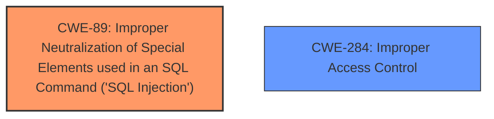

# Raw Analyzer Response for CVE-2025-26606

# Summary
| CWE ID | CWE Name | Confidence | CWE Abstraction Level | CWE Vulnerability Mapping Label | CWE-Vulnerability Mapping Notes |
|---|---|---|---|---|---|
| CWE-89 | Improper Neutralization of Special Elements used in an SQL Command ('SQL Injection') | 1.0 | Base | Allowed | Primary CWE. The vulnerability occurs due to the lack of input validation in the `informacao_adicional.php` endpoint, leading to SQL injection. |
| CWE-284 | Improper Access Control | 0.5 | Base | Allowed | Secondary CWE. The CVE Reference Links Content Summary mentions Improper Access Control. |

## Evidence and Confidence

*   **Confidence Score:** 0.9
*   **Evidence Strength:** HIGH

## Relationship Analysis
The primary relationship impacting the decision is the direct match of the vulnerability description to the CWE-89 description. CWE-89 is a base level CWE, which is the preferred level of abstraction.
The inclusion of CWE-284 is less certain.

## Vulnerability Chain
The vulnerability chain starts with the **lack of input validation** in the `informacao_adicional.php` endpoint. This leads to **SQL injection**, which allows an attacker to **execute arbitrary SQL queries** and gain **unauthorized access to sensitive information**.
- Root Cause: Lack of input validation
- Weakness: SQL Injection (CWE-89)
- Impact: Unauthorized access to sensitive information

## Summary of Analysis
The primary weakness is clearly **SQL Injection** due to the **lack of input validation** on the `id_descricao` parameter in the `informacao_adicional.php` endpoint. The CVE Reference Links Content Summary confirms this, stating that the code directly uses user-supplied input in an SQL query without sanitization. This aligns perfectly with the description of CWE-89. The impact, as described, is unauthorized access to sensitive information.
The retriever results strongly support CWE-89 as the primary weakness.
CWE-284, Improper Access Control, is mentioned in the CVE Reference Links Content Summary, supporting its inclusion, although the evidence is not as strong as for CWE-89.

The selection of CWE-89 is at the optimal level of specificity, as it is a base-level CWE that directly addresses the root cause of the vulnerability.

Relevant CWE Information:

# Enhanced Context (25 CWEs)
The following CWEs were identified as potentially relevant to this vulnerability:

## CWE-89: Improper Neutralization of Special Elements used in an SQL Command ('SQL Injection')
**Abstraction Level**: Base
**Similarity Score**: 0.73
**Source**: dense

**Description**:
The product constructs all or part of an SQL command using externally-influenced input from an upstream component, but it does not neutralize or incorrectly neutralizes special elements that could modify the intended SQL command when it is sent to a downstream component. Without sufficient removal or quoting of SQL syntax in user-controllable inputs, the generated SQL query can cause those inputs to be interpreted as SQL instead of ordinary user data.

**Mapping Guidance**:
- Usage: Allowed
- Rationale: This CWE entry is at the Base level of abstraction, which is a preferred level of abstraction for mapping to the root causes of vulnerabilities.