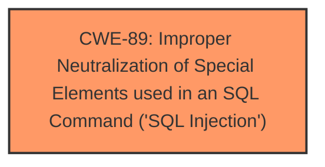

# Analysis for CVE-2025-26607

# Summary
| CWE ID | CWE Name | Confidence | CWE Abstraction Level | CWE Vulnerability Mapping Label | CWE-Vulnerability Mapping Notes |
|---|---|---|---|---|---|
| CWE-89 | Improper Neutralization of Special Elements used in an SQL Command ('SQL Injection') | 1.0 | Base | Allowed | Primary CWE. The application **does not neutralize** special elements in user input used in an SQL command. |

## Evidence and Confidence

*   **Confidence Score:** 1.0
*   **Evidence Strength:** HIGH

## Relationship Analysis
The primary relationship that influenced the decision was the direct match of the vulnerability description to the CWE-89 description. The vulnerability description specifically mentions "SQL Injection" and the analysis of CVE-2025-26607 mentions that the root cause is a lack of validation of user input for the `id_funcionario` parameter, leading to SQL injection. The abstraction level of Base is appropriate as it directly reflects the **root cause** of the vulnerability.

## Vulnerability Chain
The vulnerability chain starts with the **lack of proper input validation** of the `id_funcionario` parameter in the `documento_excluir.php` endpoint, which leads to the execution of arbitrary SQL queries. This allows unauthorized access to sensitive information, and potentially allows for a denial-of-service attack.

## Summary of Analysis
The analysis is based on the provided evidence. The vulnerability description clearly states that there is a **SQL injection** vulnerability in the WeGIA application. The analysis of CVE-2025-26607 confirms that the root cause is the lack of validation of user input in the `documento_excluir.php` endpoint. This directly aligns with CWE-89, which describes the improper neutralization of special elements used in an SQL command. The evidence is sufficient and the CWE is at the optimal level of specificity.

Relevant CWE Information:

# Enhanced Context (25 CWEs)
The following CWEs were identified as potentially relevant to this vulnerability:

## CWE-89: Improper Neutralization of Special Elements used in an SQL Command ('SQL Injection')
**Abstraction Level**: Base
**Similarity Score**: 0.73
**Source**: dense

**Description**:
The product constructs all or part of an SQL command using externally-influenced input from an upstream component, but it **does not neutralize** or incorrectly neutralizes special elements that could modify the intended SQL command when it is sent to a downstream component. Without sufficient removal or quoting of SQL syntax in user-controllable inputs, the generated SQL query can cause those inputs to be interpreted as SQL instead of ordinary user data.

**Mapping Guidance**:
- Usage: Allowed
- Rationale: This CWE entry is at the Base level of abstraction, which is a preferred level of abstraction for mapping to the root causes of vulnerabilities.