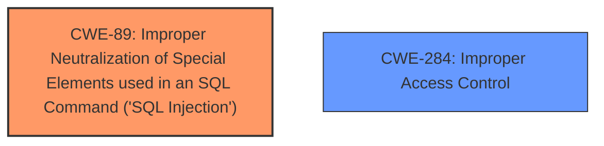

# Raw Analyzer Response for CVE-2025-26608

# Summary
| CWE ID | CWE Name | Confidence | CWE Abstraction Level | CWE Vulnerability Mapping Label | CWE-Vulnerability Mapping Notes |
|---|---|---|---|---|---|
| CWE-89 | Improper Neutralization of Special Elements used in an SQL Command ('SQL Injection') | 1.0 | Base | Primary | Allowed |
| CWE-284 | Improper Access Control | 0.7 | Base | Secondary | Allowed |

## Evidence and Confidence

*   **Confidence Score:** 0.9
*   **Evidence Strength:** HIGH

## Relationship Analysis
The primary relationship to consider is that CWE-89 [Improper Neutralization of Special Elements used in an SQL Command ('SQL Injection')] is a **root cause** vulnerability. This means it describes the fundamental flaw in the code that allows for the exploitation. CWE-284 [Improper Access Control] is also considered a secondary related weakness. CWE-89 is at the Base level, which is the preferred level of abstraction.

## Vulnerability Chain
The vulnerability chain starts with the **lack of input validation** in the `dependente_docdependente.php` endpoint, leading to **SQL injection**. This allows an **attacker to execute arbitrary SQL queries**, potentially leading to **unauthorized access to sensitive information**, **DoS attacks**, and even **arbitrary file uploads**. The root cause is CWE-89 [Improper Neutralization of Special Elements used in an SQL Command ('SQL Injection')], and the impact includes unauthorized access to data and potential system compromise.

## Summary of Analysis
The analysis strongly supports CWE-89 [Improper Neutralization of Special Elements used in an SQL Command ('SQL Injection')] as the primary CWE. The key phrases "SQL injection vulnerability" and "execute arbitrary SQL queries" in the Vulnerability Description, coupled with the root cause analysis in the CVE Reference Links Content Summary, directly align with CWE-89. The evidence clearly indicates that the application **does not properly neutralize** special elements in SQL commands. The retriever results also list CWE-89 as the top candidate. CWE-284 [Improper Access Control] is a secondary concern due to the vulnerability being exploitable without authentication.

I considered other CWEs from the **Complete CWE Specifications**, but they are not as directly relevant:

*   CWE-79 [Improper Neutralization of Input During Web Page Generation ('Cross-site Scripting')] is not applicable because the vulnerability is not related to web page generation or XSS.
*   CWE-434 [Unrestricted Upload of File with Dangerous Type] is a potential impact, but not the root cause.
*   CWE-209 [Generation of Error Message Containing Sensitive Information] is not mentioned in the description.
*   CWE-1336 [Improper Neutralization of Special Elements Used in a Template Engine] is not applicable as the application is not using a template engine.
*   CWE-502 [Deserialization of Untrusted Data] is not applicable because deserialization is not involved.
*   CWE-116 [Improper Encoding or Escaping of Output] is related to neutralization, but less specific than CWE-89.
*   CWE-201 [Insertion of Sensitive Information Into Sent Data] is not applicable because the data is not intentionally sent.
*   CWE-94 [Improper Control of Generation of Code ('Code Injection')] is not the root cause.
*   CWE-138 [Improper Neutralization of Special Elements] is too general.
*   CWE-863 [Incorrect Authorization] is related to access control, but less direct than CWE-89.

Therefore, CWE-89 is the most accurate and specific representation of the vulnerability based on the provided evidence. CWE-284 is a related issue.

Relevant CWE Information:

# Enhanced Context (25 CWEs)
The following CWEs were identified as potentially relevant to this vulnerability:

## CWE-89: Improper Neutralization of Special Elements used in an SQL Command ('SQL Injection')
**Abstraction Level**: Base
**Similarity Score**: 0.72
**Source**: dense

**Description**:
The product constructs all or part of an SQL command using externally-influenced input from an upstream component, but it **does not neutralize** or incorrectly neutralizes special elements that could modify the intended SQL command when it is sent to a downstream component. Without sufficient removal or quoting of SQL syntax in user-controllable inputs, the generated SQL query can cause those inputs to be interpreted as SQL instead of ordinary user data.

**Mapping Guidance**:
- Usage: Allowed
- Rationale: This CWE entry is at the Base level of abstraction, which is a preferred level of abstraction for mapping to the root causes of vulnerabilities.