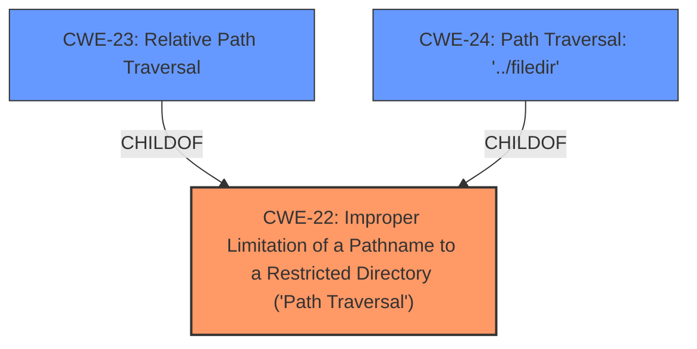

# Raw Analyzer Response for CVE-2025-26615

# Summary
| CWE ID | CWE Name | Confidence | CWE Abstraction Level | CWE Vulnerability Mapping Label | CWE-Vulnerability Mapping Notes |
|---|---|---|---|---|---|
| CWE-22 | Improper Limitation of a Pathname to a Restricted Directory ('Path Traversal') | 1.0 | Base | Allowed | Primary CWE. The vulnerability is caused by **improper limitation of a pathname** to a restricted directory. |

## Evidence and Confidence

*   **Confidence Score:** 1.0
*   **Evidence Strength:** HIGH

## Relationship Analysis
The primary CWE is CWE-22, which is a base level CWE. There are child CWEs like CWE-23 (Relative Path Traversal) and CWE-24 (Path Traversal: '../filedir'). However, CWE-22 is the most appropriate because the description doesn't explicitly mention relative path traversal, just path traversal in general.

## Vulnerability Chain
The vulnerability chain starts with **improper validation** of the `src` parameter in `examples.php`, leading to a **Path Traversal vulnerability**, which results in **Sensitive Information Disclosure** (access to `config.php`), potentially leading to **Database Takeover** and other system information disclosure, and ultimately potential SSH access.

## Summary of Analysis
The vulnerability is a **Path Traversal vulnerability** in the WeGIA application, specifically in the `examples.php` endpoint. The root cause is the **improper validation** of the `src` parameter, allowing an attacker to access sensitive information stored in `config.php`. This aligns directly with CWE-22, "Improper Limitation of a Pathname to a Restricted Directory ('Path Traversal')".

The evidence from the CVE Reference Links Content Summary clearly points to a path traversal issue: "Improper validation of the `src` parameter in the `examples.php` endpoint." and "Path Traversal (CWE-22, CWE-284)". The impact of the vulnerability is also well-defined: "Sensitive Information Disclosure: An attacker can read `config.php`, potentially exposing database login credentials.".

CWE-22 is the most specific and appropriate CWE based on the provided information. The retriever results also list CWE-22 as the top result with a high score.

CWE-23 (Relative Path Traversal) was considered, but the description doesn't specifically focus on relative path traversal, so the parent, CWE-22, is more appropriate.