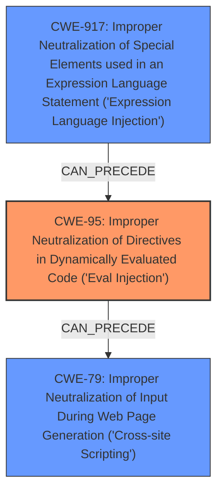

# Analysis Report for CVE-2025-26619

# Vulnerability Analysis Report: CVE-2025-26619

## Description

Vega is a visualization grammar, a declarative format for creating, saving, and sharing interactive visualization designs. In `vega` 5.30.0 and lower and in `vega-functions` 5.15.0 and lower , **it was possible to call JavaScript functions from the Vega expression language that were not meant to be supported**. The issue is patched in `vega` `5.31.0` and `vega-functions` `5.16.0`. Some workarounds are available. Run `vega` without `vega.expressionInterpreter`. This mode is not the default as it is slower. Alternatively, using the interpreter described in CSP safe mode (Content Security Policy) prevents arbitrary Javascript from running, so users of this mode are not affected by this vulnerability.

## Vulnerability Description Key Phrases

- **Rootcause:** it was possible to call JavaScript functions from the Vega expression language that were not meant to be supported
- **Impact:** arbitrary Javascript from running
- **Product:** vega
- **Version:** ['5.30.0 and lower', '5.31.0']

## Analysis (with Relationship Data)

# Summary
| CWE ID | CWE Name | Confidence | CWE Abstraction Level | CWE Vulnerability Mapping Label | CWE-Vulnerability Mapping Notes |
|---|---|---|---|---|---|
| CWE-95 | Improper Neutralization of Directives in Dynamically Evaluated Code ('Eval Injection') | 0.8 | Variant | Allowed | Primary CWE. The vulnerability allows calling Javascript functions that were not meant to be supported, which directly aligns with the 'Eval Injection' concept where input is used in dynamic evaluation. |
| CWE-79 | Improper Neutralization of Input During Web Page Generation ('Cross-site Scripting') | 0.7 | Base | Allowed | Secondary CWE. The ability to execute arbitrary Javascript code in the context of the user's browser aligns with the impact of XSS. |
| CWE-917 | Improper Neutralization of Special Elements used in an Expression Language Statement ('Expression Language Injection') | 0.6 | Base | Allowed | Secondary CWE. The Vega expression language allows calling functions without proper sanitization, which is a form of expression language injection. |

## Evidence and Confidence

*   **Confidence Score:** 0.7
*   **Evidence Strength:** MEDIUM

## Relationship Analysis
The primary weakness is CWE-95, which is a variant. CWE-79 and CWE-917 are related as they both describe issues where improper neutralization leads to unintended code execution. CWE-95 is a specific type of code injection. CWE-79 ('Cross-site Scripting') describes the impact of the vulnerability, and CWE-917 ('Expression Language Injection') describes how the injection occurs.



## Vulnerability Chain
The vulnerability chain begins with the **improper neutralization** of Javascript functions, leading to **'Eval Injection'** (CWE-95). This allows for the execution of arbitrary Javascript code in the user's browser, which manifests as **Cross-site Scripting (XSS)** (CWE-79). The improper neutralization can also be seen as an **Expression Language Injection** (CWE-917).

## Summary of Analysis
The vulnerability allows the calling of arbitrary Javascript functions in Vega, which leads to the execution of arbitrary Javascript code in the context of the user's browser. This is a classic case of **'Eval Injection'** (CWE-95), as the Vega expression language does not properly neutralize the input, allowing for the execution of unintended code. The evidence lies in the "**it was possible to call JavaScript functions from the Vega expression language that were not meant to be supported**" phrase. The impact of this vulnerability is Cross-site Scripting (XSS), as an attacker can inject malicious Javascript code into the user's browser. This can be classified as CWE-79. The ability to call functions without proper sanitization can be viewed as an Expression Language Injection (CWE-917). The selection of CWE-95 as the primary weakness is based on the root cause, while CWE-79 and CWE-917 are based on the impact and mechanism, respectively.

CWE-674 (Uncontrolled Recursion), CWE-1333 (Inefficient Regular Expression Complexity), CWE-863 (Incorrect Authorization), CWE-94 (Improper Control of Generation of Code ('Code Injection')), CWE-138 (Improper Neutralization of Special Elements), CWE-624 (Executable Regular Expression Error), and CWE-184 (Incomplete List of Disallowed Inputs) were considered but not selected. CWE-674 and CWE-1333 are not relevant to the vulnerability. CWE-863 is not relevant because there is no mention of authorization issues. CWE-94 is similar to CWE-95 but is more general and less specific. CWE-138 is too broad and doesn't fit the specific context of the vulnerability. CWE-624 and CWE-184 are not applicable to the vulnerability.


## CWE Relationship Analysis

Current CWEs represent these abstraction levels: .


### Vulnerability Chain Analysis

**Chain starting from CWE-863:**
- 863 (Incorrect Authorization) - ROOT


**Chain starting from CWE-94:**
- 94 (Improper Control of Generation of Code ('Code Injection')) - ROOT


### CWE Relationship Diagram

```mermaid
graph TD
    classDef primary fill:#f96,stroke:#333,stroke-width:2px
    classDef secondary fill:#69f,stroke:#333
    classDef tertiary fill:#9e9,stroke:#333
```


*Report generated on 2025-07-14 14:31:19*
