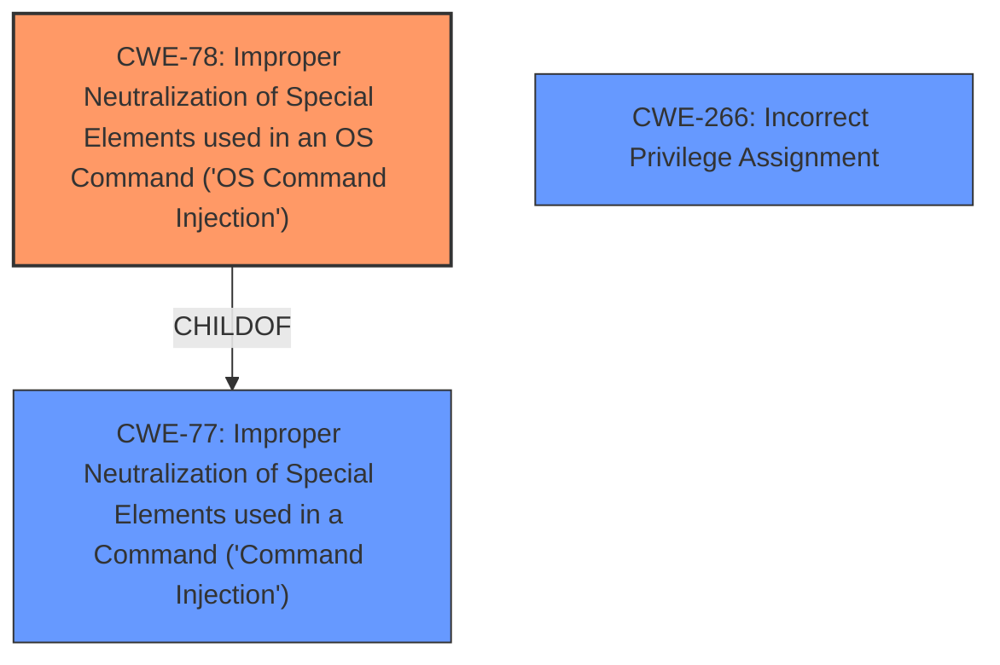

# Analysis Report for CVE-2025-26627

# Vulnerability Analysis Report: CVE-2025-26627

## Description

**Improper neutralization of special elements** used in a command (**command injection**) in Azure Arc allows an authorized attacker to elevate privileges locally.

## Vulnerability Description Key Phrases

- **Rootcause:** Improper neutralization of special elements
- **Weakness:** command injection
- **Impact:** elevate privileges
- **Attacker:** authorized attacker
- **Product:** Azure Arc

## Analysis (with Relationship Data)

# Summary
| CWE ID | CWE Name | Confidence | CWE Abstraction Level | CWE Vulnerability Mapping Label | CWE-Vulnerability Mapping Notes |
|---|---|---|---|---|---|
| CWE-78 | Improper Neutralization of Special Elements used in an OS Command ('OS Command Injection') | 1.0 | Base | Allowed | Primary CWE. The vulnerability description explicitly mentions "Improper neutralization of special elements used in a command (command injection)" |
| CWE-266 | Incorrect Privilege Assignment | 0.4 | Base | Allowed | Secondary candidate. The description mentions "elevate privileges locally" which could indicate a privilege assignment issue. |

## Evidence and Confidence

*   **Confidence Score:** 0.7
*   **Evidence Strength:** MEDIUM

## Relationship Analysis
The primary CWE, CWE-78, is a base level CWE, which is preferred. It is a child of CWE-77, which is a Class level CWE. CWE-78 directly addresses the vulnerability of OS Command Injection. CWE-266 relates due to the privilege escalation but is not the root cause.



## Vulnerability Chain
The vulnerability chain starts with the **improper neutralization of special elements**, leading to **command injection**, and ultimately resulting in the ability to "elevate privileges locally".
  - CWE-78: **Improper Neutralization of Special Elements used in an OS Command ('OS Command Injection')** - Root cause is the **improper neutralization**.
  - Privilege Escalation: Elevate privileges locally

## Summary of Analysis
The vulnerability description explicitly states "**Improper neutralization of special elements** used in a command (**command injection**)" and the Retriever Results also suggest CWE-78 as a strong candidate. The description also mentions "elevate privileges locally". Given this information, CWE-78 is the most appropriate primary CWE. I considered CWE-266 because of the privilege escalation, but the root cause is the command injection. The evidence is not strong enough to support an additional CWE.

Relevant CWE Information:

# Enhanced Context (25 CWEs)
The following CWEs were identified as potentially relevant to this vulnerability:

## CWE-266: Incorrect Privilege Assignment
**Abstraction Level**: Base
**Similarity Score**: 0.76
**Source**: dense

**Description**:
A product incorrectly assigns a privilege to a particular actor, creating an unintended sphere of control for that actor.

**Mapping Guidance**:
- Usage: Allowed
- Rationale: This CWE entry is at the Base level of abstraction, which is a preferred level of abstraction for mapping to the root causes of vulnerabilities.

## CWE-78: Improper Neutralization of Special Elements used in an OS Command ('OS Command Injection')
**Abstraction Level**: base
**Similarity Score**: 4.33
**Source**: graph

**Description**:
CWE-78: Improper Neutralization of Special Elements used in an OS Command ('OS Command Injection')

**Mapping Guidance**:
- Usage: Allowed
- Rationale: This CWE entry is at the Base level of abstraction, which is a preferred level of abstraction for mapping to the root causes of vulnerabilities.


## CWE Relationship Analysis

Current CWEs represent these abstraction levels: .


### Vulnerability Chain Analysis

**Chain starting from CWE-266:**
- 266 (Incorrect Privilege Assignment) - ROOT


**Chain starting from CWE-77:**
- 77 (Improper Neutralization of Special Elements used in a Command ('Command Injection')) - ROOT


### CWE Relationship Diagram

```mermaid
graph TD
    classDef primary fill:#f96,stroke:#333,stroke-width:2px
    classDef secondary fill:#69f,stroke:#333
    classDef tertiary fill:#9e9,stroke:#333
```


*Report generated on 2025-07-14 14:32:34*
