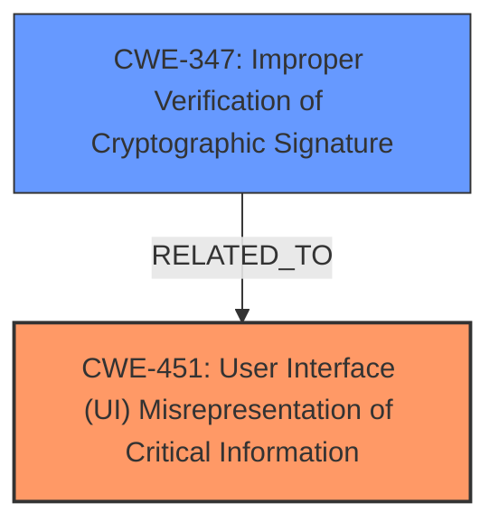

# Analysis Report for CVE-2025-26696

# Vulnerability Analysis Report: CVE-2025-26696

## Description

Certain crafted MIME email messages that claimed to contain an encrypted OpenPGP message, which instead contained an OpenPGP signed message, were wrongly shown as being encrypted. This vulnerability affects Thunderbird < 136 and Thunderbird < 128.8.

## Vulnerability Description Key Phrases

- **Vector:** crafted MIME email messages
- **Product:** Thunderbird
- **Version:** < 136 and < 128.8

## Analysis (with Relationship Data)

# Summary
| CWE ID | CWE Name | Confidence | CWE Abstraction Level | CWE Vulnerability Mapping Label | CWE-Vulnerability Mapping Notes |
|---|---|---|---|---|---|
| CWE-451 | User Interface (UI) Misrepresentation of Critical Information | 0.9 | Class | Allowed-with-Review | Primary CWE. The crafted email messages are **misrepresented** as encrypted when they are only signed. |
| CWE-347 | Improper Verification of Cryptographic Signature | 0.6 | Base | Allowed | Secondary candidate. The **improper verification** could be a contributing factor, but the main issue is the misrepresentation in the UI. |

## Evidence and Confidence

*   **Confidence Score:** 0.8
*   **Evidence Strength:** MEDIUM

## Relationship Analysis
The primary relationship that influenced the decision was the direct match of CWE-451 to the vulnerability description, specifically the "wrongly shown as being encrypted" aspect. While CWE-347 was considered due to the cryptographic nature of the issue, the evidence points more strongly to a UI misrepresentation problem than a signature verification failure. CWE-451 is a Class, and a more specific Base CWE would be preferred if one existed for UI misrepresentation of security status.



## Vulnerability Chain
The chain of events is as follows:
1.  A crafted MIME email message is created that claims to be encrypted but is actually signed.
2.  The Thunderbird application fails to correctly interpret the message type.
3.  The user interface **misrepresents** the message as encrypted.

The root cause is the **improper handling** of the MIME message type, leading to the **misrepresentation** in the UI.

## Summary of Analysis
The primary CWE identified is CWE-451, which accurately describes the vulnerability where the user interface **misrepresents** the email message as encrypted when it is only signed. The evidence for this is directly from the CVE description: "Certain crafted MIME email messages that claimed to contain an encrypted OpenPGP message, which instead contained an OpenPGP signed message, were wrongly shown as being encrypted."

CWE-347 was considered because the vulnerability involves cryptographic signatures. However, the description focuses on the **misrepresentation** of the message status in the UI rather than a failure in signature verification itself. Therefore, CWE-451 is the more appropriate choice.

The selected CWE is at the Class level. While a more specific Base CWE would be preferable, none of the provided options fit the vulnerability description as accurately as CWE-451.

Relevant CWE Information:

# Enhanced Context (25 CWEs)
The following CWEs were identified as potentially relevant to this vulnerability:

## CWE-610: Externally Controlled Reference to a Resource in Another Sphere
**Abstraction Level**: Class
**Similarity Score**: 0.69
**Source**: dense

**Description**:
The product uses an externally controlled name or reference that resolves to a resource that is outside of the intended control sphere.

**Mapping Guidance**:
- Usage: Discouraged
- Rationale: This CWE entry is a level-1 Class (i.e., a child of a Pillar). It might have lower-level children that would be more appropriate

*Not Used:* This CWE doesn't fit the vulnerability description as it does not involve external control of resources.

## CWE-451: User Interface (UI) Misrepresentation of Critical Information
**Abstraction Level**: Class
**Similarity Score**: 0.67
**Source**: dense

**Description**:
The user interface (UI) does not properly represent critical information to the user, allowing the information - or its source - to be obscured or spoofed. This is often a component in phishing attacks.

**Mapping Guidance**:
- Usage: Allowed-with-Review
- Rationale: This CWE entry is a Class and might have Base-level children that would be more appropriate

*Used:* This CWE accurately describes the vulnerability, where the UI **misrepresents** the email message as encrypted when it is only signed.

## CWE-346: Origin Validation Error
**Abstraction Level**: Class
**Similarity Score**: 0.66
**Source**: dense

**Description**:
The product does not properly verify that the source of data or communication is valid.

**Mapping Guidance**:
- Usage: Allowed-with-Review
- Rationale: This CWE entry is a Class and might have Base-level children that would be more appropriate

*Not Used:* This CWE is not applicable, as the issue is not with origin validation.

## CWE-319: Cleartext Transmission of Sensitive Information
**Abstraction Level**: Base
**Similarity Score**: 0.66
**Source**: dense

**Description**:
The product transmits sensitive or security-critical data in cleartext in a communication channel that can be sniffed by unauthorized actors.

**Mapping Guidance**:
- Usage: Allowed
- Rationale: This CWE entry is at the Base level of abstraction, which is a preferred level of abstraction for mapping to the root causes of vulnerabilities.

*Not Used:* The email is not necessarily transmitted in cleartext, as it is signed.

## CWE-311: Missing Encryption of Sensitive Data
**Abstraction Level**: Class
**Similarity Score**: 0.66
**Source**: dense

**Description**:
The product does not encrypt sensitive or critical information before storage or transmission.

**Mapping Guidance**:
- Usage: Discouraged
- Rationale: CWE-311 is high-level with more precise children available. It is a level-1 Class (i.e., a child of a Pillar).

*Not Used:* The issue is not that the data is unencrypted but that it's **misrepresented** as encrypted.

## CWE-347: Improper Verification of Cryptographic Signature
**Abstraction Level**: Base
**Similarity Score**: 0.65
**Source**: dense

**Description**:
The product does not verify, or incorrectly verifies, the cryptographic signature for data.

**Mapping Guidance**:
- Usage: Allowed
- Rationale: This CWE entry is at the Base level of abstraction, which is a preferred level of abstraction for mapping to the root causes of vulnerabilities.

*Used as Secondary:* While signature verification might be related, the main issue is the **misrepresentation** in the UI, not a direct failure to verify the signature.

## CWE-941: Incorrectly Specified Destination in a Communication Channel
**Abstraction Level**: Base
**Similarity Score**: 0.65
**Source**: dense

**Description**:
The product creates a communication channel to initiate an outgoing request to an actor, but it does not correctly specify the intended destination for that actor.

**Mapping Guidance**:
- Usage: Allowed
- Rationale: This CWE entry is at the Base level of abstraction, which is a preferred level of abstraction for mapping to the root causes of vulnerabilities.

*Not Used:* This is not related to the described vulnerability.

## CWE-203: Observable Discrepancy
**Abstraction Level**: Base
**Similarity Score**: 0.65
**Source**: dense

**Description**:
The product behaves differently or sends different responses under different circumstances in a way that is observable to an unauthorized actor, which exposes security-relevant information about the state of the product, such as whether a particular operation was successful or not.

**Mapping Guidance**:
- Usage: Allowed
- Rationale: This CWE entry is at the Base level of abstraction, which is a preferred level of abstraction for mapping to the root causes of vulnerabilities.

*Not Used:* While there is a discrepancy in the UI, CWE-451 more accurately describes the issue.

## CWE-116: Improper Encoding or Escaping of Output
**Abstraction Level**: Class
**Similarity Score**: 0.64
**Source**: dense

**Description**:
The product prepares a structured message for communication with another component, but encoding or escaping of the data is either missing or done incorrectly. As a result, the intended structure of the message is not preserved.

**Mapping Guidance**:
- Usage: Allowed-with-Review
- Rationale: This CWE entry is a Class and might have Base-level children that would be more appropriate

*Not Used:* This is not related to the described vulnerability.

## CWE-923: Improper Restriction of Communication Channel to Intended Endpoints
**Abstraction Level**: Class
**Similarity Score**: 0.64
**Source**: dense

**Description**:
The product establishes a communication channel to (or from) an endpoint for privileged or protected operations, but it does not properly ensure that it is communicating with the correct endpoint.

**Mapping Guidance**:
- Usage: Allowed-with-Review
- Rationale: This CWE entry is a Class and might have Base-level children that would be more appropriate

*Not Used:* This is not related to the described vulnerability.

## CWE-327: Use of


## CWE Relationship Analysis

Current CWEs represent these abstraction levels: .


### Vulnerability Chain Analysis

**Chain starting from CWE-610:**
- 610 (Externally Controlled Reference to a Resource in Another Sphere) - ROOT


**Chain starting from CWE-203:**
- 203 (Observable Discrepancy) - ROOT


### CWE Relationship Diagram

```mermaid
graph TD
    classDef primary fill:#f96,stroke:#333,stroke-width:2px
    classDef secondary fill:#69f,stroke:#333
    classDef tertiary fill:#9e9,stroke:#333
```


*Report generated on 2025-07-14 14:39:13*
