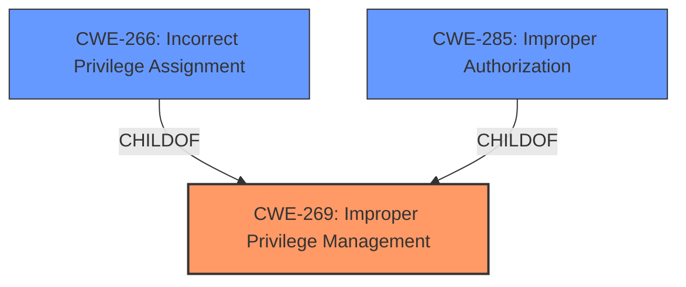

# Analysis for CVE-2025-26704

# Summary
| CWE ID | CWE Name | Confidence | CWE Abstraction Level | CWE Vulnerability Mapping Label | CWE-Vulnerability Mapping Notes |
|---|---|---|---|---|---|
| CWE-269 | Improper Privilege Management | 0.9 | Class | Primary | Discouraged |
| CWE-266 | Incorrect Privilege Assignment | 0.7 | Base | Secondary | Allowed |
| CWE-285 | Improper Authorization | 0.6 | Class | Secondary | Discouraged |

## Evidence and Confidence

*   **Confidence Score:** 0.8
*   **Evidence Strength:** MEDIUM

## Relationship Analysis
The primary CWE is CWE-269, which is a Class-level CWE. While it's generally discouraged to use Class-level CWEs, in this case, the description explicitly mentions **Improper Privilege Management**, making it a reasonable starting point. However, it's important to consider more specific Base-level CWEs. CWE-266, Incorrect Privilege Assignment, is a child of CWE-269 and offers more granularity by focusing on the assignment aspect. CWE-285, Improper Authorization, while also a child of a higher-level class, represents a different facet of access control failures, namely, incorrect checks, rather than management itself. The relationships influence the decision by allowing for movement from a high level class to a more detailed base class.

## Vulnerability Chain
The vulnerability chain starts with **Improper Privilege Management** (CWE-269) which leads to Privilege Escalation. A more specific cause might be **Incorrect Privilege Assignment** (CWE-266) or **Improper Authorization** (CWE-285). The final impact is Privilege Escalation, but this is the effect, not the cause.

## Summary of Analysis
The initial assessment based on the vulnerability description key phrases points to **Improper Privilege Management** (CWE-269) as the root cause. The description explicitly states this weakness.

The evidence is based on the "Vulnerability Description Key Phrases" section, which highlights "**rootcause: Improper Privilege Management**". This indicates a problem in how privileges are managed within the ZTE GoldenDB software.

CWE-269 is selected as the primary CWE because it aligns directly with the provided root cause: "**Improper Privilege Management**". However, it's a Class-level CWE and the mapping guidance discourages its use when more specific Base-level CWEs are available.

CWE-266 (Incorrect Privilege Assignment) and CWE-285 (Improper Authorization) were considered as more specific alternatives. While "Privilege Escalation" is the impact, the root cause is more likely related to how privileges are assigned or managed initially.

The final decision to include CWE-266 and CWE-285 as secondary considerations, along with CWE-269, acknowledges that the available information is limited. Further investigation would be needed to pinpoint the exact mechanism of the **Improper Privilege Management**.

Relevant CWE Information:
*   CWE-269: Improper Privilege Management
*   CWE-266: Incorrect Privilege Assignment
*   CWE-285: Improper Authorization