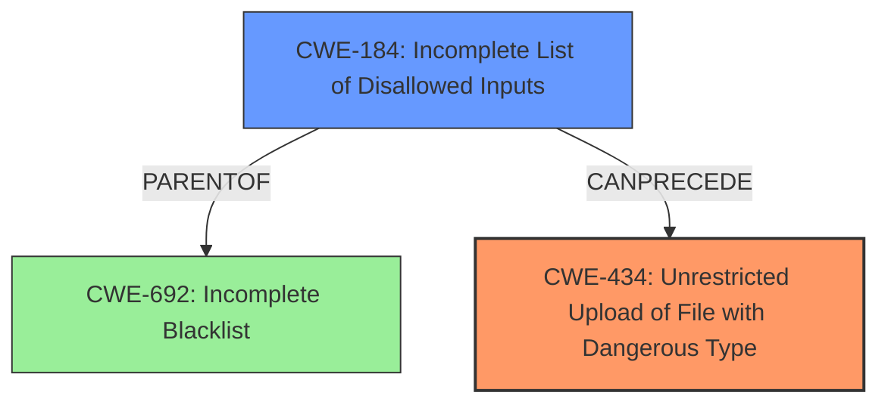

# Raw Analyzer Response for CVE-2025-2671

# Summary
| CWE ID | CWE Name | Confidence | CWE Abstraction Level | CWE Vulnerability Mapping Label | CWE-Vulnerability Mapping Notes |
|---|---|---|---|---|---|
| CWE-434 | Unrestricted Upload of File with Dangerous Type | 1.0 | Base | Allowed | Primary CWE |
| CWE-184 | Incomplete List of Disallowed Inputs | 0.7 | Base | Allowed | Secondary Candidate |

## Evidence and Confidence

*   **Confidence Score:** 0.9
*   **Evidence Strength:** HIGH

## Relationship Analysis
The primary CWE is CWE-434, which deals with unrestricted uploads of dangerous file types. This aligns directly with the vulnerability description. CWE-184 is a parent of CWE-692, suggesting that an incomplete list of disallowed inputs could lead to unrestricted uploads.

## Vulnerability Chain
The vulnerability chain starts with the **unrestricted upload** due to **missing input validation** and filtering of file extensions, leading to the ability to upload and execute arbitrary PHP code.

## Summary of Analysis
The primary weakness is clearly **unrestricted upload** of dangerous files (CWE-434) because the application directly decodes Base64 data and saves it without filtering the file extension. This allows an attacker to upload and execute arbitrary PHP code, as demonstrated by the provided example. The evidence is strong, with the CVE reference explicitly mentioning the **unfiltered file upload** as a key weakness.

CWE-434 is at the Base level of abstraction, which is the preferred level.

CWE-184 (Incomplete List of Disallowed Inputs) is considered as a secondary CWE because the vulnerability stems from an incomplete or non-existent list of disallowed file types. This CWE could precede CWE-434 in the vulnerability chain.

I considered other CWEs from the retriever results, such as CWE-79 (Improper Neutralization of Input During Web Page Generation ('Cross-site Scripting')), CWE-89 (Improper Neutralization of Special Elements used in an SQL Command ('SQL Injection')), and CWE-22 (Improper Limitation of a Pathname to a Restricted Directory ('Path Traversal')), but these are not applicable to this specific vulnerability, as it directly involves uploading and executing dangerous files rather than other types of injection or traversal.