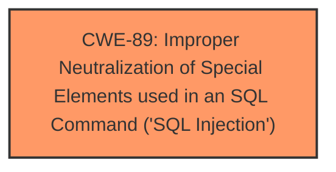

# Raw Analyzer Response for CVE-2025-2674

# Summary
| CWE ID | CWE Name | Confidence | CWE Abstraction Level | CWE Vulnerability Mapping Label | CWE-Vulnerability Mapping Notes |
|---|---|---|---|---|---|
| CWE-89 | Improper Neutralization of Special Elements used in an SQL Command ('SQL Injection') | 1.0 | Base | Allowed | Primary CWE |

## Evidence and Confidence

*   **Confidence Score:** 1.0
*   **Evidence Strength:** HIGH

## Relationship Analysis
The primary identified weakness is CWE-89. This is a base-level CWE, and no further specialization is warranted given the provided information. The retriever results do include other CWEs related to injection and input validation, but the description explicitly identifies SQL Injection, making CWE-89 the most direct and accurate classification.

## Vulnerability Chain
The vulnerability chain starts with the **improper neutralization** of special elements used in an SQL command (**SQL Injection**), leading to the ability to manipulate SQL queries. The root cause is the **lack of proper input validation** or sanitization on the `pagetitle` parameter in `/aboutus.php`. This leads directly to the impact of being able to inject SQL commands.

## Summary of Analysis
The vulnerability description clearly states that the manipulation of the `pagetitle` argument leads to **SQL injection**. The retriever results confirm that CWE-89 is the most relevant CWE. The description provides sufficient evidence to directly map the vulnerability to CWE-89.
The evidence from the Vulnerability Description: "The manipulation of the argument pagetitle leads to **sql injection**." confirms that CWE-89 is the optimal level of specificity and a confident assessment.

Relevant CWE Information:

# Enhanced Context (25 CWEs)
The following CWEs were identified as potentially relevant to this vulnerability:

## CWE-89: Improper Neutralization of Special Elements used in an SQL Command ('SQL Injection')
**Abstraction Level**: Base
**Similarity Score**: 0.77
**Source**: dense

**Description**:
The product constructs all or part of an SQL command using externally-influenced input from an upstream component, but it does not neutralize or incorrectly neutralizes special elements that could modify the intended SQL command when it is sent to a downstream component. Without sufficient removal or quoting of SQL syntax in user-controllable inputs, the generated SQL query can cause those inputs to be interpreted as SQL instead of ordinary user data.

**Mapping Guidance**:
- Usage: Allowed
- Rationale: This CWE entry is at the Base level of abstraction, which is a preferred level of abstraction for mapping to the root causes of vulnerabilities.