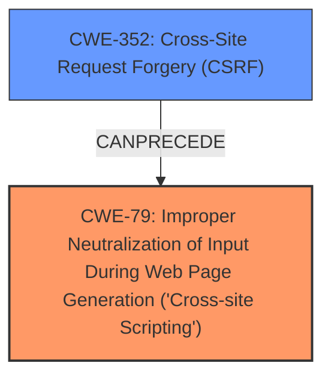

# Enhanced Analysis for CVE-2025-26759

# Summary

| CWE ID | CWE Name | Confidence | CWE Abstraction Level | CWE Vulnerability Mapping Label | CWE-Vulnerability Mapping Notes |
|---|---|---|---|---|---|
| CWE-79 | Improper Neutralization of Input During Web Page Generation ('Cross-site Scripting') | 1 | Base | Primary | Allowed |
| CWE-352 | Cross-Site Request Forgery (CSRF) | 1 | Compound | Secondary | Allowed |

## Evidence and Confidence

*   **Confidence Score:** 1
*   **Evidence Strength:** HIGH

## Relationship Analysis
The primary weakness is **Cross-Site Scripting (XSS)**, which occurs due to **improper neutralization of input**. Cross-Site Request Forgery (CSRF) can be a prerequisite for triggering the Stored XSS. The relationship is that CSRF could be used to inject malicious scripts that are then executed as XSS. CWE-79 is a base-level CWE, and is more specific than its parent classes.



## Vulnerability Chain
The vulnerability chain starts with **Cross-Site Request Forgery (CSRF)**, which allows an attacker to perform actions on behalf of a user without their consent. This can then lead to the injection of malicious scripts, resulting in **Stored XSS**. Therefore, the chain is CSRF -> Stored XSS.

## Summary of Analysis
The vulnerability description clearly states a **Cross-Site Request Forgery (CSRF)** vulnerability leading to **Stored XSS**. The **root cause** is the CSRF, which enables injecting the malicious payload, and the **weakness** is the XSS itself due to the improper neutralization of input.

The evidence from the vulnerability description is: "Cross-Site Request Forgery (CSRF) vulnerability in alexvtn Content Snippet Manager allows Stored XSS."

The relationship graph shows that CWE-352 can precede CWE-79, which aligns with the vulnerability description.

CWE-79 (Improper Neutralization of Input During Web Page Generation ('Cross-site Scripting')) is selected as the primary CWE because the ultimate vulnerability is Stored XSS. The CSRF vulnerability is a means to an end, allowing the injection of malicious code that leads to XSS. CWE-79 is at the optimal level of specificity (Base).

CWE-352 (Cross-Site Request Forgery (CSRF)) is included as a secondary CWE because it is the method used to exploit the system and inject the XSS payload.

CWE-80 (Improper Neutralization of Script-Related HTML Tags in a Web Page (Basic XSS)) was considered but not chosen as it is a variant of XSS focused on HTML tags, and the description doesn't restrict it to just HTML tags.

CWE-89 (Improper Neutralization of Special Elements used in an SQL Command ('SQL Injection')), CWE-918 (Server-Side Request Forgery (SSRF)), CWE-601 (URL Redirection to Untrusted Site ('Open Redirect')), and CWE-434 (Unrestricted Upload of File with Dangerous Type) were also considered but deemed not relevant as they describe completely different types of vulnerabilities.

Relevant CWE Information:


## CWE Relationship Analysis

Current CWEs represent these abstraction levels: .


### Vulnerability Chain Analysis

**Chain starting from CWE-89:**
- 89 (Improper Neutralization of Special Elements used in an SQL Command ('SQL Injection')) - ROOT


**Chain starting from CWE-80:**
- 80 (Improper Neutralization of Script-Related HTML Tags in a Web Page (Basic XSS)) - ROOT


### CWE Relationship Diagram

```mermaid
graph TD
    classDef primary fill:#f96,stroke:#333,stroke-width:2px
    classDef secondary fill:#69f,stroke:#333
    classDef tertiary fill:#9e9,stroke:#333
```