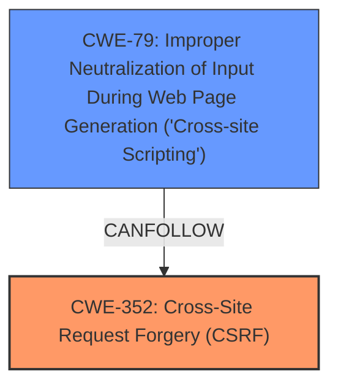

# Analysis for CVE-2025-26768

# Summary
| CWE ID | CWE Name | Confidence | CWE Abstraction Level | CWE Vulnerability Mapping Label | CWE-Vulnerability Mapping Notes |
|---|---|---|---|---|---|
| CWE-352 | Cross-Site Request Forgery (CSRF) | 0.9 | Compound |  Primary | Allowed |
| CWE-79 | Improper Neutralization of Input During Web Page Generation ('Cross-site Scripting') | 0.8 | Base | Secondary | Allowed |

## Evidence and Confidence

*   **Confidence Score:** 0.85
*   **Evidence Strength:** HIGH

## Relationship Analysis
The primary weakness is CWE-352, which is a compound weakness representing a combination of multiple underlying issues that lead to CSRF. CWE-79 is identified as a secondary weakness due to the mention of Stored XSS in the vulnerability description. While CWE-79 itself isn't directly causing the CSRF, its presence alongside the CSRF vulnerability suggests that input validation and output encoding issues may be exacerbating the overall risk.

## Vulnerability Chain
The vulnerability chain starts with the **lack of CSRF protection** (**CWE-352**), which allows an attacker to perform actions on behalf of an authenticated user. The presence of Stored XSS (**CWE-79**) suggests that input is not being properly neutralized, potentially allowing for malicious scripts to be stored and executed, further compounding the impact of the CSRF vulnerability.

## Summary of Analysis
The initial assessment identifies **Cross-Site Request Forgery (CSRF)** as the primary vulnerability, due to the **lack of proper CSRF protection**. The additional finding of "Stored XSS" suggests that there may be input validation issues as well. The retriever results support the selection of CWE-352 and CWE-79. Given the evidence provided, CWE-352 is the primary root cause, with CWE-79 exacerbating the impact. The final selection is based on the evidence from the vulnerability description and the retriever results. The selected CWEs are at the optimal level of specificity, with CWE-352 being a compound weakness and CWE-79 being a Base weakness.

Relevant CWE Information:

# Enhanced Context (25 CWEs)
The following CWEs were identified as potentially relevant to this vulnerability:

## CWE-352: Cross-Site Request Forgery (CSRF)
**Abstraction Level**: Compound
**Similarity Score**: 0.76
**Source**: dense

**Description**:
The web application does not, or can not, sufficiently verify whether a well-formed, valid, consistent request was intentionally provided by the user who submitted the request.

**Mapping Guidance**:
- Usage: Allowed
- Rationale: This is a well-known Composite of multiple weaknesses that must all occur simultaneously, although it is attack-oriented in nature.

**Technical Explanation:**

The primary vulnerability is **CWE-352 - Cross-Site Request Forgery (CSRF)**. This occurs because the what3words Address Field plugin **does not sufficiently verify if a request was intentionally provided by the user.** This allows an attacker to craft a malicious request that is then executed by an authenticated user without their knowledge or consent.

**Security Implications and Potential Impact:**
The security implication is that an attacker can perform actions on behalf of an authenticated user. The impact can vary depending on the privileges of the user and the actions that can be performed.

**Parent-Child Relationships and Chain Patterns:**
CWE-352 is a compound weakness, meaning it is composed of multiple underlying issues.

**Primary or Secondary Weakness:**
This is the primary weakness, as it is the root cause of the vulnerability.

**MITRE Mapping Guidance Influence:**
The MITRE mapping guidance allows for the use of CWE-352, stating "This is a well-known Composite of multiple weaknesses that must all occur simultaneously, although it is attack-oriented in nature."

## CWE-79: Improper Neutralization of Input During Web Page Generation ('Cross-site Scripting')
**Abstraction Level**: Base
**Similarity Score**: 0.73
**Source**: dense

**Description**:
The product does not neutralize or incorrectly neutralizes user-controllable input before it is placed in output that is used as a web page that is served to other users.

**Mapping Guidance**:
- Usage: Allowed
- Rationale: This CWE entry is at the Base level of abstraction, which is a preferred level of abstraction for mapping to the root causes of vulnerabilities.

**Technical Explanation:**
The vulnerability description mentions "Stored XSS," which maps to **CWE-79 - Improper Neutralization of Input During Web Page Generation ('Cross-site Scripting')**. This occurs because the product **does not neutralize user-controllable input** before placing it in output used as a web page.

**Security Implications and Potential Impact:**
The security implication is that an attacker can inject malicious scripts into the web page, which will be executed by other users who view the page. The impact can range from defacement to data theft to session hijacking.

**Parent-Child Relationships and Chain Patterns:**
CWE-79 can be related to other CWEs such as CWE-116 (Improper Encoding or Escaping of Output) and CWE-80 (Improper Neutralization of Script-Related HTML Tags in a Web Page).

**Primary or Secondary Weakness:**
This is a secondary weakness, as it is not the root cause of the CSRF vulnerability, but it exacerbates the overall risk.

**MITRE Mapping Guidance Influence:**
The MITRE mapping guidance allows for the use of CWE-79, stating "This CWE entry is at the Base level of abstraction, which is a preferred level of abstraction for mapping to the root causes of vulnerabilities."

**CWEs Considered but Not Used:**

*   CWE-89: Improper Neutralization of Special Elements used in an SQL Command ('SQL Injection') - Not used because there is no evidence of SQL injection in the vulnerability description.
*   CWE-918: Server-Side Request Forgery (SSRF) - Not used because there is no evidence of SSRF in the vulnerability description.
*   CWE-425: Direct Request ('Forced Browsing') - Not used because the issue is not about direct request, but rather about CSRF.
*   CWE-601: URL Redirection to Untrusted Site ('Open Redirect') - Not used because there is no URL redirection issue.
*   CWE-113: Improper Neutralization of CRLF Sequences in HTTP Headers ('HTTP Request/Response Splitting') - Not used because there is no CRLF injection issue.
*   CWE-184: Incomplete List of Disallowed Inputs - Not used because the vulnerability is about CSRF and XSS.