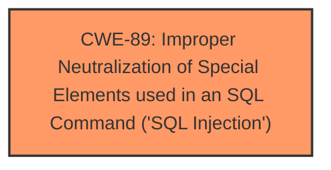

# Analysis Report for CVE-2025-2683

# Vulnerability Analysis Report: CVE-2025-2683

## Description

A vulnerability classified as critical was found in PHPGurukul Bank Locker Management System 1.0. This vulnerability affects unknown code of the file /profile.php. The manipulation of the argument mobilenumber leads to **sql injection**. The attack can be initiated remotely. The exploit has been disclosed to the public and may be used.

## Vulnerability Description Key Phrases

- **Weakness:** sql injection
- **Vector:** manipulation of mobilenumber argument
- **Product:** PHPGurukul Bank Locker Management System
- **Version:** 1.0
- **Component:** /profile.php

## Analysis (with Relationship Data)

# Summary
| CWE ID | CWE Name | Confidence | CWE Abstraction Level | CWE Vulnerability Mapping Label | CWE-Vulnerability Mapping Notes |
|---|---|---|---|---|---|
| CWE-89 | Improper Neutralization of Special Elements used in an SQL Command ('SQL Injection') | 1.0 | Base | Primary | Allowed |

## Evidence and Confidence

*   **Confidence Score:** 1.0
*   **Evidence Strength:** HIGH

## Relationship Analysis
The primary relationship is that CWE-89 stands alone as the root cause. No child or parent relationships are crucial in this case. The abstraction level is optimal as it's a Base CWE.



## Vulnerability Chain
The vulnerability chain starts with the **improper neutralization** of the 'mobilenumber' argument, leading directly to **SQL Injection**. The root cause is the lack of input validation and sanitization, which allows malicious SQL code to be injected and executed.

## Summary of Analysis
The analysis is based on the vulnerability description and the CVE Reference Links Content Summary. The vulnerability description explicitly mentions **SQL injection** due to the manipulation of the 'mobilenumber' argument in the `/profile.php` file. The CVE Reference Links Content Summary confirms that the root cause is the **lack of appropriate cleaning or validation** of the 'mobilenumber' parameter, leading to **SQL injection**.

The retriever results also strongly suggest CWE-89 as the most relevant CWE. The graph relationships and abstraction levels support the selection of CWE-89 as the optimal choice.

The evidence from the vulnerability description and the supporting CVE reference material clearly points to CWE-89 as the primary weakness. Therefore, the selection of CWE-89 is at the optimal level of specificity.

Relevant CWE Information:

# Enhanced Context (25 CWEs)
The following CWEs were identified as potentially relevant to this vulnerability:

## CWE-89: Improper Neutralization of Special Elements used in an SQL Command ('SQL Injection')
**Abstraction Level**: Base
**Similarity Score**: 1.00
**Source**: dense

**Description**:
The product constructs all or part of an SQL command using externally-influenced input from an upstream component, but it does not neutralize or incorrectly neutralizes special elements that could modify the intended SQL command when it is sent to a downstream component. Without sufficient removal or quoting of SQL syntax in user-controllable inputs, the generated SQL query can cause those inputs to be interpreted as SQL instead of ordinary user data.

**Mapping Guidance**:
- Usage: Allowed
- Rationale: This CWE entry is at the Base level of abstraction, which is a preferred level of abstraction for mapping to the root causes of vulnerabilities.


## CWE Relationship Analysis

Current CWEs represent these abstraction levels: .


### Vulnerability Chain Analysis

**Chain starting from CWE-89:**
- 89 (Improper Neutralization of Special Elements used in an SQL Command ('SQL Injection')) - ROOT


### CWE Relationship Diagram

```mermaid
graph TD
    classDef primary fill:#f96,stroke:#333,stroke-width:2px
    classDef secondary fill:#69f,stroke:#333
    classDef tertiary fill:#9e9,stroke:#333
```


*Report generated on 2025-07-14 14:48:01*
