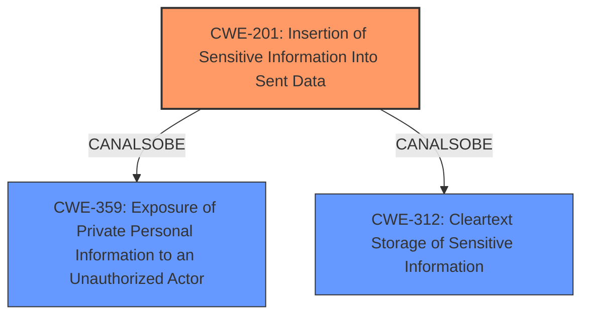

# Analysis Report for CVE-2025-26842

# Vulnerability Analysis Report: CVE-2025-26842

## Description

An issue was discovered in Znuny through 7.1.3. If access to a ticket is not given, the content of S/MIME encrypted e-mail messages is visible to users with access to the CommunicationLog.

## Vulnerability Description Key Phrases

- **Impact:** access to the CommunicationLog
- **Attacker:** users with access
- **Product:** Znuny
- **Version:** through 7.1.3

## Analysis (with Relationship Data)

# Summary
| CWE ID  | CWE Name  | Confidence | CWE Abstraction Level | CWE Vulnerability Mapping Label | CWE-Vulnerability Mapping Notes |
|---|---|---|---|---|---|
| CWE-201 | Insertion of Sensitive Information Into Sent Data | 0.9 | Base | Allowed | Primary CWE |
| CWE-359 | Exposure of Private Personal Information to an Unauthorized Actor | 0.7 | Base | Allowed | Secondary Candidate |
| CWE-312 | Cleartext Storage of Sensitive Information | 0.6 | Base | Allowed | Secondary Candidate |

## Evidence and Confidence

*   **Confidence Score:** 0.8
*   **Evidence Strength:** HIGH

## Relationship Analysis
The primary CWE is CWE-201, as it directly addresses the root cause of the vulnerability. CWE-359 and CWE-312 are potential secondary weaknesses related to the exposure of personal information and its storage. These have a peer relationship with CWE-201, representing related but distinct aspects of the vulnerability. CWE-201 is at the Base level, which is the preferred level of abstraction.



## Vulnerability Chain
The vulnerability chain starts with the **insertion of sensitive information (decrypted S/MIME email content) into the communication log (CWE-201)**. This leads to the potential **exposure of private personal information to unauthorized actors (CWE-359)** and the **cleartext storage of sensitive information (CWE-312)**.

## Summary of Analysis
The primary vulnerability is the **insertion of sensitive information into the communication log (CWE-201)**. This is supported by the CVE analysis, which states: "The decrypted content of S/MIME emails is stored in the communication log." The impact is that "users who have access to the communication log can view the decrypted content of S/MIME emails." This aligns perfectly with the description of CWE-201: "The code transmits data to another actor, but a portion of the data includes sensitive information that should not be accessible to that actor."

CWE-359 (Exposure of Private Personal Information to an Unauthorized Actor) is a potential secondary weakness, as the decrypted emails may contain private personal information. The vulnerability description mentions "S/MIME encrypted e-mail messages," which suggests the potential for exposure of personal data.

CWE-312 (Cleartext Storage of Sensitive Information) could also be a secondary weakness because the decrypted content is stored without encryption.

The retriever results also suggest CWE-201 as a relevant CWE. The abstraction level for CWE-201 is Base, which is the preferred level.

Other CWEs considered but not used:

*   CWE-79: Improper Neutralization of Input During Web Page Generation ('Cross-site Scripting') - This CWE is not relevant because the vulnerability does not involve improper neutralization of input.
*   CWE-639: Authorization Bypass Through User-Controlled Key - This CWE is not relevant because the vulnerability is not related to authorization bypass.
*   CWE-472: External Control of Assumed-Immutable Web Parameter - This CWE is not relevant because it does not relate to controlling web parameters.
*   CWE-327: Use of a Broken or Risky Cryptographic Algorithm - This CWE is not relevant because the issue is not with the cryptographic algorithm itself, but with how decrypted data is handled.
*   CWE-226: Sensitive Information in Resource Not Removed Before Reuse - This CWE is not the primary weakness, but a potential result of the initial weakness.


## CWE Relationship Analysis

Current CWEs represent these abstraction levels: .


### Vulnerability Chain Analysis

**Chain starting from CWE-359:**
- 359 (Exposure of Private Personal Information to an Unauthorized Actor) - ROOT


**Chain starting from CWE-327:**
- 327 (Use of a Broken or Risky Cryptographic Algorithm) - ROOT


### CWE Relationship Diagram

```mermaid
graph TD
    classDef primary fill:#f96,stroke:#333,stroke-width:2px
    classDef secondary fill:#69f,stroke:#333
    classDef tertiary fill:#9e9,stroke:#333
```


*Report generated on 2025-07-14 14:48:47*
