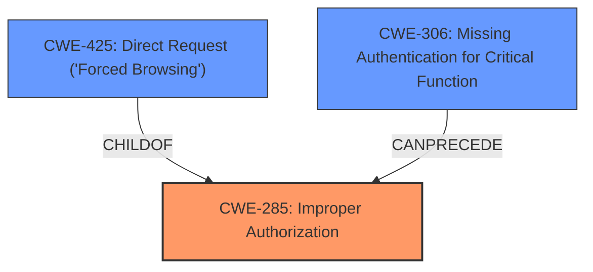

# Analysis for CVE-2025-2686

# Summary

| CWE ID | CWE Name | Confidence | CWE Abstraction Level | CWE Vulnerability Mapping Label | CWE-Vulnerability Mapping Notes |
|---|---|---|---|---|---|
| CWE-285 | Improper Authorization | 0.9 | Class | Primary | Allowed-with-Review |
| CWE-306 | Missing Authentication for Critical Function | 0.7 | Base | Secondary | Allowed |
| CWE-425 | Direct Request ('Forced Browsing') | 0.6 | Base | Secondary | Allowed |

## Evidence and Confidence

*   **Confidence Score:** 0.9
*   **Evidence Strength:** HIGH

## Relationship Analysis
The primary relationship that influenced the CWE selection is the hierarchical relationship between CWE-285 (Improper Authorization) and its potential children. While the description points to an authorization issue, the specific nature of the **improper access control** suggests that authentication might be a prerequisite weakness, as the system is not correctly verifying the identity of the user before granting access. CWE-425 (Direct Request) is considered because the vulnerability involves directly accessing administrative URLs without proper authorization. The abstraction levels were considered to ensure the selected CWEs were as specific as possible while still accurately representing the weakness.

## Vulnerability Chain
The vulnerability chain starts with a **missing authentication** check (CWE-306) which leads to **improper authorization** (CWE-285), allowing an attacker to perform actions they should not be allowed to perform. This can be compounded by direct requests (CWE-425).
  - The root cause is the **lack of proper authentication** and **authorization** checks on the `/admin/` component.
  - The impact is unauthorized access to administrative functionalities.

## Summary of Analysis
The initial assessment focused on the **improper access controls** identified in the vulnerability description. The retriever results suggested several CWEs related to injection and input validation, but the root cause is more accurately described as an authorization issue.

The analysis of the CVE Reference Links Content Summary provided strong evidence that the vulnerability stems from **insufficient access control** in the `AdminFilter` and **improper session handling**. Specifically, the filter doesn't properly terminate the request chain if the user is not an administrator, and session regeneration is missing.

The final selection of CWE-285 (Improper Authorization) as the primary CWE is based on the **rootcause** being a failure to properly authorize access to the `/admin/` component. This is further supported by the content summary which states that unauthorized access to administrative interfaces is possible. CWE-306 (Missing Authentication for Critical Function) is included as a secondary CWE because the reference content shows that the system does not properly authenticate users before granting access. CWE-425 (Direct Request) is added as another secondary CWE because the vulnerability allows direct access to administrative URLs without proper authorization. These selections are at the optimal level of specificity, representing the core weaknesses contributing to the vulnerability.

Relevant CWE Information:
*   CWE-285: Improper Authorization - The product grants access to resources or functionality without verifying that the actor is authorized to perform the requested action.
*   CWE-306: Missing Authentication for Critical Function - When an actor attempts to access a critical function, the product does not require authentication.
*   CWE-425: Direct Request ('Forced Browsing') - The web application does not adequately enforce appropriate authorization on all restricted URLs, scripts, or files.

The other CWEs were considered but rejected because they were either too general (e.g., CWE-74, CWE-138) or did not directly address the root cause of the vulnerability (e.g., injection-related CWEs).