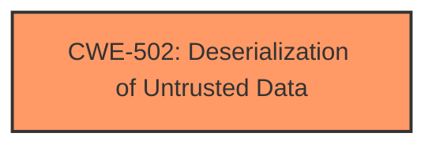

# Analysis Report for CVE-2025-2689

# Vulnerability Analysis Report: CVE-2025-2689

## Description

A vulnerability, which was classified as critical, has been found in yiisoft Yii2 up to 2.0.45. Affected by this issue is the function getIterator of the file symfony\\finder\\Iterator\\SortableIterator.php. The manipulation leads to **deserialization**. The attack may be launched remotely. The exploit has been disclosed to the public and may be used.

## Vulnerability Description Key Phrases

- **Weakness:** deserialization
- **Product:** yiisoft Yii2
- **Version:** up to 2.0.45
- **Component:** symfony\finder\Iterator\SortableIterator.php

## Analysis (with Relationship Data)

# Summary
| CWE ID | CWE Name | Confidence | CWE Abstraction Level | CWE Vulnerability Mapping Label | CWE-Vulnerability Mapping Notes |
|---|---|---|---|---|---|
| CWE-502 | Deserialization of Untrusted Data | 0.9 | Base | Primary | Allowed |

## Evidence and Confidence

*   **Confidence Score:** 0.9
*   **Evidence Strength:** MEDIUM

## Relationship Analysis
The primary CWE selected is CWE-502, which is a Base level CWE. No parent-child or chain relationships significantly influenced the decision in this case due to the limited information provided.



## Vulnerability Chain
The vulnerability chain consists of a single point:
  - **Root Cause:** CWE-502 Deserialization of Untrusted Data.

## Summary of Analysis
The primary weakness identified is **deserialization** based on the vulnerability description. The report states, "The manipulation leads to **deserialization**."

The "Retriever Results" list CWE-502 as a candidate with a good score. The CWE-502 description, "The product deserializes untrusted data without sufficiently ensuring that the resulting data will be valid," aligns well with the vulnerability description.

Other CWEs were considered from the retriever results, but were not selected:
*   CWE-89 (Improper Neutralization of Special Elements used in an SQL Command ('SQL Injection')): This CWE relates to SQL injection vulnerabilities, which are not indicated in the description.
*   CWE-79 (Improper Neutralization of Input During Web Page Generation ('Cross-site Scripting')): This CWE relates to Cross-site Scripting, which is not indicated in the description.
*   CWE-434 (Unrestricted Upload of File with Dangerous Type): This CWE relates to file upload vulnerabilities, which are not indicated in the description.
*   CWE-96 (Improper Neutralization of Directives in Statically Saved Code ('Static Code Injection')): This CWE relates to Static Code Injection, which is not indicated in the description.

Based on the available information, CWE-502 best represents the vulnerability, and is at the optimal level of specificity.


## CWE Relationship Analysis

Current CWEs represent these abstraction levels: .


### Vulnerability Chain Analysis

**Chain starting from CWE-502:**
- 502 (Deserialization of Untrusted Data) - ROOT


**Chain starting from CWE-89:**
- 89 (Improper Neutralization of Special Elements used in an SQL Command ('SQL Injection')) - ROOT


### CWE Relationship Diagram

```mermaid
graph TD
    classDef primary fill:#f96,stroke:#333,stroke-width:2px
    classDef secondary fill:#69f,stroke:#333
    classDef tertiary fill:#9e9,stroke:#333
```


*Report generated on 2025-07-14 14:50:59*
