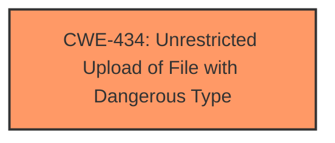

# Analysis for CVE-2025-2702

# Summary
| CWE ID | CWE Name | Confidence | CWE Abstraction Level | CWE Vulnerability Mapping Label | CWE-Vulnerability Mapping Notes |
|---|---|---|---|---|---|
| CWE-434 | Unrestricted Upload of File with Dangerous Type | 1.0 | Base | Allowed | Primary CWE. The **unrestricted upload** is the root cause of the vulnerability. |

## Evidence and Confidence

*   **Confidence Score:** 1.0
*   **Evidence Strength:** HIGH

## Relationship Analysis
The primary CWE is CWE-434, which stands alone. No parent-child or chain relationships are relevant in this case, as the description focuses solely on the unrestricted file upload. The abstraction level is Base, which is appropriate as it directly reflects the **unrestricted upload** vulnerability.

## Vulnerability Chain
The vulnerability chain starts with the **unrestricted upload** (**CWE-434**). The impact is not detailed, but generally, this leads to remote code execution or other malicious activities, depending on how the uploaded file is processed.

## Summary of Analysis
The analysis is based on the provided vulnerability description, which explicitly mentions "**unrestricted upload**" as the weakness. This directly corresponds to CWE-434 (Unrestricted Upload of File with Dangerous Type). The high confidence is due to the clear and direct evidence from the vulnerability description and the retriever results.

The selected CWE is at the optimal level of specificity (Base), as it directly describes the **root cause** of the vulnerability.

Relevant CWE Information:

# Enhanced Context (25 CWEs)
The following CWEs were identified as potentially relevant to this vulnerability:

## CWE-434: Unrestricted Upload of File with Dangerous Type
**Abstraction Level**: Base
**Similarity Score**: 0.80
**Source**: dense

**Description**:
The product allows the upload or transfer of dangerous file types that are automatically processed within its environment.

**Mapping Guidance**:
- Usage: Allowed
- Rationale: This CWE entry is at the Base level of abstraction, which is a preferred level of abstraction for mapping to the root causes of vulnerabilities.

### CWEs Considered But Not Used:

*   **CWE-89 (Improper Neutralization of Special Elements used in an SQL Command ('SQL Injection')) and CWE-79 (Improper Neutralization of Input During Web Page Generation ('Cross-site Scripting'))**: While these CWEs appear in the Retriever Results, they are not relevant because the vulnerability description specifically points to an **unrestricted file upload**, not SQL injection or XSS.
*   **CWE-306 (Missing Authentication for Critical Function)**: This could be a contributing factor, but the primary issue is the **unrestricted upload** itself. Authentication might prevent unauthorized uploads, but the core weakness is the lack of restrictions on the file type being uploaded.
*   **CWE-646 (Reliance on File Name or Extension of Externally-Supplied File)**: This could be a secondary weakness if the application relies on the file extension to determine how to process the file. However, without further information, the primary weakness remains the **unrestricted upload**.
*   **CWE-73 (External Control of File Name or Path)**: The vulnerability description mentions the manipulation of the argument File, but it does not control paths or file names that are used in filesystem operations, so it is not relevant.