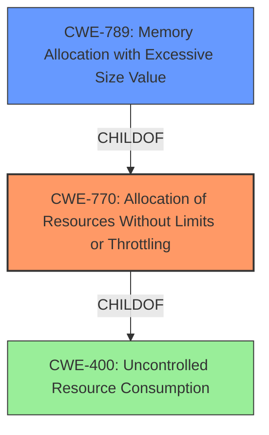

# Enhanced Analysis for CVE-2025-27100

# Summary
| CWE ID | CWE Name | Confidence | CWE Abstraction Level | CWE Vulnerability Mapping Label | CWE-Vulnerability Mapping Notes |
|---|---|---|---|---|---|
| CWE-770 | Allocation of Resources Without Limits or Throttling | 0.9 | Base | Allowed | Primary CWE: The product allocates resources without limits, leading to denial of service. |
| CWE-789 | Memory Allocation with Excessive Size Value | 0.7 | Variant | Allowed | Secondary Candidate: The vulnerability involves exhausting server memory, which suggests excessive memory allocation might be the underlying cause. |

## Evidence and Confidence

*   **Confidence Score:** 0.8
*   **Evidence Strength:** MEDIUM

## Relationship Analysis
The primary CWE, CWE-770 [Allocation of Resources Without Limits or Throttling], is a base CWE that has a parent-child relationship with CWE-400 [Uncontrolled Resource Consumption] and CWE-789 [Memory Allocation with Excessive Size Value]. CWE-789 is a more specific variant of CWE-770, focusing specifically on memory allocation. Because the vulnerability description mentions memory exhaustion, CWE-789 is considered as a secondary candidate. However, the root cause is likely the **lack of limits** on resource allocation (CWE-770) which then leads to excessive memory allocation as a consequence (CWE-789).



## Vulnerability Chain
The vulnerability chain starts with the **lack of resource limits** (CWE-770), leading to excessive memory allocation, ultimately resulting in a denial-of-service condition.

CWE-770 (Root Cause: **Allocation of Resources Without Limits or Throttling**) -> CWE-789 (Memory Allocation with Excessive Size Value) -> Denial of Service (Impact).

## Summary of Analysis
The initial assessment focused on identifying the root cause of the denial-of-service vulnerability in lakeFS. The evidence from the vulnerability description and CVE summary clearly indicates that an authenticated user can exhaust server memory, leading to a crash. The primary CWE, CWE-770 [Allocation of Resources Without Limits or Throttling], accurately represents the underlying issue of the **lack of proper resource management**. While CWE-789 [Memory Allocation with Excessive Size Value] is a relevant secondary consideration due to the memory exhaustion aspect, CWE-770 captures the broader problem of unbounded resource allocation that leads to the memory issue.

The graph relationships highlight that CWE-789 is a child of CWE-770, indicating a more specific manifestation of the general resource management problem. The selected CWEs are at the optimal level of specificity because CWE-770 directly addresses the root cause, while CWE-789 provides additional context about the specific resource being exhausted (memory).


## CWE Relationship Analysis

Current CWEs represent these abstraction levels: .


### Vulnerability Chain Analysis

**Chain starting from CWE-400:**
- 400 (Uncontrolled Resource Consumption) - ROOT


**Chain starting from CWE-789:**
- 789 (Memory Allocation with Excessive Size Value) - ROOT


### CWE Relationship Diagram

```mermaid
graph TD
    classDef primary fill:#f96,stroke:#333,stroke-width:2px
    classDef secondary fill:#69f,stroke:#333
    classDef tertiary fill:#9e9,stroke:#333
```