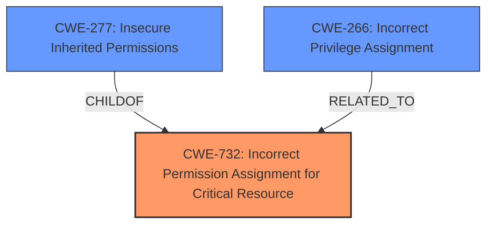

# Analysis Report for CVE-2025-2713

# Vulnerability Analysis Report: CVE-2025-2713

## Description

Google gVisors runsc component exhibited a local **privilege escalation vulnerability** due to **incorrect handling of file access permissions**, which allowed unprivileged users to access restricted files. This occurred because the process initially ran with root-like permissions until the first fork.

## Vulnerability Description Key Phrases

- **Rootcause:** incorrect handling of file access permissions
- **Weakness:** privilege escalation vulnerability
- **Impact:** ['local privilege escalation', 'access restricted files']
- **Attacker:** unprivileged users
- **Product:** Google gVisors runsc component

## Analysis (with Relationship Data)

# Summary
| CWE ID | CWE Name | Confidence | CWE Abstraction Level | CWE Vulnerability Mapping Label | CWE-Vulnerability Mapping Notes |
|---|---|---|---|---|---|
| CWE-732 | Incorrect Permission Assignment for Critical Resource | 0.8 | Class | Allowed-with-Review | Primary CWE. Focuses on incorrect permission assignment for critical resources. |
| CWE-277 | Insecure Inherited Permissions | 0.6 | Variant | Allowed | Secondary Candidate. Relates to how permissions are inherited, which can be a factor in incorrect assignments. |
| CWE-266 | Incorrect Privilege Assignment | 0.5 | Base | Allowed | Secondary Candidate. Could be involved if the incorrect permissions lead to privilege escalation. |

## Evidence and Confidence

*   **Confidence Score:** 0.7
*   **Evidence Strength:** MEDIUM

## Relationship Analysis
The primary CWE is CWE-732, "Incorrect Permission Assignment for Critical Resource." This is a Class-level CWE. CWE-277, "Insecure Inherited Permissions," is a Variant and child of CWE-732. CWE-266, "Incorrect Privilege Assignment" is a Base level CWE that is related because incorrect permissions can lead to incorrect privileges.



## Vulnerability Chain
The chain of events is as follows:
1.  **ROOT CAUSE:** **Incorrect handling of file access permissions** (Implied by CWE-732).
2.  Incorrect Permission Assignment (CWE-732) leads to
3.  Privilege Escalation (Impact).

## Summary of Analysis
The initial assessment focused on the **incorrect handling of file access permissions** leading to a **privilege escalation vulnerability**. The primary CWE selected is CWE-732 (Incorrect Permission Assignment for Critical Resource), as it directly addresses the root cause described in the vulnerability. The evidence supporting this is the vulnerability description stating "incorrect handling of file access permissions" allowed unprivileged users to access restricted files.

The retriever results also point to CWE-732 as a strong candidate. The guidance provided emphasizes distinguishing between privileges and permissions. In this case, the vulnerability stems from how permissions were incorrectly assigned to a resource, leading to privilege escalation.

CWE-277 (Insecure Inherited Permissions) was considered because the issue could involve permissions being improperly inherited by new processes. However, the description focuses more on the initial assignment of permissions rather than inheritance.

CWE-266 (Incorrect Privilege Assignment) was considered, but it is less specific than CWE-732, which directly addresses the resource permission issue. CWE-266 could be a consequence of the incorrect permission assignment, but CWE-732 is the more direct root cause.

The final selection is based on the evidence that the vulnerability involves the **incorrect handling of file access permissions**, making CWE-732 the most appropriate choice. This is further supported by the retriever results and the guidance on privileges vs. permissions.

Relevant CWE Information:
*   **CWE-732**: The product specifies permissions for a security-critical resource in a way that allows that resource to be read or modified by unintended actors. The vulnerability description explicitly mentions "incorrect handling of file access permissions," aligning with the core concept of CWE-732.
*   **CWE-277**: The product specifies permissions for a security-critical resource in a way that allows that resource to be read or modified by unintended actors. This is relevant if the permissions are inherited from some parent process.
*   **CWE-266**: A product incorrectly assigns a privilege to a particular actor, creating an unintended sphere of control for that actor. This is relevant if incorrect permissions lead to privilege escalation.


## CWE Relationship Analysis

Current CWEs represent these abstraction levels: .


### Vulnerability Chain Analysis

**Chain starting from CWE-277:**
- 277 (Insecure Inherited Permissions) - ROOT


**Chain starting from CWE-266:**
- 266 (Incorrect Privilege Assignment) - ROOT


### CWE Relationship Diagram

```mermaid
graph TD
    classDef primary fill:#f96,stroke:#333,stroke-width:2px
    classDef secondary fill:#69f,stroke:#333
    classDef tertiary fill:#9e9,stroke:#333
```


*Report generated on 2025-07-14 14:57:48*
