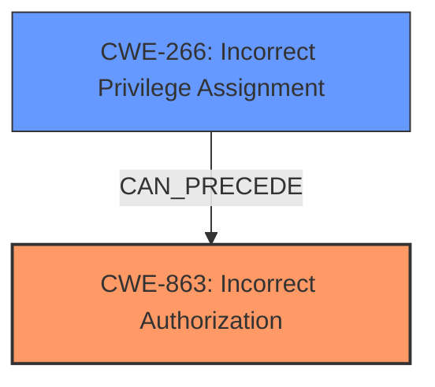

# Raw Analyzer Response for CVE-2025-27134

# Summary
| CWE ID | CWE Name | Confidence | CWE Abstraction Level | CWE Vulnerability Mapping Label | CWE-Vulnerability Mapping Notes |
|---|---|---|---|---|---|
| CWE-863 | Incorrect Authorization | 1.0 | Class | Primary CWE | Allowed-with-Review |
| CWE-266 | Incorrect Privilege Assignment | 0.7 | Base | Secondary Candidate | Allowed |

## Evidence and Confidence

*   **Confidence Score:** 0.9
*   **Evidence Strength:** HIGH

## Relationship Analysis
The primary CWE is CWE-863, which is a Class-level CWE. While it is generally preferred to map to Base-level CWEs, in this case, the evidence strongly supports a flaw in the authorization logic, making CWE-863 the most accurate choice. CWE-863 is related to other authorization CWEs like CWE-285 (Improper Authorization), but CWE-863 specifically indicates that the authorization check is performed but incorrectly, which aligns with the vulnerability description. CWE-266 (Incorrect Privilege Assignment) is a possible root cause for the authorization issue.

## Vulnerability Chain
The vulnerability chain starts with an **incorrect authorization** check (CWE-863) that allows non-admin users to modify the `is_admin` field, leading to **privilege escalation** and the ability to perform administrative actions. The root cause can also be traced to **incorrect privilege assignment** (CWE-266) during user creation.
  - **Incorrect Privilege Assignment** (CWE-266)
  - **Incorrect Authorization** (CWE-863)
  - **Privilege Escalation** (Impact)

## Summary of Analysis
Based on the provided evidence, the primary weakness is **incorrect authorization** (CWE-863), as the application performs an authorization check but does so incorrectly. This allows a non-admin user to set the `is_admin` field to 1, effectively escalating their privileges. The vulnerability description clearly states that a low-privileged user can perform administrative actions without proper authorization.
The key phrase from the "Vulnerability Description Key Phrases" section is "**privilege escalation vulnerability**".
The "CVE Reference Links Content Summary" section indicates that the **root cause** is insufficient access control checks on the `PATCH /api/users/:id` endpoint, allowing non-admin users to modify the `is_admin` field. This aligns with CWE-863, which describes a scenario where the authorization check is performed, but incorrectly. A possible cause is **incorrect privilege assignment** (CWE-266).

The provided "Authentication vs Authorization vs Access Control Guidance" specifically points to CWE-863 as a possible match when "role check is present but flawed".

CWE-266 was considered as a possible **root cause**, with the system possibly assigning incorrect privileges to the user during account provisioning.

Other CWEs were considered but deemed less suitable:

*   CWE-285 (Improper Authorization): This is a more general category, and CWE-863 is more specific because it indicates that a check is in place, but it's incorrect.
*   CWE-862 (Missing Authorization): This CWE would be more appropriate if there were no authorization checks at all, but the vulnerability description implies that there is a check, albeit a flawed one.
*   CWE-284 (Improper Access Control): This is a high-level category and less specific than CWE-863.
*   CWE-306 (Missing Authentication for Critical Function): This is not applicable since the users are authenticated.

The selection of CWE-863 is at the optimal level of specificity, as it accurately reflects the nature of the vulnerability based on the available evidence.

Relevant CWE Information:

# Enhanced Context (25 CWEs)
The following CWEs were identified as potentially relevant to this vulnerability:

## CWE-267: Privilege Defined With Unsafe Actions
**Abstraction Level**: Base
**Similarity Score**: 0.76
**Source**: dense

**Description**:
A particular privilege, role, capability, or right can be used to perform unsafe actions that were not intended, even when it is assigned to the correct entity.

**Mapping Guidance**:
- Usage: Allowed
- Rationale: This CWE entry is at the Base level of abstraction, which is a preferred level of abstraction for mapping to the root causes of vulnerabilities.

## CWE-266: Incorrect Privilege Assignment
**Abstraction Level**: Base
**Similarity Score**: 0.75
**Source**: dense

**Description**:
A product incorrectly assigns a privilege to a particular actor, creating an unintended sphere of control for that actor.

**Mapping Guidance**:
- Usage: Allowed
- Rationale: This CWE entry is at the Base level of abstraction, which is a preferred level of abstraction for mapping to the root causes of vulnerabilities.

## CWE-274: Improper Handling of Insufficient Privileges
**Abstraction Level**: Base
**Similarity Score**: 0.74
**Source**: dense

**Description**:
The product does not handle or incorrectly handles when it has insufficient privileges to perform an operation, leading to resultant weaknesses.

**Mapping Guidance**:
- Usage: Discouraged
- Rationale: This CWE entry could be deprecated in a future version of CWE.

## CWE-668: Exposure of Resource to Wrong Sphere
**Abstraction Level**: Class
**Similarity Score**: 0.74
**Source**: dense

**Description**:
The product exposes a resource to the wrong control sphere, providing unintended actors with inappropriate access to the resource.

**Mapping Guidance**:
- Usage: Discouraged
- Rationale: CWE-668 is high-level and is often misused as a catch-all when lower-level CWE IDs might be applicable. It is sometimes used for low-information vulnerability reports [REF-1287]. It is a level-1 Class (i.e., a child of a Pillar). It is not useful for trend analysis.

## CWE-41: Improper Resolution of Path Equivalence
**Abstraction Level**: Base
**Similarity Score**: 0.73
**Source**: dense

**Description**:
The product is vulnerable to file system contents disclosure through path equivalence. Path equivalence involves the use of special characters in file and directory names. The associated manipulations are intended to generate multiple names for the same object.

**Mapping Guidance**:
- Usage: Allowed
- Rationale: This CWE entry is at the Base level of abstraction, which is a preferred level of abstraction for mapping to the root causes of vulnerabilities.

## CWE-280: Improper Handling of Insufficient Permissions or Privileges 
**Abstraction Level**: Base
**Similarity Score**: 0.73
**Source**: dense

**Description**:
The product does not handle or incorrectly handles when it has insufficient privileges to access resources or functionality as specified by their permissions. This may cause it to follow unexpected code paths that may leave the product in an invalid state.

**Mapping Guidance**:
- Usage: Allowed
- Rationale: This CWE entry is at the Base level of abstraction, which is a preferred level of abstraction for mapping to the root causes of vulnerabilities.

## CWE-472: External Control of Assumed-Immutable Web Parameter
**Abstraction Level**: Base
**Similarity Score**: 0.73
**Source**: dense

**Description**:
The web application does not sufficiently verify inputs that are assumed to be immutable but are actually externally controllable, such as hidden form fields.

**Mapping Guidance**:
- Usage: Allowed
- Rationale: This CWE entry is at the Base level of abstraction, which is a preferred level of abstraction for mapping to the root causes of vulnerabilities.

## CWE-59: Improper Link Resolution Before File Access ('Link Following')
**Abstraction Level**: Base
**Similarity Score**: 0.73
**Source**: dense

**Description**:
The product attempts to access a file based on the filename, but it does not properly prevent that filename from identifying a link or shortcut that resolves to an unintended resource.

**Mapping Guidance**:
- Usage: Allowed
- Rationale: This CWE entry is at the Base level of abstraction, which is a preferred level of abstraction for mapping to the root causes of vulnerabilities.

## CWE-1390: Weak Authentication
**Abstraction Level**: Class
**Similarity Score**: 0.73
**Source**: dense

**Description**:
The product uses an authentication mechanism to restrict access to specific users or identities, but the mechanism does not sufficiently prove that the claimed identity is correct.

**Mapping Guidance**:
- Usage: Allowed-with-Review
- Rationale: This CWE entry is a Class and might have Base-level children that would be more appropriate

## CWE-639: Authorization Bypass Through User-Controlled Key
**Abstraction Level**: Base
**Similarity Score**: 0.73
**Source**: dense

**