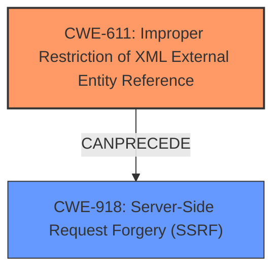

# Analysis Report for CVE-2025-27136

# Vulnerability Analysis Report: CVE-2025-27136

## Description

LocalS3 is an Amazon S3 mock service for testing and local development. Prior to version 1.21, the LocalS3 services bucket creation endpoint is vulnerable to XML External Entity (XXE) injection. When processing the CreateBucketConfiguration XML document during bucket creation, the services XML parser is configured to resolve external entities. This allows an attacker to declare an external entity that references an internal URL, which the server will then attempt to fetch when parsing the XML. The vulnerability specifically occurs in the location constraint processing, where the XML parser resolves external entities without proper validation or restrictions. When the external entity is resolved, the server makes an HTTP request to the specified URL and includes the response content in the parsed XML document. This vulnerability can be exploited to perform server-side request forgery (SSRF) attacks, allowing an attacker to make requests to internal services or resources that should not be accessible from external networks. The server will include the responses from these internal requests in the resulting bucket configuration, effectively leaking sensitive information. The attacker only needs to be able to send HTTP requests to the LocalS3 service to exploit this vulnerability.

## Vulnerability Description Key Phrases

- **Weakness:** XML external entity injection
- **Impact:** server-side request forgery (SSRF)
- **Vector:** create bucket configuration XML document with external entity
- **Attacker:** attacker
- **Product:** LocalS3
- **Version:** prior to 1.21
- **Component:** bucket creation endpoint

## Analysis (with Relationship Data)

# Summary
| CWE ID | CWE Name | Confidence | CWE Abstraction Level | CWE Vulnerability Mapping Label | CWE-Vulnerability Mapping Notes |
|---|---|---|---|---|---|
| CWE-611 | Improper Restriction of XML External Entity Reference | 1.0 | Base | Allowed | Primary CWE. The root cause is the **improper restriction of XML external entity reference** that leads to XXE injection. |
| CWE-918 | Server-Side Request Forgery (SSRF) | 1.0 | Base | Allowed | Secondary. The XXE injection is exploited to perform a Server-Side Request Forgery (SSRF). |

## Evidence and Confidence

*   **Confidence Score:** 1.0
*   **Evidence Strength:** HIGH

## Relationship Analysis
The primary weakness is the improper restriction of XML external entity reference (CWE-611), which allows an attacker to inject external entities into the XML document. This leads to a server-side request forgery (CWE-918), where the server makes requests to internal services or resources. The relationship between CWE-611 and CWE-918 is that CWE-611 can precede CWE-918 in a vulnerability chain. CWE-611 is the root cause, and CWE-918 is the impact. Both CWEs are at the Base abstraction level, which is the preferred level.



## Vulnerability Chain
The vulnerability chain starts with the **improper restriction of XML external entity references** (CWE-611). This allows an attacker to inject malicious XML entities. The injected entities are then resolved by the XML parser, causing the server to make requests to internal resources, leading to Server-Side Request Forgery (SSRF) (CWE-918).

## Summary of Analysis
The vulnerability is an XML External Entity (XXE) injection vulnerability (CWE-611) in the LocalS3 service's bucket creation endpoint. The XML parser is configured to resolve external entities without proper validation or restrictions. This allows an attacker to declare an external entity that references an internal URL. When the external entity is resolved, the server makes an HTTP request to the specified URL, leading to a Server-Side Request Forgery (SSRF) (CWE-918).

The primary CWE is CWE-611, as it is the root cause of the vulnerability. The secondary CWE is CWE-918, as it is the impact of the vulnerability. Both CWEs are at the Base abstraction level, which is the preferred level.

The evidence for this classification is found in the vulnerability description and the CVE Reference Links Content Summary. The vulnerability description states that the service is vulnerable to **XML external entity injection**. The CVE Reference Links Content Summary confirms that the root cause of the vulnerability is the **lack of proper validation or restrictions on external entity resolution** within the XML parser. It also states that the impact of exploitation is **Server-Side Request Forgery (SSRF)**.

Other CWEs considered but not used:

*   CWE-776: Improper Restriction of Recursive Entity References in DTDs ('XML Entity Expansion'): While related to XML vulnerabilities, this is more specific to recursive entity references in DTDs, which is not the primary issue described in the vulnerability.
*   CWE-923: Improper Restriction of Communication Channel to Intended Endpoints: Although the SSRF aspect involves communication, the root cause is the XXE injection, not a general failure to restrict the communication channel.
*   CWE-74: Improper Neutralization of Special Elements in Output Used by a Downstream Component ('Injection'): This is a more general injection category. CWE-611 is more specific to the type of injection occurring.


## CWE Relationship Analysis

Current CWEs represent these abstraction levels: .


### Vulnerability Chain Analysis

**Chain starting from CWE-611:**
- 611 (Improper Restriction of XML External Entity Reference) - ROOT


**Chain starting from CWE-923:**
- 923 (Improper Restriction of Communication Channel to Intended Endpoints) - ROOT


### CWE Relationship Diagram

```mermaid
graph TD
    classDef primary fill:#f96,stroke:#333,stroke-width:2px
    classDef secondary fill:#69f,stroke:#333
    classDef tertiary fill:#9e9,stroke:#333
```


*Report generated on 2025-07-14 14:58:43*
