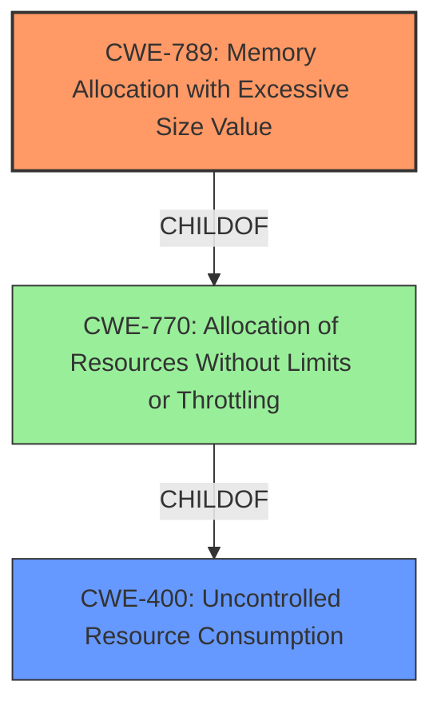

# Enhanced Analysis for CVE-2025-27144

# Summary
| CWE ID | CWE Name | Confidence | CWE Abstraction Level | CWE Vulnerability Mapping Label | CWE-Vulnerability Mapping Notes |
|---|---|---|---|---|---|
| CWE-789 | Memory Allocation with Excessive Size Value | 0.9 | Variant | Allowed | Primary CWE. The code allocates memory based on an untrusted, large size value, but it does not ensure that the size is within expected limits, allowing arbitrary amounts of memory to be allocated. |
| CWE-400 | Uncontrolled Resource Consumption | 0.7 | Class | Discouraged | Secondary CWE. The vulnerability leads to excessive memory consumption, which is a form of uncontrolled resource consumption leading to DoS. |

## Evidence and Confidence

*   **Confidence Score:** 0.8
*   **Evidence Strength:** HIGH

## Relationship Analysis
The primary weakness is **CWE-789 (Memory Allocation with Excessive Size Value)**, which is a variant of **CWE-770 (Allocation of Resources Without Limits or Throttling)** and is related to **CWE-400 (Uncontrolled Resource Consumption)** as a consequence of the excessive memory allocation. **CWE-789** is a more specific variant of **CWE-770**, which is a child of **CWE-400**.



## Vulnerability Chain
The vulnerability chain starts with the use of `strings.Split(token, ".")` to split JWT tokens. This leads to **CWE-789 (Memory Allocation with Excessive Size Value)**, because an attacker can craft a token with a large number of '.' characters, leading to **excessive memory consumption** and, ultimately, **CWE-400 (Uncontrolled Resource Consumption)**, resulting in a Denial of Service (DoS).

## Summary of Analysis
The analysis is based on the provided evidence, which includes the vulnerability description and the CVE reference summary. The key phrase "**excessive memory consumption**" directly points to memory allocation issues. The CVE reference summary confirms that the code splits JWT tokens in a way that is vulnerable to excessive memory consumption when processing maliciously crafted tokens.

The retriever results also indicate **CWE-789 (Memory Allocation with Excessive Size Value)** as a potential candidate, and after careful consideration, it is the most appropriate primary CWE. Other CWEs like **CWE-834 (Excessive Iteration)** and **CWE-674 (Uncontrolled Recursion)** are less relevant because the core issue is related to memory allocation rather than iteration or recursion. **CWE-400 (Uncontrolled Resource Consumption)** is also relevant as a consequence of the **excessive memory consumption**.

The selected CWEs are at the optimal level of specificity because **CWE-789** is a Variant-level CWE, providing a detailed description of the **memory allocation** issue, and **CWE-400** represents the broader impact of resource consumption.


## CWE Relationship Analysis

Current CWEs represent these abstraction levels: .


### Vulnerability Chain Analysis

**Chain starting from CWE-400:**
- 400 (Uncontrolled Resource Consumption) - ROOT


**Chain starting from CWE-770:**
- 770 (Allocation of Resources Without Limits or Throttling) - ROOT


### CWE Relationship Diagram

```mermaid
graph TD
    classDef primary fill:#f96,stroke:#333,stroke-width:2px
    classDef secondary fill:#69f,stroke:#333
    classDef tertiary fill:#9e9,stroke:#333
```