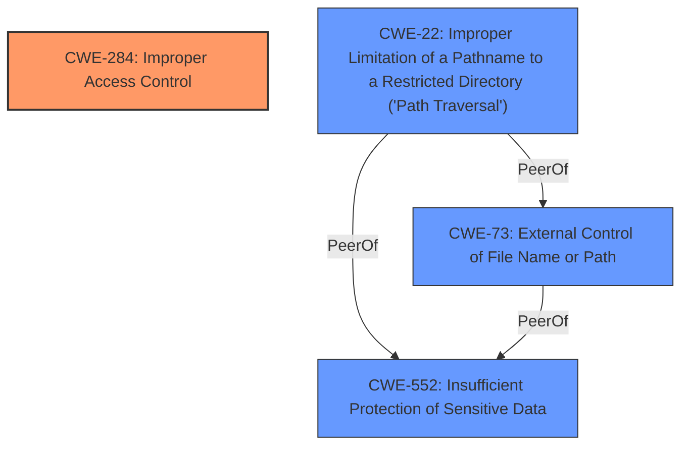

# Raw Analyzer Response for CVE-2025-27147

# Summary
| CWE ID  | CWE Name                                                                                                | Confidence | CWE Abstraction Level | CWE Vulnerability Mapping Label | CWE-Vulnerability Mapping Notes |
| :-------- | :-------------------------------------------------------------------------------------------------------- | :---------- | :---------------------- | :-------------------------------- | :-------------------------------- |
| CWE-284   | Improper Access Control                                                                                 | 0.75      | Pillar                  | Primary                           | Allowed-with-Review               |
| CWE-22    | Improper Limitation of a Pathname to a Restricted Directory ('Path Traversal')                          | 0.65       | Base                    | Secondary                         | Allowed                           |
| CWE-73    | External Control of File Name or Path                                                                   | 0.65       | Base                    | Secondary                         | Allowed                           |
| CWE-552   | Insufficient Protection of Sensitive Data                                                               | 0.65       | Base                    | Secondary                         | Allowed                           |

## Evidence and Confidence

*   **Confidence Score:** 0.7
*   **Evidence Strength:** MEDIUM

## Relationship Analysis
The primary CWE is CWE-284, which is a high-level category. The CVE reference provides more specific weaknesses (CWE-22, CWE-73, and CWE-552) which contribute to the overall access control issue. CWE-284 is a Pillar, while the others are Base. The base level weaknesses give details about the **improper access control**.



## Vulnerability Chain
The vulnerability chain starts with **improper access control** (CWE-284). This leads to CWE-22, CWE-73, and CWE-552, which allows unauthorized access.

## Summary of Analysis
The primary weakness is **improper access control**, as stated in the vulnerability description key phrases. The CVE reference confirms the presence of this weakness, which is mapped to CWE-284. Additionally, the CVE reference identifies CWE-22, CWE-73, and CWE-552 as contributing factors.

The analysis is heavily based on the CVE reference summary, which provides specific details about the weaknesses present in the `deploypackage.form.php` file.
```text
Root cause of vulnerability:
Improper Access Control Vulnerability in deploypackage.form.php

Weaknesses/vulnerabilities present:
- CWE-22: Improper Limitation of a Pathname to a Restricted Directory ('Path Traversal')
- CWE-73: External Control of File Name or Path
- CWE-552: Insufficient Protection of Sensitive Data
```

The graph relationships show that while CWE-284 is the primary issue, it is composed of other weaknesses that have a peer relationship, since they all cause the same vulnerability.

The selected CWEs are at the optimal level of specificity based on the provided evidence. CWE-284 is the general **improper access control** issue, while CWE-22, CWE-73, and CWE-552 detail the underlying causes.

Relevant CWE Information:

# Enhanced Context (25 CWEs)
The following CWEs were identified as potentially relevant to this vulnerability:

## CWE-425: Direct Request ('Forced Browsing')
**Abstraction Level**: Base
**Similarity Score**: 0.77
**Source**: dense

**Description**:
The web application does not adequately enforce appropriate authorization on all restricted URLs, scripts, or files.

**Mapping Guidance**:
- Usage: Allowed
- Rationale: This CWE entry is at the Base level of abstraction, which is a preferred level of abstraction for mapping to the root causes of vulnerabilities.

*Not Selected:* While potentially relevant, it doesn't accurately capture the specific vulnerabilities described in the CVE reference.

## CWE-639: Authorization Bypass Through User-Controlled Key
**Abstraction Level**: Base
**Similarity Score**: 0.77
**Source**: dense

**Description**:
The system's authorization functionality does not prevent one user from gaining access to another user's data or record by modifying the key value identifying the data.

**Mapping Guidance**:
- Usage: Allowed
- Rationale: This CWE entry is at the Base level of abstraction, which is a preferred level of abstraction for mapping to the root causes of vulnerabilities.

*Not Selected:* This CWE is too specific and doesn't align with the general **improper access control** issue.

## CWE-212: Improper Removal of Sensitive Information Before Storage or Transfer
**Abstraction Level**: Base
**Similarity Score**: 0.77
**Source**: dense

**Description**:
The product stores, transfers, or shares a resource that contains sensitive information, but it does not properly remove that information before the product makes the resource available to unauthorized actors.

*Not Selected:* This CWE does not fit the vulnerability.

## CWE-472: External Control of Assumed-Immutable Web Parameter
**Abstraction Level**: Base
**Similarity Score**: 0.76
**Source**: dense

**Description**:
The web application does not sufficiently verify inputs that are assumed to be immutable but are actually externally controllable, such as hidden form fields.

*Not Selected:* Does not fit the vulnerability.

## CWE-267: Privilege Defined With Unsafe Actions
**Abstraction Level**: Base
**Similarity Score**: 0.76
**Source**: dense

**Description**:
A particular privilege, role, capability, or right can be used to perform unsafe actions that were not intended, even when it is assigned to the correct entity.

*Not Selected:* This CWE is too specific and doesn't align with the general **improper access control** issue.

## CWE-74: Improper Neutralization of Special Elements in Output Used by a Downstream Component ('Injection')
**Abstraction Level**: Class
**Similarity Score**: 0.75
**Source**: dense

**Description**:
The product constructs all or part of a command, data structure, or record using externally-influenced input from an upstream component, but it does not neutralize or incorrectly neutralizes special elements that could modify how it is parsed or interpreted when it is sent to a downstream component.

*Not Selected:* Does not fit the vulnerability.

## CWE-497: Exposure of Sensitive System Information to an Unauthorized Control Sphere
**Abstraction Level**: Base
**Similarity Score**: 0.75
**Source**: dense

**Description**:
The product does not properly prevent sensitive system-level information from being accessed by unauthorized actors who do not have the same level of access to the underlying system as the product does.

*Not Selected:* Does not fit the vulnerability.

## CWE-668: Exposure of Resource to Wrong Sphere
**Abstraction Level**: Class
**Similarity Score**: 0.75
**Source**: dense

**Description**:
The product exposes a resource to the wrong control sphere, providing unintended actors with inappropriate access to the resource.

*Not Selected:* Does not fit the vulnerability.

## CWE-266: Incorrect Privilege Assignment
**Abstraction Level**: Base
**Similarity Score**: 0.75
**Source**: dense

**Description**:
A product incorrectly assigns a privilege to a particular actor, creating an unintended sphere of control for that actor.

*Not Selected:* Does not fit the vulnerability.

## CWE-23: Relative Path Traversal
**Abstraction Level**: Base
**Similarity Score**: 0.75
**Source**: dense

**Description**:
The product uses external input to construct a pathname that should be within a restricted directory, but it does not properly neutralize sequences such as ".." that can resolve to a location that is outside of that directory.

*Selected:* This vulnerability is listed in the CVE summary.

## CWE-639: Authorization Bypass Through User-Controlled Key
**Abstraction Level**: Base
**Similarity Score**: 1373.28
**Source**: sparse

**Description**:
The system's authorization functionality does not prevent one user from gaining access to another user's data or record by modifying the key value identifying the data.

*Not Selected:* This CWE is too specific and doesn't align with the general **improper access control** issue.

## CWE-285: Improper Authorization
**Abstraction Level**: Class
**Similarity Score**: 1364.24
**Source**: sparse

**Description**:
The product does not perform or incorrectly performs an authorization check when an actor attempts to access a resource or perform an action.

*Not Selected:* CWE-284 is a better fit.

## CWE-