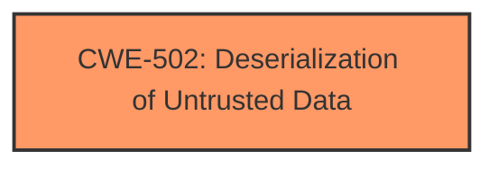

# Enhanced Analysis for CVE-2025-27218

# Summary
| CWE ID | CWE Name | Confidence | CWE Abstraction Level | CWE Vulnerability Mapping Label | CWE-Vulnerability Mapping Notes |
|---|---|---|---|---|---|
| CWE-502 | Deserialization of Untrusted Data | 1.0 | Base | Allowed | Primary CWE: The vulnerability description explicitly states "**insecure deserialization**" as the root cause. |

## Evidence and Confidence

*   **Confidence Score:** 1.0
*   **Evidence Strength:** HIGH

## Relationship Analysis
The primary relationship to consider is that CWE-502 stands alone as the root cause, with no direct parent or child relationships immediately relevant in this context based on the provided information. It could potentially lead to other CWEs depending on the code execution.



## Vulnerability Chain
The vulnerability chain starts with **insecure deserialization** (CWE-502), which then leads to remote code execution.
  - CWE-502 (Root Cause) -> Remote Code Execution (Impact)

## Summary of Analysis
The vulnerability description clearly indicates that the root cause is **insecure deserialization**, which directly maps to CWE-502. The description explicitly mentions "**insecure deserialization**". The retriever results also list CWE-502 as the top candidate.

Relevant CWE Information:

# Enhanced Context (25 CWEs)
The following CWEs were identified as potentially relevant to this vulnerability:

## CWE-502: Deserialization of Untrusted Data
**Abstraction Level**: Base
**Similarity Score**: 0.79
**Source**: dense

**Description**:
The product deserializes untrusted data without sufficiently ensuring that the resulting data will be valid.

**Mapping Guidance**:
- Usage: Allowed
- Rationale: This CWE entry is at the Base level of abstraction, which is a preferred level of abstraction for mapping to the root causes of vulnerabilities.

## CWE-502: Deserialization of Untrusted Data
**Abstraction Level**: Base
**Similarity Score**: 380.88
**Source**: sparse

**Description**:
The product deserializes untrusted data without sufficiently ensuring that the resulting data will be valid.

**Mapping Guidance**:
- Usage: Allowed
- Rationale: This CWE entry is at the Base level of abstraction, which is a preferred level of abstraction for mapping to the root causes of vulnerabilities.

## CWE-502: Deserialization of Untrusted Data
**Abstraction Level**: Base
**Similarity Score**: 2.50
**Source**: graph

**Description**:
The product deserializes untrusted data without sufficiently ensuring that the resulting data will be valid.

**Mapping Guidance**:
- Usage: Allowed
- Rationale: This CWE entry is at the Base level of abstraction, which is a preferred level of abstraction for mapping to the root causes of vulnerabilities.

The other CWEs were considered, but they did not directly relate to the root cause of the vulnerability as clearly as CWE-502. For example, CWE-915 (Improperly Controlled Modification of Dynamically-Determined Object Attributes) and CWE-639 (Authorization Bypass Through User-Controlled Key) are related to object attribute modification and authorization bypass, respectively, but they do not capture the **insecure deserialization** aspect.


## CWE Relationship Analysis

Current CWEs represent these abstraction levels: .


### Vulnerability Chain Analysis

**Chain starting from CWE-639:**
- 639 (Authorization Bypass Through User-Controlled Key) - ROOT


**Chain starting from CWE-502:**
- 502 (Deserialization of Untrusted Data) - ROOT


### CWE Relationship Diagram

```mermaid
graph TD
    classDef primary fill:#f96,stroke:#333,stroke-width:2px
    classDef secondary fill:#69f,stroke:#333
    classDef tertiary fill:#9e9,stroke:#333
```