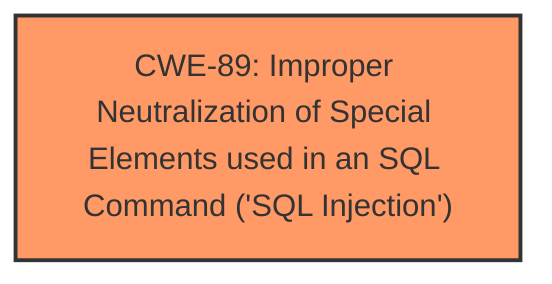

# Analysis Report for CVE-2025-2734

# Vulnerability Analysis Report: CVE-2025-2734

## Description

A vulnerability, which was classified as critical, was found in PHPGurukul Old Age Home Management System 1.0. Affected is an unknown function of the file /admin/aboutus.php. The manipulation of the argument pagetitle leads to **sql injection**. It is possible to launch the attack remotely. The exploit has been disclosed to the public and may be used.

## Vulnerability Description Key Phrases

- **Weakness:** sql injection
- **Product:** PHPGurukul Old Age Home Management System
- **Version:** 1
- **Component:** /admin/aboutus.php

## Analysis (with Relationship Data)

# Summary
| CWE ID | CWE Name | Confidence | CWE Abstraction Level | CWE Vulnerability Mapping Label | CWE-Vulnerability Mapping Notes |
|---|---|---|---|---|---|
| CWE-89 | Improper Neutralization of Special Elements used in an SQL Command ('SQL Injection') | 1.0 | Base | Allowed | Primary CWE |

## Evidence and Confidence

*   **Confidence Score:** 1.0
*   **Evidence Strength:** HIGH

## Relationship Analysis
The primary identified CWE is CWE-89, which is a base-level CWE. No child or parent relationships influenced the selection in this case, as CWE-89 directly and accurately describes the **SQL injection** vulnerability. There are no chain or peer relationships that were relevant to the classification of this specific vulnerability based on the provided information.



## Vulnerability Chain
The vulnerability chain consists of a single point:

1.  **Root Cause:** CWE-89 - Improper Neutralization of Special Elements used in an SQL Command ('SQL Injection'). The application fails to neutralize special elements in the `pagetitle` argument, leading to **SQL injection**.

## Summary of Analysis
The vulnerability description clearly indicates an **SQL injection** vulnerability in PHPGurukul Old Age Home Management System 1.0 within the `/admin/aboutus.php` file. The `pagetitle` argument is vulnerable to manipulation, which confirms the presence of **SQL injection**.

The evidence is the phrase "**sql injection**" in the Vulnerability Description and the target `pagetitle`.

The Retriever Results list CWE-89 as the top candidate.

CWE-89 is at the Base level of abstraction, which is the preferred level.

Based on this evidence, CWE-89 is the most appropriate classification.

CWEs considered but not used:

*   CWE-79 (Improper Neutralization of Input During Web Page Generation ('Cross-site Scripting')): While neutralization is a factor in many injection vulnerabilities, the specific injection target is an SQL command, not a web page. Therefore, CWE-79 is not applicable.
*   CWE-434 (Unrestricted Upload of File with Dangerous Type): This CWE relates to file uploads, which is not relevant to the described **SQL injection** vulnerability.
*   CWE-1336 (Improper Neutralization of Special Elements Used in a Template Engine): This CWE relates to Template Engines, which is not relevant to the described **SQL injection** vulnerability.
*   CWE-96 (Improper Neutralization of Directives in Statically Saved Code ('Static Code Injection')): This CWE relates to static code injection, which is not relevant to the described **SQL injection** vulnerability.


## CWE Relationship Analysis

Current CWEs represent these abstraction levels: .


### Vulnerability Chain Analysis

**Chain starting from CWE-89:**
- 89 (Improper Neutralization of Special Elements used in an SQL Command ('SQL Injection')) - ROOT


**Chain starting from CWE-79:**
- 79 (Improper Neutralization of Input During Web Page Generation ('Cross-site Scripting')) - ROOT


### CWE Relationship Diagram

```mermaid
graph TD
    classDef primary fill:#f96,stroke:#333,stroke-width:2px
    classDef secondary fill:#69f,stroke:#333
    classDef tertiary fill:#9e9,stroke:#333
```


*Report generated on 2025-07-14 15:09:39*
