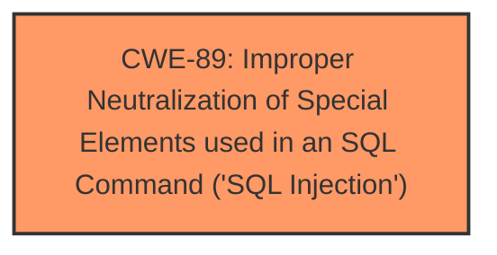

# Enhanced Analysis for CVE-2025-2735

# Summary
| CWE ID | CWE Name | Confidence | CWE Abstraction Level | CWE Vulnerability Mapping Label | CWE-Vulnerability Mapping Notes |
|---|---|---|---|---|---|
| CWE-89 | Improper Neutralization of Special Elements used in an SQL Command ('SQL Injection') | 1.0 | Base | Allowed | Primary CWE. The **sertitle** argument is not neutralized, leading to SQL injection. |

## Evidence and Confidence

*   **Confidence Score:** 1.0
*   **Evidence Strength:** HIGH

## Relationship Analysis
The primary relationship to consider is that CWE-89 is a base-level weakness, representing the specific issue of SQL Injection. There are no direct parent-child or chain relationships that significantly impact the mapping decision in this case, as the provided information points directly to this specific weakness. The abstraction level of "Base" for CWE-89 is appropriate as it accurately represents the root cause.



## Vulnerability Chain
The vulnerability chain starts with the **improper neutralization** of the **sertitle** argument, leading directly to SQL injection.

Root Cause: **Improper Neutralization** of **sertitle** -> Impact: SQL Injection

## Summary of Analysis
The vulnerability description clearly indicates an SQL injection vulnerability due to the **improper neutralization** of the **sertitle** argument in the `/admin/add-services.php` file. The CVE Reference Links Content Summary confirms this, stating that attackers inject malicious code from the **sertitle** parameter directly into SQL queries without proper cleaning or validation.

The Retriever Results also strongly support CWE-89, with a score of 1.0.

CWE-89 is the most appropriate because the root cause is the **lack of neutralization** of the **sertitle** argument, enabling attackers to manipulate SQL queries. The CWE description aligns perfectly with the vulnerability.

Other CWEs Considered but Not Used:

*   CWE-79 (Improper Neutralization of Input During Web Page Generation ('Cross-site Scripting')): While input is involved, the specific vulnerability is SQL injection, not XSS.
*   CWE-434 (Unrestricted Upload of File with Dangerous Type): Not relevant as the vulnerability is related to SQL injection, not file uploads.
*   CWE-1336 (Improper Neutralization of Special Elements Used in a Template Engine): Not relevant as the vulnerability is related to SQL injection, not template engine injection.
*   CWE-425 (Direct Request ('Forced Browsing')): This is related to authorization issues, which is not the case here.
*   CWE-306 (Missing Authentication for Critical Function): While it's stated that no login is required to exploit the vulnerability, the root cause is the SQL Injection.
*   CWE-94 (Improper Control of Generation of Code ('Code Injection')): While SQL injection *can* lead to code execution, the root cause here is specifically the **improper neutralization**, not generic code injection.


## CWE Relationship Analysis

Current CWEs represent these abstraction levels: .


### Vulnerability Chain Analysis

**Chain starting from CWE-89:**
- 89 (Improper Neutralization of Special Elements used in an SQL Command ('SQL Injection')) - ROOT


**Chain starting from CWE-94:**
- 94 (Improper Control of Generation of Code ('Code Injection')) - ROOT


### CWE Relationship Diagram

```mermaid
graph TD
    classDef primary fill:#f96,stroke:#333,stroke-width:2px
    classDef secondary fill:#69f,stroke:#333
    classDef tertiary fill:#9e9,stroke:#333
```