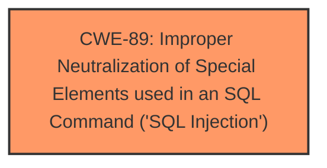

# Raw Analyzer Response for CVE-2025-2739

# Summary
| CWE ID | CWE Name | Confidence | CWE Abstraction Level | CWE Vulnerability Mapping Label | CWE-Vulnerability Mapping Notes |
|---|---|---|---|---|---|
| CWE-89 | Improper Neutralization of Special Elements used in an SQL Command ('SQL Injection') | 1.0 | Base | Allowed | Primary CWE. The application constructs an SQL command using externally-influenced input, but it does not neutralize or incorrectly neutralizes special elements that could modify the intended SQL command. |

## Evidence and Confidence

*   **Confidence Score:** 1.0
*   **Evidence Strength:** HIGH

## Relationship Analysis
The primary identified CWE is CWE-89, which stands alone as the root cause in this scenario. There are no hierarchical, chain, or peer relationships that influence this selection as the description clearly states the presence of SQL Injection.

## Vulnerability Chain
The vulnerability chain consists of a single element:

1.  **Root Cause:** CWE-89 - Improper Neutralization of Special Elements used in an SQL Command ('SQL Injection')

This is a direct SQL Injection vulnerability due to the lack of proper input validation when constructing SQL queries. The impact is direct, where a remote attacker can manipulate the 'sertitle' argument to inject malicious SQL code.

## Summary of Analysis
The analysis is based on the vulnerability description, which clearly states that the manipulation of the argument 'sertitle' leads to **sql injection** in the `/admin/manage-services.php` file of the PHPGurukul Old Age Home Management System 1.0.

The evidence from the "Vulnerability Description Key Phrases" section confirms the presence of **sql injection**. The retriever results also list CWE-89 as the top candidate with a score of 1.0, further reinforcing this choice.

The selection of CWE-89 is at the optimal level of specificity, as it directly addresses the root cause of the vulnerability, which is the improper neutralization of special elements used in an SQL command.