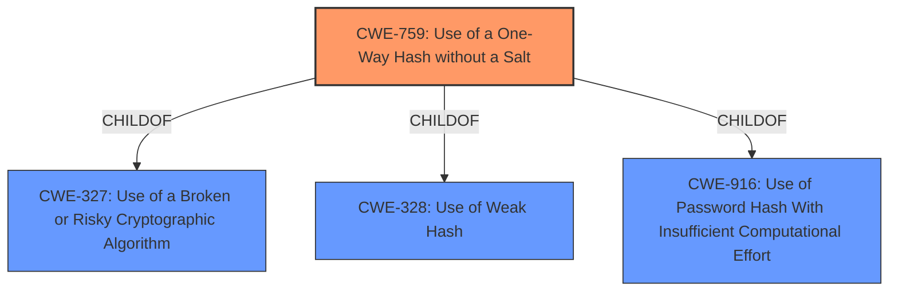

# Enhanced Analysis for CVE-2025-27408

# Summary
| CWE ID | CWE Name | Confidence | CWE Abstraction Level | CWE Vulnerability Mapping Label | CWE-Vulnerability Mapping Notes |
|---|---|---|---|---|---|
| CWE-759 | Use of a One-Way Hash without a Salt | 1.0 | Variant | Allowed | Primary CWE |
| CWE-328 | Use of Weak Hash | 0.8 | Base | Allowed | Secondary Candidate |
| CWE-916 | Use of Password Hash With Insufficient Computational Effort | 0.7 | Base | Allowed | Secondary Candidate |

## Evidence and Confidence

*   **Confidence Score:** 0.9
*   **Evidence Strength:** HIGH

## Relationship Analysis
The primary CWE is CWE-759, which is a variant-level CWE and a child of several class-level CWEs, including CWE-327 (Use of a Broken or Risky Cryptographic Algorithm), CWE-328 (Use of Weak Hash), and CWE-916 (Use of Password Hash With Insufficient Computational Effort). This indicates that the use of a one-way hash without a salt is a specific type of cryptographic weakness. CWE-328 and CWE-916 were considered as broader classifications but were deemed less specific than CWE-759 based on the provided evidence.



## Vulnerability Chain
The vulnerability chain starts with the **weak password hashing implementation** using SHA3 without a salt (CWE-759). This leads to a higher risk of password cracking if an attacker gains access to the database, potentially compromising user accounts and system security.

## Summary of Analysis
The primary CWE is CWE-759 (Use of a One-Way Hash without a Salt), which accurately describes the vulnerability. The vulnerability description explicitly states that Manifest employs a **weak password hashing implementation** that uses SHA3 without a salt, exposing user passwords to a higher risk of being cracked. This aligns directly with the characteristics of CWE-759. The retriever results also list CWE-759 as a highly relevant CWE.

CWE-328 (Use of Weak Hash) and CWE-916 (Use of Password Hash With Insufficient Computational Effort) were considered as secondary CWEs because they represent broader categories of cryptographic weaknesses. However, CWE-759 is a more specific variant that accurately captures the **root cause** of the vulnerability.

The choice of CWE-759 is based on direct evidence from the vulnerability description and aligns with the MITRE mapping guidance for selecting the most specific CWE. The confidence score is high (0.9) due to the clear match between the vulnerability description and the CWE characteristics.
The evidence includes: "Manifest employs a **weak password hashing implementation** that uses SHA3 without a salt."
CWE-759 is the optimal level of specificity because it directly addresses the **root cause** of the vulnerability – the use of a one-way hash without a salt. Other CWEs, such as CWE-328 and CWE-916, are more general and do not capture the specific weakness.


## CWE Relationship Analysis

Current CWEs represent these abstraction levels: .


### Vulnerability Chain Analysis

**Chain starting from CWE-328:**
- 328 (Use of Weak Hash) - ROOT


**Chain starting from CWE-916:**
- 916 (Use of Password Hash With Insufficient Computational Effort) - ROOT


### CWE Relationship Diagram

```mermaid
graph TD
    classDef primary fill:#f96,stroke:#333,stroke-width:2px
    classDef secondary fill:#69f,stroke:#333
    classDef tertiary fill:#9e9,stroke:#333
```