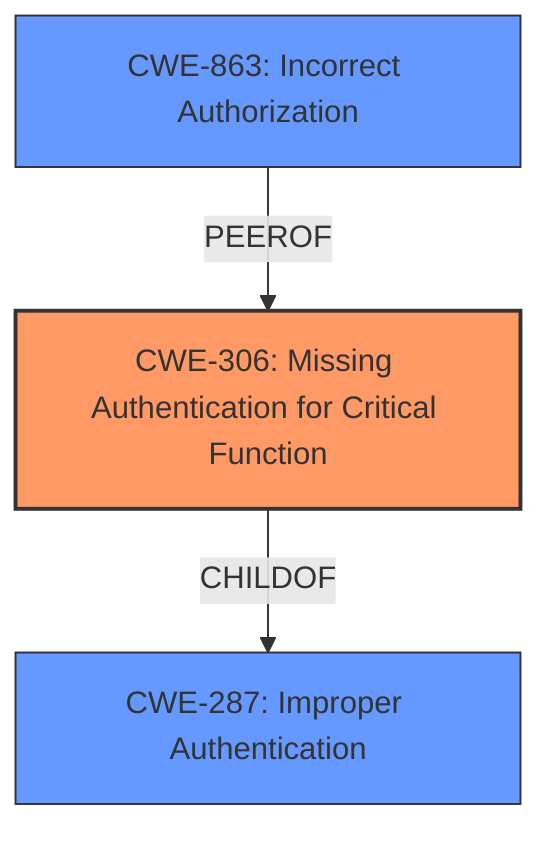

# Analysis Report for CVE-2025-27414

# Vulnerability Analysis Report: CVE-2025-27414

## Description

MinIO is a high performance object storage. Starting in RELEASE.2024-06-06T09-36-42Z and prior to RELEASE.2025-02-28T09-55-16Z, a **bug in evaluating the trust of the SSH key used in an SFTP connection to MinIO** allows authentication bypass and unauthorized data access. On a MinIO server with SFTP access configured and using LDAP as an external identity provider, MinIO supports SSH key based authentication for SFTP connections when the user has the `sshPublicKey` attribute set in their LDAP server. The server trusts the clients key only when the public key is the same as the `sshPublicKey` attribute. Due to the bug, when the user has no `sshPublicKey` property in LDAP, the server ends up trusting the key allowing the client to perform any FTP operations allowed by the MinIO access policies associated with the LDAP user (or any of their groups). Three requirements must be met in order to exploit the vulnerability. First, the MinIO server must be configured to allow SFTP access and use LDAP as an external identity provider. Second, the attacker must have knowledge of an LDAP username that does not have the `sshPublicKey` property set. Third, such an LDAP username or one of their groups must also have some MinIO access policy configured. When this bug is successfully exploited, the attacker can perform any FTP operations (i.e. reading, writing, deleting and listing objects) allowed by the access policy associated with the LDAP user account (and their groups). Version 1.2.0 fixes the issue.

## Vulnerability Description Key Phrases

- **Component:** SFTP connection
- **Rootcause:** bug in evaluating the trust of the SSH key used in an SFTP connection to MinIO
- **Product:** MinIO server
- **Impact:** authentication bypass, unauthorized data access
- **Version:** RELEASE.2024-06-06T09-36-42Z and prior to RELEASE.2025-02-28T09-55-16Z, Version 1.2.0 (fixes issue)

## Analysis (with Relationship Data)

# Summary
| CWE ID | CWE Name | Confidence | CWE Abstraction Level | CWE Vulnerability Mapping Label | CWE-Vulnerability Mapping Notes |
|---|---|---|---|---|---|
| CWE-306 | Missing Authentication for Critical Function | 0.9 | Base | Primary | Allowed |
| CWE-863 | Incorrect Authorization | 0.7 | Class | Secondary | Allowed-with-Review |

## Evidence and Confidence

*   **Confidence Score:** 0.8
*   **Evidence Strength:** MEDIUM

## Relationship Analysis
The primary relationship influencing the CWE selection is the parent-child relationship between CWE-287 (Improper Authentication) and CWE-306 (Missing Authentication for Critical Function). While CWE-287 is a broader class, CWE-306 provides a more specific description of the vulnerability: the complete absence of authentication for a critical function (SFTP access).

The `Authentication vs Authorization vs Access Control Guidance` was very influential in choosing the right CWE, emphasizing that *“If you **know no login happened**, lean toward **authentication** → CWE-306.”*



## Vulnerability Chain
The vulnerability chain starts with the **bug in evaluating the trust of the SSH key**, leading to **missing authentication** and ultimately resulting in **unauthorized data access**.

1.  **Root Cause:** **Bug in evaluating the trust of the SSH key** (Implicitly CWE related to incorrect trust/validation)
2.  **Weakness:** CWE-306 Missing Authentication for Critical Function. No authentication is performed when the `sshPublicKey` attribute is missing in the LDAP entry.
3.  **Impact:** Unauthorized data access.

## Summary of Analysis
The initial analysis focused on identifying the root cause and the resulting impact. The vulnerability description and the CVE reference summary both highlight the **bug in evaluating the trust of the SSH key** when the `sshPublicKey` attribute is absent in LDAP. This leads to a complete bypass of authentication for SFTP access.

The decision to assign CWE-306 as the primary CWE is based on the explicit statement that the server trusts the client's key even when the user lacks the `sshPublicKey` property in LDAP, effectively bypassing authentication. The `Authentication vs Authorization vs Access Control Guidance` helped choose between Authentication (CWE-306) and Authorization (CWE-863, CWE-285). Because no login happened, this implied Authentication and CWE-306.

CWE-863 (Incorrect Authorization) was considered as a secondary CWE because after authentication is bypassed, the attacker can perform operations allowed by the MinIO access policies, which could be viewed as an authorization issue. However, the primary problem is the lack of authentication.

The selected CWEs are at the optimal level of specificity because CWE-306 directly addresses the missing authentication, and CWE-863 highlights the consequences related to MinIO access policies.

Relevant CWE Information:

# Enhanced Context (25 CWEs)
The following CWEs were identified as potentially relevant to this vulnerability:

## CWE-212: Improper Removal of Sensitive Information Before Storage or Transfer
**Abstraction Level**: Base
**Similarity Score**: 0.76
**Source**: dense

**Description**:
The product stores, transfers, or shares a resource that contains sensitive information, but it does not properly remove that information before the product makes the resource available to unauthorized actors.

**Mapping Guidance**:
- Usage: Allowed
- Rationale: This CWE entry is at the Base level of abstraction, which is a preferred level of abstraction for mapping to the root causes of vulnerabilities.

## CWE-303: Incorrect Implementation of Authentication Algorithm
**Abstraction Level**: Base
**Similarity Score**: 0.76
**Source**: dense

**Description**:
The requirements for the product dictate the use of an established authentication algorithm, but the implementation of the algorithm is incorrect.

**Mapping Guidance**:
- Usage: Allowed
- Rationale: This CWE entry is at the Base level of abstraction, which is a preferred level of abstraction for mapping to the root causes of vulnerabilities.

## CWE-639: Authorization Bypass Through User-Controlled Key
**Abstraction Level**: Base
**Similarity Score**: 0.75
**Source**: dense

**Description**:
The system's authorization functionality does not prevent one user from gaining access to another user's data or record by modifying the key value identifying the data.

**Mapping Guidance**:
- Usage: Allowed
- Rationale: This CWE entry is at the Base level of abstraction, which is a preferred level of abstraction for mapping to the root causes of vulnerabilities.

## CWE-1390: Weak Authentication
**Abstraction Level**: Class
**Similarity Score**: 0.75
**Source**: dense

**Description**:
The product uses an authentication mechanism to restrict access to specific users or identities, but the mechanism does not sufficiently prove that the claimed identity is correct.

**Mapping Guidance**:
- Usage: Allowed-with-Review
- Rationale: This CWE entry is a Class and might have Base-level children that would be more appropriate

## CWE-345: Insufficient Verification of Data Authenticity
**Abstraction Level**: Class
**Similarity Score**: 0.75
**Source**: dense

**Description**:
The product does not sufficiently verify the origin or authenticity of data, in a way that causes it to accept invalid data.

**Mapping Guidance**:
- Usage: Discouraged
- Rationale: This CWE entry is a level-1 Class (i.e., a child of a Pillar). It might have lower-level children that would be more appropriate

## CWE-41: Improper Resolution of Path Equivalence
**Abstraction Level**: Base
**Similarity Score**: 0.75
**Source**: dense

**Description**:
The product is vulnerable to file system contents disclosure through path equivalence. Path equivalence involves the use of special characters in file and directory names. The associated manipulations are intended to generate multiple names for the same object.

**Mapping Guidance**:
- Usage: Allowed
- Rationale: This CWE entry is at the Base level of abstraction, which is a preferred level of abstraction for mapping to the root causes of vulnerabilities.

## CWE-1391: Use of Weak Credentials
**Abstraction Level**: Class
**Similarity Score**: 0.75
**Source**: dense

**Description**:
The product uses weak credentials (such as a default key or hard-coded password) that can be calculated, derived, reused, or guessed by an attacker.

**Mapping Guidance**:
- Usage: Allowed-with-Review
- Rationale: This CWE entry is a Class and might have Base-level children that would be more appropriate

## CWE-552: Files or Directories Accessible to External Parties
**Abstraction Level**: Base
**Similarity Score**: 0.74
**Source**: dense

**Description**:
The product makes files or directories accessible to unauthorized actors, even though they should not be.

**Mapping Guidance**:
- Usage: Allowed
- Rationale: This CWE entry is at the Base level of abstraction, which is a preferred level of abstraction for mapping to the root causes of vulnerabilities.

## CWE-1286: Improper Validation of Syntactic Correctness of Input
**Abstraction Level**: Base
**Similarity Score**: 0.74
**Source**: dense

**Description**:
The product receives input that is expected to be well-formed - i.e., to comply with a certain syntax - but it does not validate or incorrectly validates that the input complies with the syntax.

**Mapping Guidance**:
- Usage: Allowed
- Rationale: This CWE entry is at the Base level of abstraction, which is a preferred level of abstraction for mapping to the root causes of vulnerabilities.

## CWE-23: Relative Path Traversal
**Abstraction Level**: Base
**Similarity Score**: 0.74
**Source**: dense

**Description**:
The product uses external input to construct a pathname that should be within a restricted directory, but it does not properly neutralize sequences such as ".." that can resolve to a location that is outside of that directory.

**Mapping Guidance**:
- Usage: Allowed
- Rationale: This CWE entry is at the Base level of abstraction, which is a preferred level of abstraction for mapping to the root causes of vulnerabilities.

## CWE-863: Incorrect Authorization
**Abstraction Level**: Class
**Similarity Score**: 2143.54
**Source**: sparse

**Description**:
The product performs an authorization check when an actor attempts to access a resource or perform an action, but it does not correctly perform the check.

**Mapping Guidance**:
- Usage: Allowed-with-Review
- Rationale: This


## CWE Relationship Analysis

Current CWEs represent these abstraction levels: .


### Vulnerability Chain Analysis

**Chain starting from CWE-1390:**
- 1390 (Weak Authentication) - ROOT


**Chain starting from CWE-863:**
- 863 (Incorrect Authorization) - ROOT


### CWE Relationship Diagram

```mermaid
graph TD
    classDef primary fill:#f96,stroke:#333,stroke-width:2px
    classDef secondary fill:#69f,stroke:#333
    classDef tertiary fill:#9e9,stroke:#333
```


*Report generated on 2025-07-14 15:13:31*
