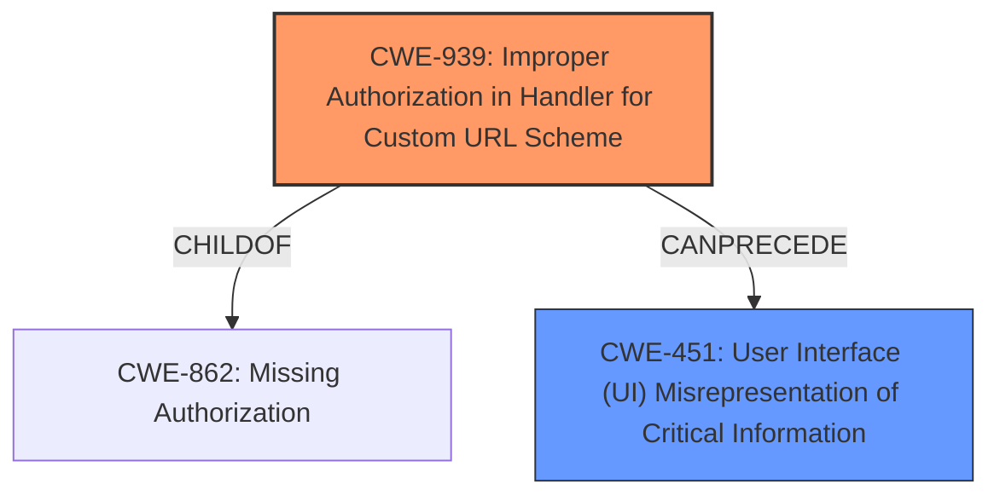

# Raw Analyzer Response for CVE-2025-27425

# Summary
| CWE ID | CWE Name | Confidence | CWE Abstraction Level | CWE Vulnerability Mapping Label | CWE-Vulnerability Mapping Notes |
|---|---|---|---|---|---|
| CWE-939 | Improper Authorization in Handler for Custom URL Scheme | 0.75 | Base | Allowed | Primary CWE. The application **does not properly authorize** the opening of a URL from a QR code, bypassing the expected user confirmation. |
| CWE-451 | User Interface (UI) Misrepresentation of Critical Information | 0.6 | Class | Allowed-with-Review | Secondary CWE. Failure to present a confirmation dialog **misrepresents critical information** to the user, leading them to believe they are not about to navigate to a new website. |

## Evidence and Confidence

*   **Confidence Score:** 0.7
*   **Evidence Strength:** MEDIUM

## Relationship Analysis
The primary weakness, CWE-939, is at the Base level, providing a specific description of the authorization issue related to custom URL schemes. It has a hierarchical relationship as a child of CWE-862 (Missing Authorization). CWE-451 is a Class-level CWE, representing the more general issue of UI misrepresentation. While potentially relevant, it's a higher-level abstraction. The chain relationship here isn't strong, but one could argue that **improper authorization** (CWE-939) leads to **UI misrepresentation** (CWE-451) by omitting the confirmation dialog.

## Vulnerability Chain
The chain of events is as follows:
1.  A malicious QR code containing a URL is scanned.
2.  The application **fails to properly authorize** the action of opening the URL (CWE-939).
3.  The user is not presented with a confirmation dialog, resulting in **UI misrepresentation** (CWE-451).
4.  The URL is opened without user consent.

The root cause is the **improper authorization** in handling the custom URL scheme within the QR code. The impact is that the user is not warned about the URL being opened.

## Summary of Analysis
The initial analysis identified several candidate CWEs. Based on the retriever results, the most relevant CWEs are CWE-939 and CWE-451.

The core issue is that the Firefox app is opening a URL without proper authorization, bypassing the user confirmation. This directly relates to **improper authorization** in handling the custom URL scheme.

The evidence from the vulnerability description key phrases highlights that the "impact" is to open a website URL without a confirmation alert. The "root cause of the vulnerability" is that "Scanning certain QR codes that included text with a website URL could allow the URL to be opened without presenting the user with a confirmation alert first." This lack of confirmation can be seen as a form of **User Interface (UI) Misrepresentation of Critical Information** (CWE-451) since the user is not being properly informed about the action being taken.

CWE-939 (Improper Authorization in Handler for Custom URL Scheme) is the primary CWE as it precisely describes the root cause - the app is not properly authorizing the opening of a URL from a QR code. CWE-451 (User Interface (UI) Misrepresentation of Critical Information) is a secondary CWE since the missing confirmation dialog leads to a misrepresentation of what's happening to the user.

The selection is based on the provided evidence and the relationships between the CWEs.

Relevant CWE Information:
*   **CWE-939: Improper Authorization in Handler for Custom URL Scheme** - This CWE is selected as the primary because it accurately describes the root cause of the vulnerability. The application **does not properly authorize** the opening of a URL from a QR code, bypassing the expected user confirmation.
*   **CWE-451: User Interface (UI) Misrepresentation of Critical Information** - This CWE is included as a secondary weakness. The failure to present a confirmation dialog **misrepresents critical information** to the user, leading them to believe they are not about to navigate to a new website.